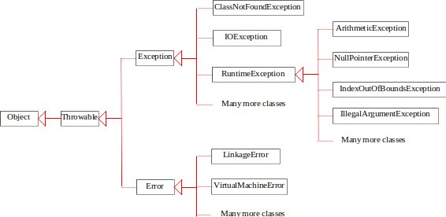

# Exception handling

Exceptions are objects represent runtime errors or conditions that prevent execution from proceeding normally.
* They are thrown from methods
* The callers of the methods can catch and handle the exceptions
* The key benefit of exception handling is separating 
  * the detection of an error (done in a called method) from 
  * the handling of an error (done in the calling method).

```java
// Quotient.java: possible runtime error - integer divides by 0
import java.util.Scanner;

public class Quotient {
  public static void main(String[] args) {
    Scanner input = new Scanner(System.in);

    // Prompt the user to enter two integers
    System.out.print("Enter two integers: ");
    int number1 = input.nextInt();
    int number2 = input.nextInt();

    // try entering number2 as 0 to see what happens?
    // Note a floating-point number divided by 0 does not raise an ­exception.
    // 1.0/0=inifinity
    System.out.println(number1 + " / " + number2 + " is " +
      (number1 / number2));
  }
}

// QuotientWithIf.java: fix the error with an if statement

import java.util.Scanner;

public class QuotientWithIf {
  public static void main(String[] args) {
    Scanner input = new Scanner(System.in);

    // Prompt the user to enter two integers
    System.out.print("Enter two integers: ");
    int number1 = input.nextInt();
    int number2 = input.nextInt();

    if (number2 != 0) // fix the error of dividing an integer by 0
      System.out.println(number1 + " / " + number2
        + " is " + (number1 / number2));
    else
      System.out.println("Divisor cannot be zero ");
  }
}

// QuotientWithMethod.java: let a method to handle the error
import java.util.Scanner;

public class QuotientWithMethod {
  // Let the method to handle the error
  public static int quotient(int number1, int number2) {
    if (number2 == 0) {
      System.out.println("Divisor cannot be zero");
      System.exit(1);
    }

    return number1 / number2;
  }

  public static void main(String[] args) {
    Scanner input = new Scanner(System.in);

    // Prompt the user to enter two integers
    System.out.print("Enter two integers: ");
    int number1 = input.nextInt();
    int number2 = input.nextInt();

    int result = quotient(number1, number2);
    System.out.println(number1 + " / " + number2 + " is "
      + result);
  }
}

// QuotientWithException.java: let the caller handle the error with a catch block
import java.util.Scanner;

public class QuotientWithException { 
  public static int quotient(int number1, int number2) {
    if (number2 == 0) // create and throw an exception
      throw new ArithmeticException("Divisor cannot be zero");

    return number1 / number2;
  }
  
  public static void main(String[] args) {
    Scanner input = new Scanner(System.in);
    
    // Prompt the user to enter two integers
    System.out.print("Enter two integers: ");
    int number1 = input.nextInt();
    int number2 = input.nextInt();
    
    try { // run normally
      int result = quotient(number1, number2);
      System.out.println(number1 + " / " + number2 + " is " 
        + result);
    }
    catch (ArithmeticException ex) {
      // process catched exception
      System.out.println("Exception: an integer " + 
        "cannot be divided by zero ");
    }

    System.out.println("Execution continues ...");
  }
}

```

**Exception types**

Exceptions are objects defined using classes. The root class for exceptions is 
*[java.lang.Throwable](https://docs.oracle.com/en/java/javase/11/docs/api/java.base/java/lang/Throwable.html)*.



The exception classes can be classified into three major types: 
* system errors
  * thrown by the JVM and represented in the **Error** class
  * little you can do beyond notifying the user and trying to terminate the program gracefully
* exceptions 
  * represented in the **Exception** class 
  * describes errors caused by your program and by external circumstance
  * can be caught and handled by your program
* runtime exceptions
  * represented in the **RuntimeException** class, 
  * describes programming errors, such as bad casting, accessing an out-of-bounds array, and numeric errors. 

**Checked Exceptions vs. Unchecked Exceptions**
* *RuntimeException, Error and their subclasses* are known as *unchecked* exceptions. 
  * reflect programming logic errors that are unrecoverable
* *All other exceptions* are known as *checked* exceptions, meaning that the compiler forces the programmer to check and deal with the exceptions.

**Examples**
* [Input mismatch exception](../bookcode/chapter12/InputMismatchExceptionDemo.java)


**Declaring, Throwing, and Catching Exceptions**

Java’s exception-handling model is based on three operations: 
* declaring an exception 
  * states the types of checked exceptions it might throw from a method
  ```java
  public void aMethod() throws Exception1, Exception2, ..., ExceptionN
  ```
  * A method without exception declaration cannot be overridden to declare exceptions
* throwing an exception
  * detects an error then create an instance of an appropriate exception type and throw it.
  ```java
  throw new TheException(); 
  // or
  TheException ex = new TheException();
  throw ex;
  ```
* catching an exception
  * The code that handles the exception is called the exception handler
  * it is found by propagating the exception backward through a chain of method calls, starting from the current method
  * The process of finding a handler is called *catching an exception*
  * If no handler is found in the chain of methods being invoked, the program terminates and prints an error message on the console.
  ```java
  try {
    statements; // Statements that may throw exceptions
  }
  catch (Exception1 exVar1) {
    handler for exception1;
  }
  catch (Exception2 exVar2) {
    handler for exception2;
  }
  ...
  catch (ExceptionN exVarN) {
    handler for exceptionN;
  }
  ```
* multicatch catches and handles multiple exceptions with the same handling code 
  ```java
  catch (Exception1 | Exception2 | ... | ExceptionN e){
    // Same code for handling these exceptions
  }
  ```
* If a method declares a checked exception, you must 
  * invoke it in a try-catch block
  ```java
  void m1(){
    try{ m2(); }
    catch(Exception1 e){ ... }
  }
  ```
  * declare to throw the exception in the calling method
  ```java
  void m1() throws Exception1 { m2(); }
  ```
* Rethrowing Exceptions
  ```java
  try{ statements; }
  catch (Exception1 e1){
    partly handle e1;
    throw e1; // rethrow
  }
  ```
  * Throwing an exception along with another exception forms a [chained exception](../bookcode/chapter12/ChainedExceptionDemo.java/)  
* The [finally clause](https://www.baeldung.com/java-finally-keyword) is always executed regardless of whether an exception occurred or not.
  ```java
  try{ statements; }
  catch(Exception1 e1){ handle e1; }
  // finally block is always executed 
  finally { finalStatements; }
  nextStatements;
  ```
  * finalStatements are often for closing files and for cleaning up resources
  * The catch block may be omitted when the finally clause is used
* Getting Information from Exceptions with methods in Throwable such as
  * getMessage, printStackTrace, getStackTrace
  * demonstrated in [Test exception](../bookcode/chapter12/TestException.java) 
* Use the exception classes in the API whenever possible. Define custom exception classes
  * if the predefined classes are not sufficient
  * by extending Exception or a subclass of Exception

**Examples**

```java
/** Set a new radius */
public void setRadius(double newRadius) 
throws IllegalArgumentException // declare an exception
{
  if (newRadius >= 0)
    radius =  newRadius;
  else // throw an exception
    throw new IllegalArgumentException("Radius cannot be negative");
}
```

* [Invalid radius exception](../bookcode/chapter12/InvalidRadiusException.java)
  * [Circle with radius exception](../bookcode/chapter12/CircleWithException.java)
  * [Test](../bookcode/chapter12/TestCircleWithException.java)


Exception handling usually requires more time and resources because it requires instantiating a new exception object, rolling back the call stack, and propagating the errors to the calling methods.
* Do not use a try-catch block to deal with simple, expected situations.
  ```java
  // prefer
  if(refVar != null)
    System.out.println(refVar.toString());
  else
    System.out.println("refVar is null!");
  // over 
  try{
    System.out.println(refVar.toString());
  }catch(NullPointerException e){
    System.out.println("refVar is null!");
  }
  ```
* A method should throw an exception if the error needs to be handled by its caller.

**[Assertions](https://docs.oracle.com/javase/7/docs/technotes/guides/language/assert.html)**

* An assertion is a Java statement that enables you to assert an assumption about your program. 
* An assertion contains a Boolean expression that should be true during program execution. 
* Assertions can be used to assure program correctness and avoid logic errors.
* Declaring assertions
  ```java
  assert assertion; // or
  assert assertion : detailMessage; // 
  ```
  * assertion is a Boolean expression 
  * detailMessage is a primitive-type or an Object value
* Executing assertions
  * Java evaluates the assertion. If it is false, an [AssertionError](https://docs.oracle.com/en/java/javase/11/docs/api/java.base/java/lang/AssertionError.html) will be thrown
    * The AssertionError class has a no-arg constructor and 
    * seven overloaded single-argument constructors of type int, long, float, double, boolean, char, and Object
  * For the first assert statement with no detail message, the no-arg constructor of AssertionError is used. 
  * For the second assert statement with a detail message, an appropriate AssertionError constructor is used to match the data type of the message. 
  * Since AssertionError is a subclass of Error, when an assertion becomes false, the program displays a message on the console and exits.
  * By default, the assertions are disabled at runtime. Use the switch –enableassertions, or –ea for short, to enable it:
  ```java
  java -ea ProgramWithAssertions
  ```
    * Assertions can be selectively enabled or disabled at class level or package level.
    ```java
    java -ea:package1 -da:Class1 ProgramWithAssertions
    ```

**Examples**

```java
// AssertionDemo.java
public class AssertionDemo {
  public static void main(String[] args) {
    int i; int sum = 0;
    for (i = 0; i < 10; i++) {
      sum += i; 
    }
    assert i == 10;
    assert sum > 10 && sum < 5 * 10 : "sum is " + sum;
  }
}
```

**Using Exception Handling or Assertions**
* Assertion should not be used to replace exception handling
  * Assertions assure the correctness of the program
  * Use assertions to reaffirm assumptions
  * Use assertions in a switch statement without a default case
    ```java
    switch (month) {
      case 1: ... ; break;
      case 2: ... ; break;
      ...
      case 12: ... ; break;
      default: assert false : "Invalid month: " + month;
    }
    ```
* Exception handling deals with unusual circumstances during program execution. 
  * Exception handles addresses robustness.
* Like exception handling, assertions are not used for normal tests, but for internal consistency and validity checks 
* Assertions are checked at runtime and can be turned on or off at startup time
* Do not use assertions for argument checking in public methods 
  * Validating arguments using exception handling


# Reference textbooks
* [Introduction to Java Programming, Comprehensive, 12/E](https://media.pearsoncmg.com/bc/abp/cs-resources/products/product.html#product,isbn=0136519350)
  * [Student resources](https://media.pearsoncmg.com/ph/esm/ecs_liang_ijp_12/cw/)
  * [Source code](https://media.pearsoncmg.com/ph/esm/ecs_liang_ijp_12/cw/content/source-code.php)