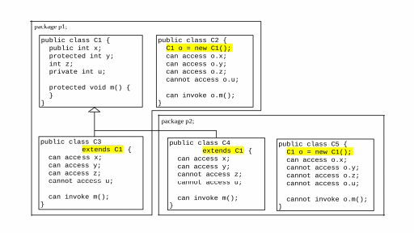

# Inheritance and polymorphism

Circle and Rectangle are inherited from GeometricObject.
* GeometricObject is called superclass, parent class, base class or supertype
* Circle and Rectangle are called subclass, child class, extended class or subtype
* Inheritance is declared as subclass extends superclass
* Inheritance is used to model the **is-a** relationship
  * for example, a Circle is a GeometricObject
* Not all is-a relationships should be modeled using inheritance
  * for example, a Square is a Rectangle, but it better extends GeometricObject instead of Rectangle
* Java supports single inheritance only not multiple inheritance
  * multiple inheritance can be achieved through *interfaces*

```java
// GeometricObject.java
public class GeometricObject {
  private String color = "white";
  private boolean filled;
  private java.util.Date dateCreated;
  
  /** Construct a default geometric object */
  public GeometricObject() {
    dateCreated = new java.util.Date();
  }

  /** Construct a geometric object with the specified color 
    *  and filled value */
  public GeometricObject(String color, boolean filled) {
    dateCreated = new java.util.Date();
    this.color = color;
    this.filled = filled;
  }

  /** Return color */
  public String getColor() {
    return color;
  }

  /** Set a new color */
  public void setColor(String color) {
    this.color = color;
  }

  /** Return filled. Since filled is boolean, 
     its get method is named isFilled */
  public boolean isFilled() {
    return filled;
  }

  /** Set a new filled */
  public void setFilled(boolean filled) {
    this.filled = filled;
  }
  
  /** Get dateCreated */
  public java.util.Date getDateCreated() {
    return dateCreated;
  }
  
  /** Return a string representation of this object */
  public String toString() {
    return "created on " + dateCreated + "\ncolor: " + color + 
      " and filled: " + filled;
  }
}

// Circle.java
public class Circle  extends GeometricObject {
  private double radius;

  public Circle() {
  }

  public Circle(double radius) {
    this.radius = radius;
  }

  public Circle(double radius, 
      String color, boolean filled) {
    this.radius = radius;
    setColor(color);
    setFilled(filled); // or super.setFilled(filled);
  }

  /** Return radius */
  public double getRadius() {
    return radius;
  }

  /** Set a new radius */
  public void setRadius(double radius) {
    this.radius = radius;
  }

  /** Return area */
  public double getArea() {
    return radius * radius * Math.PI;
  }
  
  /** Return diameter */
  public double getDiameter() {
    return 2 * radius;
  }
  
  /** Return perimeter */
  public double getPerimeter() {
    return 2 * radius * Math.PI;
  }

  /* Print the circle info */
  public void printCircle() {
    System.out.println("The circle is created " + getDateCreated() +
      " and the radius is " + radius);
  }
}

// Rectangle.java
public class Rectangle extends GeometricObject {
  private double width;
  private double height;

  public Rectangle() {
  }

  public Rectangle(double width, double height) {
    this.width = width;
    this.height = height;
  }

  public Rectangle(
      double width, double height, String color, boolean filled) {
    this.width = width;
    this.height = height;
    setColor(color);
    setFilled(filled);
  }

  /** Return width */
  public double getWidth() {
    return width;
  }

  /** Set a new width */
  public void setWidth(double width) {
    this.width = width;
  }

  /** Return height */
  public double getHeight() {
    return height;
  }

  /** Set a new height */
  public void setHeight(double height) {
    this.height = height;
  }

  /** Return area */
  public double getArea() {
    return width * height;
  }

  /** Return perimeter */
  public double getPerimeter() {
    return 2 * (width + height);
  }
}

// Test.java
public class Test {
    public static void main(String[] args) {
        Circle circle = new Circle(1);
        System.out.println("A circle " + circle.toString());
        System.out.println("The color is " + circle.getColor());
        System.out.println("The radius is " + circle.getRadius());
        System.out.println("The area is " + circle.getArea());
        System.out.println("The diameter is " + circle.getDiameter());

        Rectangle rectangle = new Rectangle(2, 4);
        System.out.println("\nA rectangle " + rectangle.toString());
        System.out.println("The area is " + rectangle.getArea());
        System.out.println("The perimeter is " + rectangle.getPerimeter());
    }
}
```

* What are inherited from Superclass?
  * data fields and methods
  * Superclass's constructors are NOT inherited
    * they can only be invoked using the keyword super
      ```java
      super(); // call the no-arg constructor, or
      super(arguments); // other constructors
      ```
    * If the keyword super is not explicitly used, the superclass's no-arg constructor is automatically invoked.
      ```java
      public C(){} // is equivalent to
      public C(){
        super(); // added by the compiler implicitly
        // Invoking a superclass constructor’s name in a subclass causes a syntax error. 
        // Java requires that the statement that uses the keyword super appear first in the constructor
        // other statements...
      }
      ```
    * The super keywork can be used to call a superclass constructor or method  
      ```java
        super.method(arguments);
      ```


**Constructor Chaining**

Constructing an instance of a class invokes all the superclasses’ constructors along the inheritance chain. This is known as constructor chaining.

```java
// 1. Demonstrate constructor chaining
// Faculty.java
public class Faculty extends Employee {
    public static void main(String[] args) {
      new Faculty();
    }
    
    public Faculty() {
      System.out.println("(4) Faculty's no-arg constructor is invoked");
    }
  }
  
  class Employee extends Person {
    public Employee() {
      this("(2) Invoke Employee's overloaded constructor");
      System.out.println("(3) Employee's no-arg constructor is invoked");
    }
  
    public Employee(String s) {
      System.out.println(s);
    }
  }
  
  class Person {
    public Person() {
      System.out.println("(1) Person's no-arg constructor is invoked");
    }
  }
// outputs:
// (1) Person's no-arg constructor is invoked
// (2) Invoke Employee's overloaded constructor
// (3) Employee's no-arg constructor is invoked
// (4) Faculty's no-arg constructor is invoked

// 2. The impact of a Superclass without no-arg Constructor
// Apple.java: compile this file, find and fix the errors
public class Apple extends Fruit {
}
 
class Fruit {
  public Fruit(String name) {
    System.out.println("Fruit's constructor is invoked");
  }
}

```

* A subclass is not a subset of its superclass but usually contains more information and methods than its superclass
* Private data fields in a superclass are not accessible outside the class
  * They can be accessed/mutated through public accessors/mutators if defined in the superclass.
* In the subclass, you can
  * Add new properties and new methods
  * Override the methods of the superclass

**Overriding Methods inherited from the Superclass**

The subclass modifying the implementation of a method defined in the superclass is called *method overriding*.
The overriding method must have the same signature as the overridden method and same or compatible return type. Compatible means that the overriding method’s return type is a subtype of the overridden method’s return type.

* An instance method can be overridden only if it is accessible. 
* Thus a private method cannot be overridden, because it is not accessible outside its own class. 
* If a method defined in a subclass is private in its superclass, the two methods are completely unrelated.
* Placing the override annotation @Override before the overriding method in the subclass help avoid mistakes
* **Note**: 
  * a static method can be inherited but cannot be overridden. 
  * If it is redefined in a subclass, the static method defined in the superclass is hidden. 
    * The hidden static methods can be invoked using the syntax SuperClassName.staticMethodName.

What are the differences between overriding and overloading?

**The Object Class and Its Methods**

Every class in Java is descended from the **java.lang.Object** class. If no inheritance is specified in the definition of a class, then its superclass is Object. 

```java
public class Person{ ... } // is equivalent to
public class Person extends Object{ ... }
```

The Object class has a *toString()* method 
* returns a string representation of the object. 
* The default implementation returns a string consisting of 
  * a class name of which the object is an instance, 
  * the at sign (@), and a number representing this object
  ```java
   Object o = new Object();
   o.toString(); // returns  "java.lang.Object@3c09711b"

   System.out.println(o); // is preferred over
   System.out.println(o.toString());
   ```
* The toString method is usually overridden to return a meaningful string representation of the object.


**Polymorphism**

Polymorphism means that a variable of a supertype can refer to an object of any of its subtypes. Which models
* A person could be a faculty, student, instructor, etc.
* A geometric object could a circle, square, rectangle, etc.
* A method can be implemented in several classes along the inheritance chain. 
  * The JVM decides which method is invoked at runtime, which is called *dynamic binding*
  * If o invokes a method m, the JVM searches and invokes the first-found implementation upward along the inheritance chain

```java
// DynamicBindingDemo.java
// The inheritance chain: GraduateStudent -> Student -> Person -> Object
public class DynamicBindingDemo {
    public static void main(String[] args) {
        m(new GraduateStudent()); // ==> Student
        m(new Student()); // ==> Student
        m(new Person()); // ==> Person
        m(new Object()); // ==> java.lang.Object@73a28541
    }

    public static void m(Object x) {
        System.out.println(x.toString());
    }
}

class GraduateStudent extends Student {
}

class Student extends Person {
    @Override
    public String toString() {
        return "Student";
    }
}

class Person extends Object {
    @Override
    public String toString() {
        return "Person";
    }
}

```

**Casting objects**
* Casting a primitive-type value returns a new value. 
* Casting an object reference does not create a new object.

```java
// implicity casting from a subclass to a superclass
Object o = new Student(); 
m(o);

// explicit casting from a superclass to a subclass
Student s = (Student) o; 

// Use the instanceof operator to test whether an object is an instance of a class
Object o2 = new Circle();
if(o2 instanceof Circle)
  System.out.println("The circle area is " + ((Circle)o2).getArea());

```

**Examples**
* [Casting demonstration](../bookcode/chapter11/CastingDemo.java)


**Comparing two objects**
* The equals() method compares the contents of two objects. 

```java
// test whether two objects are equal
object1.equals(object2);

// The default implementation of the equals method in the Object class is
public boolean equals(Object obj) {
  // checks whether two reference variables point to the same object using the == operator
  return this == obj;

}

// override equals in custom class to test whether two distinct objects have the same content.
@Override
public boolean equals(Object o) {
  if (o instanceof Circle)
    return radius == ((Circle)o).radius;
  else
    return false;
}

```

**The [ArrayList](https://docs.oracle.com/en/java/javase/11/docs/api/java.base/java/util/ArrayList.html) Class**
*  can be used to store an unlimited number of objects
   *  the elements stored in an ArrayList must be of an object type
   *  so use Wrapper class for primitive types
*  is known as a generic class with a generic type E. You can specify a concrete type to replace E when creating an ArrayList


```java
// 1. creates an ArrayList of Strings 
ArrayList<String> cities = new ArrayList<String>(); 
// or
ArrayList<String> cities = new ArrayList<>(); 

// 2. Creating an ArrayList from an array of objects
String[] array = {"red", "green", "blue"};
ArrayList<String> list = new ArrayList<>(Arrays.asList(array));

// 3. Creating an array of objects from an ArrayList:
String[] array1 = new String[list.size()];
list.toArray(array1);

// 4. Useful Methods for Lists
java.util.Collections.sort(list);
java.util.Collections.max(list);
ava.util.Collections.min(list);
java.util.Collections.shuffle(list);
```

**Examples**
* [Test ArrayList](../bookcode/chapter11/TestArrayList.java)
* [Differences and Similarities between Arrays and ArrayList](../bookcode/chapter11/DistinctNumbers.java)
* [use an ArrayList to implement Stack](../bookcode/chapter11/MyStack.java)

**The protected Modifier**



* **private** modifier hides the members of the class completely
* **default** modifier allows the members of the class to be accessed directly from any class within the same package
* **protected** modifier enables the members of the class to be accessed by the subclasses in any package
* **public** modifier enables the members of the class to be accessed by any class
* change visibility
  * A subclass may override a protected method defined in its superclass and change its visibility to public
  * a subclass cannot weaken the accessibility of a method defined in the superclass
* Applicability
  * The private and protected modifiers can be used only for members of the class
  * The public modifier and the default modifier (i.e., no modifier) can be used on members of the class as well as on the class


**The final Modifier**

```java
// A final class cannot be extended
public final class A{}

public class B{
// A final method cannot be overridden by its subclasses
  public final void m(){}  
}

// A final variable is a constant
public class C{
  public final static double 𝛑 = 3.1415926;
  public final double PI = 3.1415926;
  public void m(){
    // The final modifier can also be used on local variables to make them constant
    final double e = 2.71828;
  }
}

```


# Reference textbooks
* [Introduction to Java Programming, Comprehensive, 12/E](https://media.pearsoncmg.com/bc/abp/cs-resources/products/product.html#product,isbn=0136519350)
  * [Student resources](https://media.pearsoncmg.com/ph/esm/ecs_liang_ijp_12/cw/)
  * [Source code](https://media.pearsoncmg.com/ph/esm/ecs_liang_ijp_12/cw/content/source-code.php)