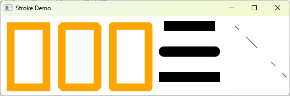

# Advanced JavaFX and FXML

Objectives
---
- Separate UI from programming logic
  - create JavaFX user interfaces using FMXL and the [visual Scene Builder](https://gluonhq.com/products/scene-builder/)
  - specify styles for UI nodes using JavaFX CSS
    - define a shape’s border using various types of strokes 
- Build advanced UI with advanced node classes
  - create menus using the Menu, MenuItem, CheckMenuItem, and RadioMemuItem classes
    - create context menus using the ContextMenu class 
  - use SplitPane to create adjustable horizontal and vertical panes 
  - create tab panes using the TabPane control
  - create and display tables using the TableView and TableColumn classes 
  - create quadratic curve, cubic curve, and path using the QuadCurve, CubicCurve, and Path classes
  - perform coordinate transformations such as translation, rotation, and scaling for nodes 


JavaFX style property
---
- defined with a prefix –fx- to distinquish it from a property in CSS 
  - All the available JavaFX properties are defined in [JavaFX CSS Reference Guide](https://openjfx.io/javadoc/11/javafx.graphics/javafx/scene/doc-files/cssref.html)
- A JavaFX CSS file makes it easy to modify the style without modifying the Java source code


Style Class and Style ID
---
- A style sheet uses the style class or style id to define styles
  - Multiple style classes can be applied to a single node
    - The syntax .styleclass defines a style class 
- A style id applies to a unique node 
  - The syntax #styleid defines a style id


```java
import javafx.application.Application;
import javafx.scene.Scene;
import javafx.scene.layout.HBox;
import javafx.scene.layout.Pane;
import javafx.scene.shape.Circle;
import javafx.stage.Stage;

public class StyleSheetDemo extends Application {
  @Override
  public void start(Stage primaryStage) {
    HBox hBox = new HBox(5);
    Scene scene = new Scene(hBox, 300, 250); 
    // The Scene and Parent classes have the stylesheets property, 
    // which can be obtained from invoking the getStylesheets() method  
    scene.getStylesheets().add("mystyle.css"); 
    //  All the nodes inside the scene can use this style sheet
    // This property is of the ObservableList<String> type. 
    // You can add multiple style sheets into this property
    // You can load a style sheet into a Scene or a Parent. 
    // Note that Parent is the superclass for containers and UI control

    Pane pane1 = new Pane();
    Circle circle1 = new Circle(50, 50, 30);
    Circle circle2 = new Circle(150, 50, 30);
    Circle circle3 = new Circle(100, 100, 30);
    pane1.getChildren().addAll(circle1, circle2, circle3);
    // Each node in JavaFX has a styleClass variable of the List<String> type,
    // which can be obtained from invoking getStyleClass()     
    pane1.getStyleClass().add("border");
    
    circle1.getStyleClass().add("plaincircle");
    circle2.getStyleClass().add("plaincircle");
    // Each node in JavaFX has an id variable of the String type, 
    // which can be set using the setID(String id) method
    // You can set only one id to a node
    circle3.setId("redcircle");
    
    Pane pane2 = new Pane();
    Circle circle4 = new Circle(100, 100, 30);
    circle4.getStyleClass().addAll("circleborder", "plainCircle"); 
    circle4.setId("greencircle");
    pane2.getChildren().add(circle4);
    pane2.getStyleClass().add("border");

    hBox.getChildren().addAll(pane1, pane2); 
    
    primaryStage.setTitle("StyleSheetDemo");
    primaryStage.setScene(scene);
    primaryStage.show();
  }

  public static void main(String[] args) {
    launch(args);
  }
}
```

```css
.plaincircle {
  -fx-fill: white;
  -fx-stroke: black;
}
.circleborder {
  -fx-stroke-width: 5;
  -fx-stroke-dash-array: 12 2 4 2;
}
.border {
  -fx-border-color: black;
  -fx-border-width: 5;
}
#redcircle {
  -fx-fill: red;
  -fx-stroke: red;
}
#greencircle {
  -fx-fill: green;
  -fx-stroke: green;
}
```


Practice
---
```java
// Comment the line below
scene.getStylesheets().add("mystyle.css");
// Add the following statement after pane1 is created
pane1.getStylesheets().add("mystyle.css");
```


[QuadCurve](https://openjfx.io/javadoc/11/javafx.graphics/javafx/scene/shape/QuadCurve.html)
---


- mathematically defined as a quadratic polynomial
- To create a QuadCurve, use its no-arg constructor or the following constructor
  ```java
  QuadCurve(double startX, double startY, double controlX, double controlY, double endX, double endY)
  ```

[CubicCurve](https://openjfx.io/javadoc/11/javafx.graphics/javafx/scene/shape/CubicCurve.html)
---


- mathematically defined as a cubic polynomial
- To create a CubicCurve, use its no-arg constructor or the following constructor
  ```java
  CubicCurve(double startX, double startY, double controlX1, 
  double controlY1, double controlX2, double controlY2, 
  double endX, double endY)
  ```

Practice
---
```java
// comment the following lines from the above code
quadCurve.setFill(Color.WHITE);
cubicCurve.setFill(Color.WHITE);
```


[Path](https://openjfx.io/javadoc/11/javafx.graphics/javafx/scene/shape/Path.html)
---


- models an arbitrary geometric path
- A path is constructed by adding path elements into the path
- The [PathElement](https://openjfx.io/javadoc/11/javafx.graphics/javafx/scene/shape/PathElement.html) is the root class for the path elements 
  - MoveTo, HLineTo, VLineTo, LineTo, 
  - ArcTo, QuadCurveTo, CubicCurveTo, and ClosePath

```java
import javafx.application.Application;
import javafx.scene.Scene;
import javafx.scene.layout.Pane;
import javafx.scene.paint.Color;
import javafx.scene.shape.*;
import javafx.stage.Stage;

public class PathDemo extends Application {
  @Override
  public void start(Stage primaryStage) {
    Pane pane = new Pane();
    
    Path path = new Path();
    path.getElements().add(new MoveTo(50.0, 50.0)); 
    path.getElements().add(new HLineTo(150.5)); 
    path.getElements().add(new VLineTo(100.5));
    path.getElements().add(new LineTo(200.5, 150.5));
    
    ArcTo arcTo = new ArcTo(45, 45, 0, 250, 100.5, 
      false, true);
    path.getElements().add(arcTo);

    path.getElements().add(new QuadCurveTo(50, 50, 350, 100));
    path.getElements().add(
      new CubicCurveTo(250, 100, 350, 250, 450, 10));
    
    path.getElements().add(new ClosePath());
    
    pane.getChildren().add(path);
    path.setFill(null);
    Scene scene = new Scene(pane, 300, 250);           
    primaryStage.setTitle("PathDemo");
    primaryStage.setScene(scene);
    primaryStage.show();
  }

  public static void main(String[] args) {
    launch(args);
  }
}
```


Coordinate Transformations
---


- related methods are provided in the Node class
- translation 
  - setTranslateX(double x), setTranslateY(double y), and setTranslateZ(double z)
- rotation
  - rotate(double theta) rotates a node by theta degrees from its pivot point clockwise
    -  where theta is a double value in degrees 
    -  The pivot point is automatically computed based on the bounds of the node
- scaling
  - setScaleX(double sx), setScaleY(double sy) , and setScaleY(double sy) specify a scaling factor
  - Scaling alters the coordinate space of the node such that each unit of distance along the axis is multiplied by the scale factor
  - As with rotation transformations, scaling transformations are applied to enlarge or shrink the node around the pivot point
  - For a node of the rectangle shape, the pivot point is the center of the rectangle

```java
import javafx.application.Application;
import javafx.scene.Scene;
import javafx.scene.layout.Pane;
import javafx.scene.paint.Color;
import javafx.scene.shape.Line;
import javafx.scene.shape.Polyline;
import javafx.scene.shape.Rectangle;
import javafx.scene.text.Text;
import javafx.stage.Stage;

public class TRSDemo extends Application {
  @Override
  public void start(Stage primaryStage) {
    Pane pane = new Pane();

    double x = 10;
    double y = 10;
    java.util.Random random = new java.util.Random();

    // translation
    for (int i = 0; i < 10; i++) {
      Rectangle rectangle = new Rectangle(10, 10, 50, 60);
      rectangle.setFill(Color.WHITE);
      rectangle.setStroke(Color.color(random.nextDouble(),
          random.nextDouble(), random.nextDouble()));
      rectangle.setTranslateX(x += 20);
      rectangle.setTranslateY(y += 5);
      pane.getChildren().add(rectangle);
    }

    // rotation
    double radius = 90;
    double width = 20;
    double height = 40;
    for (int i = 0; i < 8; i++) {
      x = 150 + radius * Math.cos(i * 2 * Math.PI / 8);
      y = 150 + radius * Math.sin(i * 2 * Math.PI / 8);
      Rectangle rectangle = new Rectangle(
          x - width / 2, y - height / 2, width, height);
      rectangle.setFill(Color.WHITE);
      rectangle.setStroke(Color.color(random.nextDouble(),
          random.nextDouble(), random.nextDouble()));
      rectangle.setRotate(i * 360 / 8);
      pane.getChildren().add(rectangle);
    }

    // scaling
    Polyline polyline = new Polyline();
    for (double angle = -360; angle <= 360; angle++) {
      polyline.getPoints().addAll(
        angle, Math.sin(Math.toRadians(angle)));
    }
    polyline.setTranslateY(100);
    polyline.setTranslateX(200);
    polyline.setScaleX(0.5);
    polyline.setScaleY(50); 
    polyline.setStrokeWidth(1.0 / 25);
    
    Line line1 = new Line(10, 100, 420, 100);
    Line line2 = new Line(420, 100, 400, 90);
    Line line3 = new Line(420, 100, 400, 110);

    Line line4 = new Line(200, 10, 200, 200);
    Line line5 = new Line(200, 10, 190, 30);
    Line line6 = new Line(200, 10, 210, 30);

    Text text1 = new Text(380, 70, "X");
    Text text2 = new Text(220, 20, "Y");    
    
    pane.getChildren().addAll(polyline, line1, line2, line3, line4,
      line5, line6, text1, text2);

    Scene scene = new Scene(pane, 300, 250);
    primaryStage.setTitle("Transformation Demo");
    primaryStage.setScene(scene);
    primaryStage.show();
  }

  public static void main(String[] args) {
    launch(args);
  }
}
```


[Strokes](https://openjfx.io/javadoc/11/javafx.graphics/javafx/scene/shape/Shape.html)
---



- Stroke defines a shape’s border line style
- setStrokeType(type) method sets a [type for the stroke](https://openjfx.io/javadoc/11/javafx.graphics/javafx/scene/shape/StrokeType.html)
  - StrokeType.INSIDE, StrokeType.OUTSIDE , or StrokeType.CENTERED (default) defines whether the stroke is inside, outside, or in the center of the border 
- setStrokeLineCap​(StrokeLineCap value) method sets the value of the property strokeLineCap
  - possible end cap styles: StrokeLineCap.BUTT, StrokeLineCap.ROUND, and StrokeLineCap.SQUARE
- setStrokeLineJoin​(StrokeLineJoin value) method defines the decoration applied where path segments meet
  - three types of line joins: StrokeLineJoin.MITER (default), StrokeLineJoin.BEVEL, and StrokeLineJoin.ROUND


strokeDashArray
---
- The Shape class has a property named strokeDashArray of the ObservableList\<Double\> type
-  This property is used to define a dashed pattern for the stroke
-  Alternate numbers in the list specify the lengths of the opaque and transparent segments of the dashes

```java
import javafx.application.Application;
import javafx.scene.Scene;
import javafx.scene.layout.Pane;
import javafx.scene.paint.Color;
import javafx.stage.Stage;
import javafx.scene.shape.Rectangle;
import javafx.scene.shape.*;
  
public class StrokeDemo extends Application {
  @Override
  public void start(Stage primaryStage) { 
    Rectangle rectangle1 = new Rectangle(20, 20, 70, 120);
    rectangle1.setFill(Color.WHITE);
    rectangle1.setStrokeWidth(15);
    rectangle1.setStroke(Color.ORANGE);
      
    Rectangle rectangle2 = new Rectangle(20, 20, 70, 120);
    rectangle2.setFill(Color.WHITE);
    rectangle2.setStrokeWidth(15);
    rectangle2.setStroke(Color.ORANGE);
    rectangle2.setTranslateX(100);
    rectangle2.setStrokeLineJoin(StrokeLineJoin.BEVEL);
       
    Rectangle rectangle3 = new Rectangle(20, 20, 70, 120);
    rectangle3.setFill(Color.WHITE);
    rectangle3.setStrokeWidth(15);
    rectangle3.setStroke(Color.ORANGE);
    rectangle3.setTranslateX(200);
    rectangle3.setStrokeLineJoin(StrokeLineJoin.ROUND);
         
    Line line1 = new Line(320, 20, 420, 20);
    line1.setStrokeLineCap(StrokeLineCap.BUTT);
    line1.setStrokeWidth(20);
      
    Line line2 = new Line(320, 70, 420, 70);
    line2.setStrokeLineCap(StrokeLineCap.ROUND);
    line2.setStrokeWidth(20);
     
    Line line3 = new Line(320, 120, 420, 120);
    line3.setStrokeLineCap(StrokeLineCap.SQUARE);
    line3.setStrokeWidth(20);
  
    Line line4 = new Line(460, 20, 560, 120);
    line4.getStrokeDashArray().addAll(10.0, 20.0, 30.0, 40.0);
    
    Pane pane = new Pane();
    pane.getChildren().addAll(rectangle1, rectangle2, rectangle3,
    line1, line2, line3, line4);
  
    Scene scene = new Scene(pane, 610, 180);           
    primaryStage.setTitle("Stroke Demo");
    primaryStage.setScene(scene);
    primaryStage.show();
  }

  public static void main(String[] args) {
    launch(args);
  }
}
```


Menu
---


- MenuBar
  - a top-level menu component used to hold the menus
- Menu
  - consists of menu items that the user can select (or toggle on or off)
- A menu item
  - can be an instance of MenuItem, CheckMenuItem, and RadioButtonMenuItem
  - can be associated with nodes and keyboard accelerators

```java
import javafx.application.Application;
import javafx.geometry.Pos;
import javafx.scene.Scene;
import javafx.scene.control.Button;
import javafx.scene.control.Label;
import javafx.scene.control.Menu;
import javafx.scene.control.MenuBar;
import javafx.scene.control.MenuItem;
import javafx.scene.control.TextField;
import javafx.scene.input.KeyCombination;
import javafx.scene.layout.HBox;
import javafx.scene.layout.VBox;
import javafx.stage.Stage;

public class MenuDemo extends Application {
  private TextField tfNumber1 = new TextField();
  private TextField tfNumber2 = new TextField();
  private TextField tfResult = new TextField();
    
  @Override
  public void start(Stage primaryStage) {   
    MenuBar menuBar = new MenuBar();    
    
    Menu menuOperation = new Menu("Operation");
    Menu menuExit = new Menu("Exit");
    menuBar.getMenus().addAll(menuOperation, menuExit);
    
    MenuItem menuItemAdd = new MenuItem("Add");
    MenuItem menuItemSubtract = new MenuItem("Subtract");
    MenuItem menuItemMultiply = new MenuItem("Multiply");
    MenuItem menuItemDivide = new MenuItem("Divide");
    menuOperation.getItems().addAll(menuItemAdd, menuItemSubtract,
      menuItemMultiply, menuItemDivide);
    
    MenuItem menuItemClose = new MenuItem("Close");
    menuExit.getItems().add(menuItemClose);
    
    menuItemAdd.setAccelerator(
      KeyCombination.keyCombination("Ctrl+A"));
    menuItemSubtract.setAccelerator(
      KeyCombination.keyCombination("Ctrl+S"));
    menuItemMultiply.setAccelerator(
      KeyCombination.keyCombination("Ctrl+M"));
    menuItemDivide.setAccelerator(
      KeyCombination.keyCombination("Ctrl+D"));
    
    HBox hBox1 = new HBox(5);
    tfNumber1.setPrefColumnCount(2);
    tfNumber2.setPrefColumnCount(2);
    tfResult.setPrefColumnCount(2);
    hBox1.getChildren().addAll(new Label("Number 1:"), tfNumber1,
      new Label("Number 2:"), tfNumber2, new Label("Result:"), 
      tfResult);
    hBox1.setAlignment(Pos.CENTER);
            
    HBox hBox2 = new HBox(5);
    Button btAdd = new Button("Add");
    Button btSubtract = new Button("Subtract");
    Button btMultiply = new Button("Multiply");
    Button btDivide = new Button("Divide");
    hBox2.getChildren().addAll(btAdd, btSubtract, btMultiply, btDivide);
    hBox2.setAlignment(Pos.CENTER);
    
    VBox vBox = new VBox(10);
    vBox.getChildren().addAll(menuBar, hBox1, hBox2);
    Scene scene = new Scene(vBox, 300, 250);  
    primaryStage.setTitle("MenuDemo");
    primaryStage.setScene(scene);
    primaryStage.show();
    
    menuItemAdd.setOnAction(e -> perform('+'));
    menuItemSubtract.setOnAction(e -> perform('-'));
    menuItemMultiply.setOnAction(e -> perform('*'));
    menuItemDivide.setOnAction(e -> perform('/'));
    menuItemClose.setOnAction(e -> System.exit(0));
    
    btAdd.setOnAction(e -> perform('+'));
    btSubtract.setOnAction(e -> perform('-'));
    btMultiply.setOnAction(e -> perform('*'));
    btDivide.setOnAction(e -> perform('/'));
  }

  private void perform(char operator) {
    double number1 = Double.parseDouble(tfNumber1.getText());
    double number2 = Double.parseDouble(tfNumber2.getText());
    
    double result = 0;
    switch (operator) {
      case '+': result = number1 + number2; break;
      case '-': result = number1 - number2; break;
      case '*': result = number1 * number2; break;
      case '/': result = number1 / number2; break;
    }
    
    tfResult.setText(result + "");
  }

  public static void main(String[] args) {
    launch(args);
  }
}
```


Context Menu
---


- also known as a popup menu, is like a regular menu 
  - but does not have a menu bar and can float anywhere on the screen 
  - create an instance of ContextMenu, then add menu items

```java
import javafx.application.Application;
import javafx.scene.Scene;
import javafx.scene.control.ContextMenu;
import javafx.scene.control.MenuItem;
import javafx.scene.image.ImageView;
import javafx.scene.layout.Pane;
import javafx.stage.Stage;

public class ContextMenuDemo extends Application {   
  @Override
  public void start(Stage primaryStage) {   
    ContextMenu contextMenu = new ContextMenu();       
    MenuItem menuItemNew = new MenuItem("New",
      new ImageView("image/new.gif"));
    MenuItem menuItemOpen = new MenuItem("Open",
      new ImageView("image/open.gif"));
    MenuItem menuItemPrint = new MenuItem("Print",
      new ImageView("image/print.gif"));
    MenuItem menuItemExit = new MenuItem("Exit");
    contextMenu.getItems().addAll(menuItemNew, menuItemOpen,
      menuItemPrint, menuItemExit);
   
    Pane pane = new Pane();
    Scene scene = new Scene(pane, 300, 250);  
    primaryStage.setTitle("ContextMenuDemo");
    primaryStage.setScene(scene);
    primaryStage.show();
    
    pane.setOnMousePressed(
      e -> contextMenu.show(pane, e.getScreenX(), e.getScreenY()));
    
    menuItemNew.setOnAction(e -> System.out.println("New"));
    menuItemOpen.setOnAction(e -> System.out.println("Open"));
    menuItemPrint.setOnAction(e -> System.out.println("Print"));
    menuItemExit.setOnAction(e -> System.exit(0));
  }

  public static void main(String[] args) {
    launch(args);
  }
}
```

[SplitPane](https://openjfx.io/javadoc/11/javafx.controls/javafx/scene/control/SplitPane.html)
---


- display multiple panes and allow the user to adjust the size of the panes

```java
import javafx.application.Application;
import javafx.geometry.Orientation;
import javafx.scene.Scene;
import javafx.scene.control.RadioButton;
import javafx.scene.control.ScrollPane;
import javafx.scene.control.SplitPane;
import javafx.scene.control.TextArea;
import javafx.scene.control.ToggleGroup;
import javafx.scene.image.Image;
import javafx.scene.image.ImageView;
import javafx.scene.layout.StackPane;
import javafx.scene.layout.VBox;
import javafx.stage.Stage;

public class SplitPaneDemo extends Application {
  private Image usImage = new Image("image/us.gif");
  private Image ukImage = new Image("image/uk.gif");
  private Image caImage = new Image("image/ca.gif");
  private String usDescription = "Description for US ...";
  private String ukDescription = "Description for UK ...";
  private String caDescription = "Description for CA ...";

  @Override
  public void start(Stage primaryStage) {   
    VBox vBox = new VBox(10);
    RadioButton rbUS = new RadioButton("US"); 
    RadioButton rbUK = new RadioButton("UK"); 
    RadioButton rbCA = new RadioButton("CA");            
    vBox.getChildren().addAll(rbUS, rbUK, rbCA);
    
    SplitPane content = new SplitPane();
    content.setOrientation(Orientation.VERTICAL);
    ImageView imageView = new ImageView(usImage);
    StackPane imagePane = new StackPane();
    imagePane.getChildren().add(imageView);
    TextArea taDescription = new TextArea();   
    taDescription.setText(usDescription);
    content.getItems().addAll(
      imagePane, new ScrollPane(taDescription));
        
    SplitPane sp = new SplitPane();
    sp.getItems().addAll(vBox, content);

    Scene scene = new Scene(sp, 300, 250);           
    primaryStage.setTitle("SplitPaneDemo");
    primaryStage.setScene(scene);
    primaryStage.show();
    
    ToggleGroup group = new ToggleGroup();
    rbUS.setToggleGroup(group);
    rbUK.setToggleGroup(group);
    rbCA.setToggleGroup(group);

    rbUS.setSelected(true);
    rbUS.setOnAction(e -> {
      imageView.setImage(usImage);
      taDescription.setText(usDescription);
    });
    
    rbUK.setOnAction(e -> {
      imageView.setImage(ukImage);
      taDescription.setText(ukDescription);
    });
        
    rbCA.setOnAction(e -> {
      imageView.setImage(caImage);
      taDescription.setText(caDescription);
    });
  }

  public static void main(String[] args) {
    launch(args);
  }
}
```

[TabPane](https://openjfx.io/javadoc/11/javafx.controls/javafx/scene/control/TabPane.html)
---


- display multiple panes with tabs

```java
import javafx.application.Application;
import javafx.scene.Scene;
import javafx.scene.control.Tab;
import javafx.scene.control.TabPane;
import javafx.scene.layout.StackPane;
import javafx.scene.shape.Circle;
import javafx.scene.shape.Ellipse;
import javafx.scene.shape.Line;
import javafx.scene.shape.Rectangle;
import javafx.stage.Stage;

public class TabPaneDemo extends Application {   
  @Override
  public void start(Stage primaryStage) {   
    TabPane tabPane = new TabPane();
    Tab tab1 = new Tab("Line");
    StackPane pane1 = new StackPane();
    pane1.getChildren().add(new Line(10, 10, 80, 80));
    tab1.setContent(pane1);
    Tab tab2 = new Tab("Rectangle");
    tab2.setContent(new Rectangle(10, 10, 200, 200));
    Tab tab3 = new Tab("Circle");
    tab3.setContent(new Circle(50, 50, 20));    
    Tab tab4 = new Tab("Ellipse");
    tab4.setContent(new Ellipse(10, 10, 100, 80));
    tabPane.getTabs().addAll(tab1, tab2, tab3, tab4);

    Scene scene = new Scene(tabPane, 300, 250);  
    primaryStage.setTitle("DisplayFigure");
    primaryStage.setScene(scene);
    primaryStage.show();
  }

  public static void main(String[] args) {
    launch(args);
  }
}
```


[TableView](https://openjfx.io/javadoc/11/javafx.controls/javafx/scene/control/TableView.html)
---


- TableView displays tables
- TableColumn defines the columns in a table
- TableCell represents a cell in the table

```java
import javafx.application.Application;
import javafx.beans.property.SimpleBooleanProperty;
import javafx.beans.property.SimpleDoubleProperty;
import javafx.beans.property.SimpleStringProperty;
import javafx.collections.FXCollections;
import javafx.collections.ObservableList;
import javafx.scene.Scene;
import javafx.scene.control.TableColumn;
import javafx.scene.control.TableView;
import javafx.scene.control.cell.PropertyValueFactory;
import javafx.scene.layout.Pane;
import javafx.stage.Stage;

public class TableViewDemo extends Application {
  @Override
  public void start(Stage primaryStage) {
    TableView<Country> tableView = new TableView<>();
    ObservableList<Country> data =
      FXCollections.observableArrayList(
        new Country("USA", "Washington DC", 280, true),
        new Country("Canada", "Ottawa", 32, true),
        new Country("United Kingdom", "London", 60, true),
        new Country("Germany", "Berlin", 83, true),
        new Country("France", "Paris", 60, true));
    tableView.setItems(data);
    
    TableColumn countryColumn = new TableColumn("Country");
    countryColumn.setMinWidth(100);
    countryColumn.setCellValueFactory(
      new PropertyValueFactory<Country, String>("country"));

    TableColumn capitalColumn = new TableColumn("Capital");
    capitalColumn.setMinWidth(100);
    capitalColumn.setCellValueFactory(
      new PropertyValueFactory<Country, String>("capital"));

    TableColumn populationColumn = 
      new TableColumn("Population (million)");
    populationColumn.setMinWidth(200);
    populationColumn.setCellValueFactory(
      new PropertyValueFactory<Country, Double>("population"));

    TableColumn democraticColumn = 
      new TableColumn("Is Democratic?");
    democraticColumn.setMinWidth(200);
    democraticColumn.setCellValueFactory(
      new PropertyValueFactory<Country, Boolean>("democratic"));

    tableView.getColumns().addAll(countryColumn, capitalColumn,
      populationColumn, democraticColumn);

    Pane pane = new Pane();
    pane.getChildren().add(tableView);
    Scene scene = new Scene(pane, 300, 250);  
    primaryStage.setTitle("TableViewDemo");
    primaryStage.setScene(scene);
    primaryStage.show();
  }

  public static class Country {
    private final SimpleStringProperty country;
    private final SimpleStringProperty capital;
    private final SimpleDoubleProperty population;
    private final SimpleBooleanProperty democratic;

    private Country(String country, String capital,
        double population, boolean democratic) {
      this.country = new SimpleStringProperty(country);
      this.capital = new SimpleStringProperty(capital);
      this.population = new SimpleDoubleProperty(population);
      this.democratic = new SimpleBooleanProperty(democratic);
    }

    public String getCountry() {
      return country.get();
    }

    public void setCountry(String country) {
      this.country.set(country);
    }

    public String getCapital() {
      return capital.get();
    }

    public void setCapital(String capital) {
      this.capital.set(capital);
    }

    public double getPopulation() {
      return population.get();
    }

    public void setPopulation(double population) {
      this.population.set(population);
    }

    public boolean isDemocratic() {
      return democratic.get();
    }

    public void setDemocratic(boolean democratic) {
      this.democratic.set(democratic);
    }
  }

  public static void main(String[] args) {
    launch(args);
  }
}
```


Developing JavaFX Programs Using FXML
---


- Prerequisites: install [visual Scene Builder](https://gluonhq.com/products/scene-builder/)
- source code
  - [Calculator.java](./demos/Calculator.java)
  - [FXMLDocumentController.java](./demos/FXMLDocumentController.java)
  - [FXMLDocument.fxml](./demos/FXMLDocument.fxml)


# Reference textbooks
* [Introduction to Java Programming, Comprehensive, 12/E](https://media.pearsoncmg.com/bc/abp/cs-resources/products/product.html#product,isbn=0136519350)
  * [Student resources](https://media.pearsoncmg.com/ph/esm/ecs_liang_ijp_12/cw/)
  * [Source code](https://media.pearsoncmg.com/ph/esm/ecs_liang_ijp_12/cw/content/source-code.php)
* [JavaFX API documentation](https://openjfx.io/javadoc/11/)
  * [JavaFX Documentation Project](https://fxdocs.github.io/docs/html5/)
* [JavaFX 11: IllegalAccessError when creating Label](https://stackoverflow.com/questions/54291958/javafx-11-illegalaccesserror-when-creating-label)
* [Handling JavaFX Events](https://docs.oracle.com/javafx/2/events/processing.htm)
* [A Primer on Bézier Curves](https://pomax.github.io/bezierinfo/)
  * [The Bézier Game](https://bezier.method.ac/)
  * [Blender 3D: Noob to Pro/Intro to Bézier Curves](https://en.wikibooks.org/wiki/Blender_3D:_Noob_to_Pro/Intro_to_Bezier_Curves)
  * [Bézier Curves](https://javascript.info/bezier-curve)