# JavaFX UI Controls and Multimedia

Motivations
---
- A graphical user interface (GUI) makes a system user-friendly and easy to use 
- The GUI components in JavaFX are very flexible and versatile
  - can be used to create a wide assortment of useful user interfaces


Frequently Used UI Controls
---

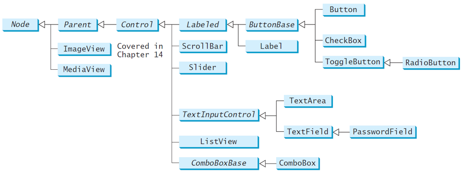

Control reference variables naming prefix convention

| control       | prefix |
| ------------- | ------ |
| Label         | lbl    |
| Button        | bt     |
| CheckBox      | chk    |
| RadioButton   | rb     |
| TextField     | tf     |
| PasswordField | pf     |
| TextArea      | ta     |
| ComboBox      | cbo    |
| ListView      | lv     |
| ScrollBar     | scb    |
| Slider        | sld    |
| MediaPlayer   | mp     |

Recommended naming style: **controlname+number**, ex. label6


[Labeled](https://openjfx.io/javadoc/11/javafx.controls/javafx/scene/control/Labeled.html)
---
* defines common properties of Label, TitledPane and ButtonBase, etc.
* A [label](https://openjfx.io/javadoc/11/javafx.controls/javafx/scene/control/Label.html) is a display area for a short text, a node, or both
  * often used to label other controls (usually text fields)

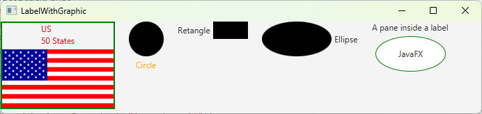

```java
import javafx.application.Application;
import javafx.stage.Stage;
import javafx.scene.Scene;
import javafx.scene.control.ContentDisplay;
import javafx.scene.control.Label;
import javafx.scene.image.Image;
import javafx.scene.image.ImageView;
import javafx.scene.layout.HBox;
import javafx.scene.layout.StackPane;
import javafx.scene.paint.Color;
import javafx.scene.shape.Circle;
import javafx.scene.shape.Rectangle;
import javafx.scene.shape.Ellipse;

public class LabelWithGraphic extends Application {
  @Override
  public void start(Stage primaryStage) {
    ImageView us = new ImageView(new Image("image/us.gif"));
    Label lb1 = new Label("US\n50 States", us);
    lb1.setStyle("-fx-border-color: green; -fx-border-width: 2");
    lb1.setContentDisplay(ContentDisplay.BOTTOM);
    lb1.setTextFill(Color.RED);
    
    Label lb2 = new Label("Circle", new Circle(50, 50, 25));
    lb2.setContentDisplay(ContentDisplay.TOP);
    lb2.setTextFill(Color.ORANGE);

    Label lb3 = new Label("Retangle", new Rectangle(10, 10, 50, 25));
    lb3.setContentDisplay(ContentDisplay.RIGHT);
    
    Label lb4 = new Label("Ellipse", new Ellipse(50, 50, 50, 25));
    lb4.setContentDisplay(ContentDisplay.LEFT);

    Ellipse ellipse = new Ellipse(50, 50, 50, 25);
    ellipse.setStroke(Color.GREEN);
    ellipse.setFill(Color.WHITE);
    StackPane stackPane = new StackPane();
    stackPane.getChildren().addAll(ellipse, new Label("JavaFX"));
    Label lb5 = new Label("A pane inside a label", stackPane);
    lb5.setContentDisplay(ContentDisplay.BOTTOM);
    
    HBox pane = new HBox(20);
    pane.getChildren().addAll(lb1, lb2, lb3, lb4, lb5);

    Scene scene = new Scene(pane, 450, 150);
    primaryStage.setTitle("LabelWithGraphic");
    primaryStage.setScene(scene);
    primaryStage.show();
  }

  public static void main(String[] args) {
    launch(args);
  }
}
```

ButtonBase and [Button](https://openjfx.io/javadoc/11/javafx.controls/javafx/scene/control/Button.html)
---
* A button is a control that triggers an action event when clicked
* JavaFX provides 
  * regular buttons
  * toggle buttons
    * radio buttons
  * check box buttons
  * The common features of these buttons are defined in ButtonBase class

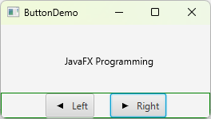

```java
import javafx.application.Application;
import javafx.stage.Stage;
import javafx.geometry.Pos;
import javafx.scene.Scene;
import javafx.scene.control.Button;
import javafx.scene.image.ImageView;
import javafx.scene.layout.BorderPane;
import javafx.scene.layout.HBox;
import javafx.scene.layout.Pane;
import javafx.scene.text.Text;

public class ButtonDemo extends Application {
  protected Text text = new Text(50, 50, "JavaFX Programming");
  
  protected BorderPane getPane() {
    HBox paneForButtons = new HBox(20);

    Button btLeft = new Button("Left", new ImageView("image/left.gif"));
    Button btRight = new Button("Right", new ImageView("image/right.gif"));   

    paneForButtons.getChildren().addAll(btLeft, btRight);
    paneForButtons.setAlignment(Pos.CENTER);
    paneForButtons.setStyle("-fx-border-color: green");

    BorderPane pane = new BorderPane();
    pane.setBottom(paneForButtons);
    
    Pane paneForText = new Pane();
    paneForText.getChildren().add(text);
    pane.setCenter(paneForText);
    
    btLeft.setOnAction(e -> text.setX(text.getX() - 10));
    btRight.setOnAction(e -> text.setX(text.getX() + 10));
    
    return pane;
  }
  
  @Override
  public void start(Stage primaryStage) {
    Scene scene = new Scene(getPane(), 450, 200);
    primaryStage.setTitle("ButtonDemo");
    primaryStage.setScene(scene);
    primaryStage.show();
  }

  public static void main(String[] args) {
    launch(args);
  }
}
```


[CheckBox](https://openjfx.io/javadoc/11/javafx.controls/javafx/scene/control/CheckBox.html)
---
* used for the user to make a selection
* derived from ButtonBase

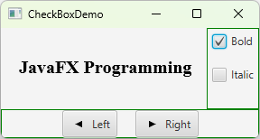

```java
import javafx.event.ActionEvent;
import javafx.event.EventHandler;
import javafx.geometry.Insets;
import javafx.scene.control.CheckBox;
import javafx.scene.layout.BorderPane;
import javafx.scene.layout.VBox;
import javafx.scene.text.Font;
import javafx.scene.text.FontPosture;
import javafx.scene.text.FontWeight;

public class CheckBoxDemo extends ButtonDemo {
    @Override
    protected BorderPane getPane() {
        BorderPane pane = super.getPane();

        Font fontBoldItalic = Font.font("Times New Roman",
                FontWeight.BOLD, FontPosture.ITALIC, 20);
        Font fontBold = Font.font("Times New Roman",
                FontWeight.BOLD, FontPosture.REGULAR, 20);
        Font fontItalic = Font.font("Times New Roman",
                FontWeight.NORMAL, FontPosture.ITALIC, 20);
        Font fontNormal = Font.font("Times New Roman",
                FontWeight.NORMAL, FontPosture.REGULAR, 20);

        text.setFont(fontNormal);

        VBox paneForCheckBoxes = new VBox(20);
        paneForCheckBoxes.setPadding(new Insets(5, 5, 5, 5));
        paneForCheckBoxes.setStyle("-fx-border-color: green");

        CheckBox chkBold = new CheckBox("Bold");
        CheckBox chkItalic = new CheckBox("Italic");
        paneForCheckBoxes.getChildren().addAll(chkBold, chkItalic);
        pane.setRight(paneForCheckBoxes);

        EventHandler<ActionEvent> handler = e -> {
            if (chkBold.isSelected() && chkItalic.isSelected()) {
                text.setFont(fontBoldItalic);
            } else if (chkBold.isSelected()) {
                text.setFont(fontBold);
            } else if (chkItalic.isSelected()) {
                text.setFont(fontItalic);
            } else {
                text.setFont(fontNormal);
            }
        };

        chkBold.setOnAction(handler);
        chkItalic.setOnAction(handler);

        return pane;
    }

    public static void main(String[] args) {
        launch(args);
    }
}
```


[RadioButton](https://openjfx.io/javadoc/11/javafx.controls/javafx/scene/control/RadioButton.html)
---
- known as option buttons
- derived from [Toggle button](https://openjfx.io/javadoc/11/javafx.controls/javafx/scene/control/ToggleButton.html)
- enable you to choose a single item from a group of choices


```java
import javafx.geometry.Insets;
import javafx.scene.control.RadioButton;
import javafx.scene.control.ToggleGroup;
import javafx.scene.layout.BorderPane;
import javafx.scene.layout.VBox;
import javafx.scene.paint.Color;

public class RadioButtonDemo extends CheckBoxDemo {
    @Override
    protected BorderPane getPane() {
        BorderPane pane = super.getPane();

        VBox paneForRadioButtons = new VBox(20);
        paneForRadioButtons.setPadding(new Insets(5, 5, 5, 5));
        paneForRadioButtons.setStyle("-fx-border-color: green");
        paneForRadioButtons.setStyle("-fx-border-width: 2px; -fx-border-color: green");

        RadioButton rbRed = new RadioButton("Red");
        RadioButton rbGreen = new RadioButton("Green");
        RadioButton rbBlue = new RadioButton("Blue");
        paneForRadioButtons.getChildren().addAll(rbRed, rbGreen, rbBlue);
        pane.setLeft(paneForRadioButtons);

        ToggleGroup group = new ToggleGroup();
        rbRed.setToggleGroup(group);
        rbGreen.setToggleGroup(group);
        rbBlue.setToggleGroup(group);

        rbRed.setOnAction(e -> {
            if (rbRed.isSelected()) {
                text.setFill(Color.RED);
            }
        });

        rbGreen.setOnAction(e -> {
            if (rbGreen.isSelected()) {
                text.setFill(Color.GREEN);
            }
        });

        rbBlue.setOnAction(e -> {
            if (rbBlue.isSelected()) {
                text.setFill(Color.BLUE);
            }
        });

        return pane;
    }

    public static void main(String[] args) {
        launch(args);
    }
}
```


[TextField](https://openjfx.io/javadoc/11/javafx.controls/javafx/scene/control/TextField.html)
---
- used to enter or display a single line of text
- a subclass of TextInputControl

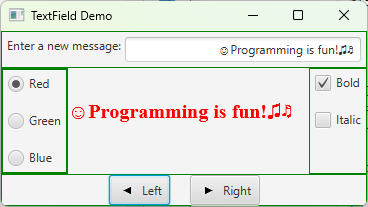

```java
import javafx.geometry.Insets;
import javafx.geometry.Pos;
import javafx.scene.control.Label;
import javafx.scene.control.TextField;
import javafx.scene.layout.BorderPane;

public class TextFieldDemo extends RadioButtonDemo {
  @Override
  protected BorderPane getPane() {
    BorderPane pane = super.getPane();
    
    BorderPane paneForTextField = new BorderPane();
    paneForTextField.setPadding(new Insets(5, 5, 5, 5)); 
    paneForTextField.setStyle("-fx-border-color: green");
    paneForTextField.setLeft(new Label("Enter a new message: "));
    
    TextField tf = new TextField();
    tf.setAlignment(Pos.BOTTOM_RIGHT);
    paneForTextField.setCenter(tf);
    pane.setTop(paneForTextField);
    
    tf.setOnAction(e -> text.setText(tf.getText()));
    
    return pane;
  }

  public static void main(String[] args) {
    launch(args);
  }
}
```


[TextArea](https://openjfx.io/javadoc/11/javafx.controls/javafx/scene/control/TextArea.html)
---
- enables the user to enter multiple lines of text

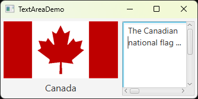

```java
// TextAreaDemo.java
import javafx.application.Application;
import javafx.stage.Stage;
import javafx.scene.Scene;
import javafx.scene.image.ImageView;

public class TextAreaDemo extends Application {
    @Override
    public void start(Stage primaryStage) {
        DescriptionPane descriptionPane = new DescriptionPane();

        descriptionPane.setTitle("Canada");
        String description = "The Canadian national flag ...";
        descriptionPane.setImageView(new ImageView("image/ca.gif"));
        descriptionPane.setDescription(description);

        Scene scene = new Scene(descriptionPane, 450, 200);
        primaryStage.setTitle("TextAreaDemo");
        primaryStage.setScene(scene);
        primaryStage.show();
    }

    public static void main(String[] args) {
        launch(args);
    }
}

// DescriptionPane.java
import javafx.geometry.Insets;
import javafx.scene.control.Label;
import javafx.scene.control.ContentDisplay;
import javafx.scene.control.ScrollPane;
import javafx.scene.control.TextArea;
import javafx.scene.image.ImageView;
import javafx.scene.layout.BorderPane;
import javafx.scene.text.Font;

public class DescriptionPane extends BorderPane {
    private Label lblImageTitle = new Label();

    private TextArea taDescription = new TextArea();

    public DescriptionPane() {
        lblImageTitle.setContentDisplay(ContentDisplay.TOP);
        lblImageTitle.setPrefSize(200, 100);

        lblImageTitle.setFont(new Font("SansSerif", 16));
        taDescription.setFont(new Font("Serif", 14));

        taDescription.setWrapText(true);
        taDescription.setEditable(true);

        ScrollPane scrollPane = new ScrollPane(taDescription);

        setLeft(lblImageTitle);
        setCenter(scrollPane);
        setPadding(new Insets(5, 5, 5, 5));
    }

    public void setTitle(String title) {
        lblImageTitle.setText(title);
    }

    public void setImageView(ImageView icon) {
        lblImageTitle.setGraphic(icon);
    }

    public void setDescription(String text) {
        taDescription.setText(text);
    }
}
```


[ComboBox](https://openjfx.io/javadoc/11/javafx.controls/javafx/scene/control/ComboBox.html)
---
- also known as a choice list or drop-down list 
- contains a list of items from which the user can choose

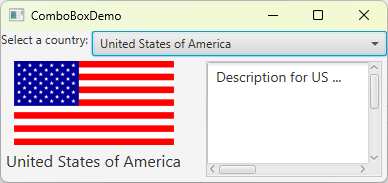

```java
import javafx.application.Application;
import javafx.stage.Stage;
import javafx.collections.FXCollections;
import javafx.collections.ObservableList;
import javafx.scene.Scene;
import javafx.scene.control.ComboBox;
import javafx.scene.control.Label;
import javafx.scene.image.ImageView;
import javafx.scene.layout.BorderPane;

public class ComboBoxDemo extends Application {
    private String[] flagTitles = { "Canada", "China", "Denmark",
            "France", "Germany", "India", "Norway", "United Kingdom",
            "United States of America" };

    private ImageView[] flagImage = {
            new ImageView("image/ca.gif"),
            new ImageView("image/china.gif"),
            new ImageView("image/denmark.gif"),
            new ImageView("image/fr.gif"),
            new ImageView("image/germany.gif"),
            new ImageView("image/india.gif"),
            new ImageView("image/norway.gif"),
            new ImageView("image/uk.gif"),
            new ImageView("image/us.gif") };

    private String[] flagDescription = new String[9];
    private DescriptionPane descriptionPane = new DescriptionPane();
    private ComboBox<String> cbo = new ComboBox<>();

    @Override
    public void start(Stage primaryStage) {
        flagDescription[0] = "The Canadian national flag ...";
        flagDescription[1] = "Description for China ... ";
        flagDescription[2] = "Description for Denmark ... ";
        flagDescription[3] = "Description for France ... ";
        flagDescription[4] = "Description for Germany ... ";
        flagDescription[5] = "Description for India ... ";
        flagDescription[6] = "Description for Norway ... ";
        flagDescription[7] = "Description for UK ... ";
        flagDescription[8] = "Description for US ... ";

        setDisplay(0);

        BorderPane pane = new BorderPane();

        BorderPane paneForComboBox = new BorderPane();
        paneForComboBox.setLeft(new Label("Select a country: "));
        paneForComboBox.setCenter(cbo);
        pane.setTop(paneForComboBox);
        cbo.setPrefWidth(400);
        cbo.setValue("Canada");

        ObservableList<String> items = FXCollections.observableArrayList(flagTitles);
        cbo.getItems().addAll(items);
        pane.setCenter(descriptionPane);

        cbo.setOnAction(e -> setDisplay(items.indexOf(cbo.getValue())));

        Scene scene = new Scene(pane, 450, 170);
        primaryStage.setTitle("ComboBox Demo");
        primaryStage.setScene(scene);
        primaryStage.show();
    }

    public void setDisplay(int index) {
        descriptionPane.setTitle(flagTitles[index]);
        descriptionPane.setImageView(flagImage[index]);
        descriptionPane.setDescription(flagDescription[index]);
    }

    public static void main(String[] args) {
        launch(args);
    }
}
```

[ListView](https://openjfx.io/javadoc/11/javafx.controls/javafx/scene/control/ListView.html)
---
- performs basically the same function as a combo box 
- but it enables the user to choose a single value or multiple values

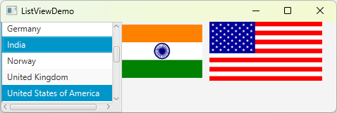

```java
import javafx.application.Application;
import javafx.stage.Stage;
import javafx.collections.FXCollections;
import javafx.scene.Scene;
import javafx.scene.control.ListView;
import javafx.scene.control.ScrollPane;
import javafx.scene.control.SelectionMode;
import javafx.scene.image.ImageView;
import javafx.scene.layout.BorderPane;
import javafx.scene.layout.FlowPane;

public class ListViewDemo extends Application {
    private String[] flagTitles = { "Canada", "China", "Denmark",
            "France", "Germany", "India", "Norway", "United Kingdom",
            "United States of America" };

    private ImageView[] ImageViews = {
            new ImageView("image/ca.gif"),
            new ImageView("image/china.gif"),
            new ImageView("image/denmark.gif"),
            new ImageView("image/fr.gif"),
            new ImageView("image/germany.gif"),
            new ImageView("image/india.gif"),
            new ImageView("image/norway.gif"),
            new ImageView("image/uk.gif"),
            new ImageView("image/us.gif")
    };

    @Override
    public void start(Stage primaryStage) {
        ListView<String> lv = new ListView<>(FXCollections.observableArrayList(flagTitles));
        lv.setPrefSize(170, 400);
        lv.getSelectionModel().setSelectionMode(SelectionMode.MULTIPLE);

        FlowPane imagePane = new FlowPane(10, 10);
        BorderPane pane = new BorderPane();
        pane.setLeft(new ScrollPane(lv));
        pane.setCenter(imagePane);

        lv.getSelectionModel().selectedItemProperty().addListener(
                ov -> {
                    imagePane.getChildren().clear();
                    for (Integer i : lv.getSelectionModel().getSelectedIndices()) {
                        imagePane.getChildren().add(ImageViews[i]);
                    }
                });

        Scene scene = new Scene(pane, 450, 170);
        primaryStage.setTitle("ListViewDemo");
        primaryStage.setScene(scene);
        primaryStage.show();
    }

    public static void main(String[] args) {
        launch(args);
    }
}
```


[ScrollBar](https://openjfx.io/javadoc/11/javafx.controls/javafx/scene/control/ScrollBar.html)
---
- enables the user to select from a range of values
- appears in two styles: horizontal and vertical

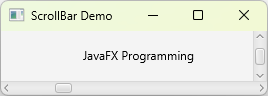

```java
import javafx.application.Application;
import javafx.stage.Stage;
import javafx.geometry.Orientation;
import javafx.scene.Scene;
import javafx.scene.control.ScrollBar;
import javafx.scene.layout.BorderPane;
import javafx.scene.layout.Pane;
import javafx.scene.text.Text;

public class ScrollBarDemo extends Application {
    @Override
    public void start(Stage primaryStage) {
        Text text = new Text(20, 20, "JavaFX Programming");

        ScrollBar sbHorizontal = new ScrollBar();
        ScrollBar sbVertical = new ScrollBar();
        sbVertical.setOrientation(Orientation.VERTICAL);

        Pane paneForText = new Pane();
        paneForText.getChildren().add(text);

        BorderPane pane = new BorderPane();
        pane.setCenter(paneForText);
        pane.setBottom(sbHorizontal);
        pane.setRight(sbVertical);

        sbHorizontal.valueProperty().addListener(ov -> 
                text.setX(sbHorizontal.getValue() * paneForText.getWidth() / sbHorizontal.getMax()));

        sbVertical.valueProperty().addListener(ov -> 
                text.setY(sbVertical.getValue() * paneForText.getHeight() / sbVertical.getMax()));

        Scene scene = new Scene(pane, 450, 170);
        primaryStage.setTitle("ScrollBar Demo");
        primaryStage.setScene(scene);
        primaryStage.show();
    }

    public static void main(String[] args) {
        launch(args);
    }
}
```


[Slider](https://openjfx.io/javadoc/11/javafx.controls/javafx/scene/control/Slider.html)
---
- similar to ScrollBar 
- but has more properties and can appear in many forms

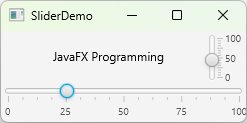

```java
import javafx.application.Application;
import javafx.stage.Stage;
import javafx.geometry.Orientation;
import javafx.scene.Scene;
import javafx.scene.control.Slider;
import javafx.scene.layout.BorderPane;
import javafx.scene.layout.Pane;
import javafx.scene.text.Text;

public class SliderDemo extends Application {
  @Override
  public void start(Stage primaryStage) {
    Text text = new Text(20, 20, "JavaFX Programming");
    
    Slider slHorizontal = new Slider();
    slHorizontal.setShowTickLabels(true);
    slHorizontal.setShowTickMarks(true);    
    
    Slider slVertical = new Slider();
    slVertical.setOrientation(Orientation.VERTICAL);
    slVertical.setShowTickLabels(true);
    slVertical.setShowTickMarks(true);
    slVertical.setValue(100);
    
    Pane paneForText = new Pane();
    paneForText.getChildren().add(text);
    
    BorderPane pane = new BorderPane();
    pane.setCenter(paneForText);
    pane.setBottom(slHorizontal);
    pane.setRight(slVertical);

    slHorizontal.valueProperty().addListener(ov -> 
      text.setX(slHorizontal.getValue() * paneForText.getWidth() /
        slHorizontal.getMax()));
    
    slVertical.valueProperty().addListener(ov -> 
      text.setY((slVertical.getMax() - slVertical.getValue()) 
        * paneForText.getHeight() / slVertical.getMax()));
    
    Scene scene = new Scene(pane, 450, 170);
    primaryStage.setTitle("SliderDemo");
    primaryStage.setScene(scene);
    primaryStage.show();
  }

  public static void main(String[] args) {
    launch(args);
  }
}
```


Case Study: Bounce Ball
---
- control the speed of the ball movement with a slider

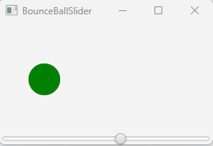

- source code
  - [BounceBallSlider.java](./demos/BounceBallSlider.java)
  - [BallPane.java](./demos/BallPane.java)

Case Study:  TicTacToe
---


# Reference textbooks
* [Introduction to Java Programming, Comprehensive, 12/E](https://media.pearsoncmg.com/bc/abp/cs-resources/products/product.html#product,isbn=0136519350)
  * [Student resources](https://media.pearsoncmg.com/ph/esm/ecs_liang_ijp_12/cw/)
  * [Source code](https://media.pearsoncmg.com/ph/esm/ecs_liang_ijp_12/cw/content/source-code.php)
* [JavaFX API documentation](https://openjfx.io/javadoc/11/)
  * [JavaFX Documentation Project](https://fxdocs.github.io/docs/html5/)
* [JavaFX 11: IllegalAccessError when creating Label](https://stackoverflow.com/questions/54291958/javafx-11-illegalaccesserror-when-creating-label)
* [Where to put resource files in JavaFX](https://edencoding.com/where-to-put-resource-files-in-javafx/)