# Event-Driven Programming and Animations

Motivations
---
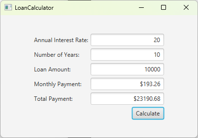

* [source code](./demos/LoanCalculator.java)

* In *event-driven programming*, code is executed upon activation of events. 
* *Procedural programming* is executed in procedural order


Objectives
---
* Exploit events, event sources, and event classes
* Handle events with 
  * handler classes
    * defined as inner classes
    * defined as anonymous inner classes
  * lambda expressions
* Deal with popular events
  * MouseEvents 
  * KeyEvents 
  * Value-change events
* Develop animations with Animation, PathTransition, FadeTransition, and Timeline classes


Taste of Event-Driven Programming
---
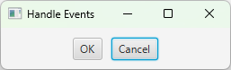

```java
import javafx.application.Application;
import javafx.geometry.Pos;
import javafx.scene.Scene;
import javafx.scene.control.Button;
import javafx.scene.layout.HBox;
import javafx.stage.Stage;
import javafx.event.ActionEvent;
import javafx.event.EventHandler;

public class HandleEvent extends Application {
  @Override
  public void start(Stage primaryStage) {
    HBox pane = new HBox(10);
    pane.setAlignment(Pos.CENTER);

    Button btOK = new Button("OK");
    Button btCancel = new Button("Cancel");

    OKHandlerClass handler1 = new OKHandlerClass();
    btOK.setOnAction(handler1);

    CancelHandlerClass handler2 = new CancelHandlerClass();
    btCancel.setOnAction(handler2);
    
    pane.getChildren().addAll(btOK, btCancel);
    
    Scene scene = new Scene(pane);
    primaryStage.setTitle("Handle Events");
    primaryStage.setScene(scene);
    primaryStage.show();
  }

  public static void main(String[] args) {
    launch(args);
  }
} 

class OKHandlerClass implements EventHandler<ActionEvent> {
  @Override
  public void handle(ActionEvent e) {
    System.out.println("OK button clicked"); 
  }
}

class CancelHandlerClass implements EventHandler<ActionEvent> {
  @Override
  public void handle(ActionEvent e) {
    System.out.println("Cancel button clicked");
  }
}
```


Flow of events
---
* Source object ---(event)---> Event handler
* User action trigger an event
  * An event signals the program that something has happened
  * Popular events: mouse movements, mouse clicks, or keystrokes
* Source object register event handler with *setOnXEventType(handler)*
  ```java
  btOK.setOnAction(handler);
  ```
* Event handler handles the event with *handle(event)*
  * an event handler is also called an event listener
  * must be an instance of [EventHandler\<T extends Event\>](https://openjfx.io/javadoc/11/javafx.base/javafx/event/EventHandler.html) for an event T
  * The program can choose to respond to or ignore an event


[Event classes](https://openjfx.io/javadoc/11/javafx.base/javafx/event/Event.html)
---
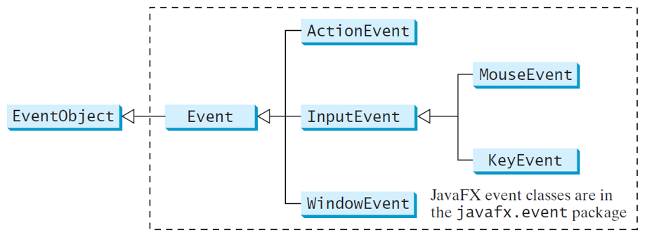


Event information
---
* An event object contains pertinent information
  * getSource(), getTarget(), getEventType() 
* The subclasses of EventObject deal with specific types of events
  * action events, window events, mouse events, and key events
* If a component can fire an event, any subclass of the component can fire the same type of event
  * Node can fire MouseEvent and KeyEvent
  * So, every JavaFX shape, layout pane, and control can fire ­MouseEvent and KeyEvent


Enlarge Shrink a circle
---
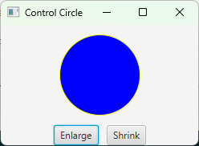

```java
import javafx.application.Application;
import javafx.event.ActionEvent;
import javafx.event.EventHandler;
import javafx.geometry.Pos;
import javafx.scene.Scene;
import javafx.scene.control.Button;
import javafx.scene.layout.StackPane;
import javafx.scene.layout.HBox;
import javafx.scene.layout.BorderPane;
import javafx.scene.paint.Color;
import javafx.scene.shape.Circle;
import javafx.stage.Stage;

public class ControlCircle extends Application {
  private CirclePane circlePane = new CirclePane();

  @Override
  public void start(Stage primaryStage) {
    HBox hBox = new HBox();
    hBox.setSpacing(10);
    hBox.setAlignment(Pos.CENTER);
    Button btEnlarge = new Button("Enlarge");
    Button btShrink = new Button("Shrink");
    hBox.getChildren().add(btEnlarge);
    hBox.getChildren().add(btShrink);
    
    btEnlarge.setOnAction(new EnlargeHandler());

    BorderPane borderPane = new BorderPane();
    borderPane.setCenter(circlePane);
    borderPane.setBottom(hBox);
    BorderPane.setAlignment(hBox, Pos.CENTER);
    
    Scene scene = new Scene(borderPane, 200, 150);
    primaryStage.setTitle("ControlCircle");
    primaryStage.setScene(scene);
    primaryStage.show();
  }
  
  class EnlargeHandler implements EventHandler<ActionEvent> {
    @Override
    public void handle(ActionEvent e) {
      circlePane.enlarge();
    }
  }

  // Practice:
  // implement shrinking the circle
  
  public static void main(String[] args) {
    launch(args);
  }
}

class CirclePane extends StackPane {
  private Circle circle = new Circle(50); 
  
  public CirclePane() {
    getChildren().add(circle);
    circle.setStroke(Color.YELLOW);
    circle.setFill(Color.BLUE);
  }
  
  public void enlarge() {
    circle.setRadius(circle.getRadius() + 2);
  }
  
  public void shrink() {
    circle.setRadius(circle.getRadius() > 2 ? 
      circle.getRadius() - 2 : circle.getRadius());
  }
}
```

Practice
---
* implement shrinking the circle


Define a listener class 
---
* A listener class is designed specifically for a GUI component
* It is appropriate to define it as
  * an *inner class* as a member inside the frame (outer) class
  * an *anonymous* inner class
  * *lambda* expressions


Inner class
---
* is compiled into a class named *OuterClassName$InnerClassName.class*
* can reference the data and methods defined in the outer class
  * can make programs simple
* may be used just like a regular class, mainly by its outer class
  * Objects of an inner class are often created in the outer class
    ```java
    OuterClass.InnerClass innerObject = outerObject.new InnerClass();
    ```
* can be defined with a visibility modifier like public, protected, or private
* can be defined as static
  * cannot access nonstatic members of the outer class 
  ```java
  OuterClass.InnerClass innerObject = new OuterClass.InnerClass();
  ```
* avoid class-naming conflicts


Anonymous Inner-Class
---
* combines defining an inner class and creating an instance of the class into one step
  ```java
  new SuperClassName/InterfaceName() {
    // Implement or override methods in superclass or interface
    // Other methods if necessary
  }
  ```
* must always extend a superclass or implement an interface without an explicit extends or implements clause
  * must implement **all** the abstract methods in the superclass or in the interface
  * always uses the *no-arg constructor* from its superclass to create an instance
  * the constructor is *Object()* if it implements an interface
* is compiled into a class named *OuterClassName$n.class*, n is a positive integer
* the handler can access local variables


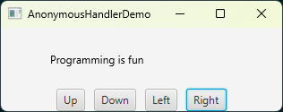

```java
import javafx.application.Application;
import javafx.event.ActionEvent;
import javafx.event.EventHandler;
import javafx.geometry.Pos;
import javafx.scene.Scene;
import javafx.scene.control.Button;
import javafx.scene.layout.BorderPane;
import javafx.scene.layout.HBox;
import javafx.scene.layout.Pane;
import javafx.scene.text.Text;
import javafx.stage.Stage;

public class AnonymousHandlerDemo extends Application {
  @Override
  public void start(Stage primaryStage) {
    Text text = new Text(40, 40, "Programming is fun");
    Pane pane = new Pane(text);
    
    Button btUp = new Button("Up");
    Button btDown = new Button("Down");
    Button btLeft = new Button("Left");
    Button btRight = new Button("Right");
    HBox hBox = new HBox(btUp, btDown, btLeft, btRight);
    hBox.setSpacing(10);
    hBox.setAlignment(Pos.CENTER);
    
    BorderPane borderPane = new BorderPane(pane);
    borderPane.setBottom(hBox);
    
    btUp.setOnAction(new EventHandler<ActionEvent>() {
      @Override
      public void handle(ActionEvent e) {
        //  the handler can access local variables like this text
        text.setY(text.getY() > 10 ? text.getY() - 5 : 10);
      }
    });

    btDown.setOnAction(new EventHandler<ActionEvent>() {
      @Override
      public void handle(ActionEvent e) {
        text.setY(text.getY() < pane.getHeight() ? 
          text.getY() + 5 : pane.getHeight());
      }
    });
    
    btLeft.setOnAction(new EventHandler<ActionEvent>() {
      @Override
      public void handle(ActionEvent e) {
        text.setX(text.getX() > 0 ? text.getX() - 5 : 0);
      }
    });
    
    btRight.setOnAction(new EventHandler<ActionEvent>() {
      @Override
      public void handle(ActionEvent e) {
        text.setX(text.getX() < pane.getWidth() - 100?
          text.getX() + 5 : pane.getWidth() - 100);
      }
    });

    Scene scene = new Scene(borderPane, 400, 350);
    primaryStage.setTitle("AnonymousHandlerDemo");
    primaryStage.setScene(scene);
    primaryStage.show();
  }
  
  public static void main(String[] args) {
    launch(args);
  }
}
```


Simplifying Event Handing Using Lambda Expressions
---
* Lambda expressions can be viewed as an anonymous method with a concise syntax
  ```java
  btEnlarge.setOnAction(
    new EventHandler<ActionEvent>(){
      @override
      public void handle(ActionEvent e){
        // processing event e
      }
    }
  ); 
  // can be simplified to be
  btEnlarge.setOnAction(
    e -> {
      // processing event e
    }
  );
  ```


Basic Syntax for a Lambda Expression
---
* (type1 param1, type2 param2, ...) -> expression
  * (type1 param1, type2 param2, ...) -> { statements; }
* The data type for a parameter may be explicitly declared 
  * or implicitly inferred by the compiler
* The parentheses can be omitted if there is only one parameter without an explicit data type. the following four lambda expressions are all equivalent:
  ```java
  (ActionEvent e) -> { circlePane.enlarge(); }
  (e) -> { circlePane.enlarge(); }
  e -> { circlePane.enlarge(); }
  e -> circlePane.enlarge()
  ```

```java
import javafx.application.Application;
import javafx.geometry.Pos;
import javafx.scene.Node;
import javafx.scene.Scene;
import javafx.scene.control.Button;
import javafx.scene.input.KeyCode;
import javafx.scene.input.MouseButton;
import javafx.scene.layout.HBox;
import javafx.scene.layout.BorderPane;
import javafx.stage.Stage;

public class ControlCircleWithMouseAndKey extends Application {
  private CirclePane circlePane = new CirclePane();

  @Override
  public void start(Stage primaryStage) {
    HBox hBox = new HBox();
    hBox.setSpacing(10);
    hBox.setAlignment(Pos.CENTER);
    Button btEnlarge = new Button("Enlarge");
    Button btShrink = new Button("Shrink");
    hBox.getChildren().add(btEnlarge);
    hBox.getChildren().add(btShrink);
    
    btEnlarge.setOnAction(e -> circlePane.enlarge());
    btShrink.setOnAction(e -> circlePane.shrink());
    
    BorderPane borderPane = new BorderPane();
    borderPane.setCenter(circlePane);
    borderPane.setBottom(hBox);
    BorderPane.setAlignment(hBox, Pos.CENTER);
    
    Scene scene = new Scene(borderPane, 200, 150);
    primaryStage.setTitle("ControlCircle");
    primaryStage.setScene(scene);
    primaryStage.show();
    
    for (Node n : borderPane.getChildren()) {
      n.setFocusTraversable(true);
    }

    scene.setOnMouseClicked(e -> {
      if (e.getButton() == MouseButton.PRIMARY) {
        circlePane.enlarge();
      }
      else if (e.getButton() == MouseButton.SECONDARY) {
        circlePane.shrink();
      }
    });
    
    scene.setOnKeyPressed(e -> {
      if (e.getCode() == KeyCode.UP) {
        circlePane.enlarge();
      }
      else if (e.getCode() == KeyCode.DOWN) {
        circlePane.shrink();
      }
    });
  }
  
  public static void main(String[] args) {
    launch(args);
  }
}
```


Single Abstract Method Interface (SAM)
---
* An interface contains exactly one abstract method is known as 
  * a functional interface, or 
  * a Single Abstract Method (SAM) interface
  * an instance of a functional interface is known as a *function object*
* [EventHandler](https://openjfx.io/javadoc/11/javafx.base/javafx/event/EventHandler.html) is a SAM
  * it contains just one method named *handle*
* The statements in the lambda expression is all for that SAM method
  * If an interface contains multiple methods, the compiler will not be able to compile the lambda expression
* a lambda expression 
  * creates an object and the object performs a function by invoking this single method
  * is also called a *lambda function*

```java
import javafx.application.Application;
import javafx.event.ActionEvent;
import javafx.geometry.Pos;
import javafx.scene.Scene;
import javafx.scene.control.Button;
import javafx.scene.layout.HBox;
import javafx.stage.Stage;

public class LambdaHandlerDemo extends Application {
  @Override
  public void start(Stage primaryStage) {
    HBox hBox = new HBox();
    hBox.setSpacing(10);
    hBox.setAlignment(Pos.CENTER);
    Button btNew = new Button("New");
    Button btOpen = new Button("Open");
    Button btSave = new Button("Save");
    Button btPrint = new Button("Print");
    hBox.getChildren().addAll(btNew, btOpen, btSave, btPrint);
  
    btNew.setOnAction((ActionEvent e) -> {
      System.out.println("Process New");
    });

    btOpen.setOnAction((e) -> {
      System.out.println("Process Open");
    });
    
    btSave.setOnAction(e -> {
      System.out.println("Process Save");
    });
    
    btPrint.setOnAction(e -> System.out.println("Process Print"));

    Scene scene = new Scene(hBox, 300, 50);
    primaryStage.setTitle("LambdaHandlerDemo");
    primaryStage.setScene(scene);
    primaryStage.show();
  }
  
  public static void main(String[] args) {
    launch(args);
  }
}
```


Define a custom functional interface
---

```java
public class TestLambda {
  public static void main(String[] args) {
    TestLambda test = new TestLambda();
    test.setAction1(() -> System.out.print("Action 1! "));
    test.setAction2(e -> System.out.print(e + " "));
    System.out.println(test.getValue((e1, e2) -> e1 + e2));
  }

  public void setAction1(T1 t) {
    t.m1();
  }
  
  public void setAction2(T2 t) {
    t.m2(4.5);
  }
  
  public int getValue(T3 t) {
    return t.m3(5, 2);
  }
}

@FunctionalInterface
interface T1 {
  public void m1();
}

@FunctionalInterface
interface T2 {
  public void m2(Double d);
}

@FunctionalInterface
interface T3 {
  public int m3(int d1, int d2);
}
```  

* T1, T2, and T3 are all SAMs, so
  ```java
  test.setAction1(() -> System.out.print("Action 1! "));
  // is equivalent to
  test.setAction1(new T1() {
    @Override
    public void m1() {
      System.out.print("Action 1! ");
    }
  });
  ```


Case Study: Loan Calculator
---


* [source code](./demos/LoanCalculator.java)


Mouse events
---
* A MouseEvent is fired whenever a mouse button is 
  * pressed, released, clicked, moved,  
  * dragged on a node or a scene
* The MouseEvent object captures the event, such as 
  * the number of clicks associated with it, 
  * the location (the x- and y-coordinates) of the mouse, 
  * which mouse button was pressed
* [MouseEvent class](https://openjfx.io/javadoc/11/javafx.graphics/javafx/scene/input/MouseEvent.html)
* [MouseDragEvent class](https://openjfx.io/javadoc/11/javafx.graphics/javafx/scene/input/MouseDragEvent.html)


MouseEventDemo
---

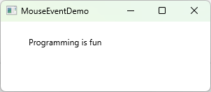

```java
import javafx.application.Application;
import javafx.scene.Scene;
import javafx.scene.layout.Pane;
import javafx.scene.text.Text;
import javafx.stage.Stage;

public class MouseEventDemo extends Application {
  @Override
  public void start(Stage primaryStage) {
    Pane pane = new Pane();
    Text text = new Text(20, 20, "Programming is fun");
    pane.getChildren().addAll(text);
    text.setOnMouseDragged(e -> {       
      text.setX(e.getX());
      text.setY(e.getY());
    });
    
    Scene scene = new Scene(pane, 300, 100);
    primaryStage.setTitle("MouseEventDemo");
    primaryStage.setScene(scene);
    primaryStage.show();
  }

  public static void main(String[] args) {
    launch(args);
  }
} 
```


Key Events
---
* A KeyEvent is fired whenever a key is 
  * pressed, held, released
  * typed on a node or a scene
* Key events enable the use of the keys to 
  * control and perform actions 
  * get input from the keyboard
* [KeyEvent class](https://openjfx.io/javadoc/11/javafx.graphics/javafx/scene/input/KeyEvent.html)
  * [KeyCode enum](https://openjfx.io/javadoc/11/javafx.graphics/javafx/scene/input/KeyCode.html)


Key Event Demo
---

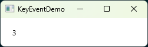

```java
import javafx.application.Application;
import javafx.scene.Scene;
import javafx.scene.layout.Pane;
import javafx.scene.text.Text;
import javafx.stage.Stage;

public class KeyEventDemo extends Application {
    @Override
    public void start(Stage primaryStage) {
      Pane pane = new Pane();
      Text text = new Text(20, 20, "A");
      pane.getChildren().add(text);
      
      Scene scene = new Scene(pane);
      primaryStage.setTitle("KeyEventDemo");
      primaryStage.setScene(scene);
      primaryStage.show();
      
      text.setOnKeyPressed(e -> { 
        // System.out.println(e.getCode() + ":" + e.getText());       
        switch (e.getCode()) {
          case DOWN: text.setY(text.getY() + 10); break;
          case UP:  text.setY(text.getY() - 10); break;
          case LEFT: text.setX(text.getX() - 10); break;
          case RIGHT: text.setX(text.getX() + 10); break;
          default: 
            if (e.getText().length() > 0)
              text.setText(e.getText());
        }
      });
      // Only a focused node can receive KeyEvent
      text.requestFocus();
    }
  
    public static void main(String[] args) {
      launch(args);
    }
  } 
```

* scene is a top-level container for receiving key events
  *  need to invoke scene.requestFocus()

Practice
---
* Change text.setOnKeyPressed to scene.setOnKeyPressed
* Change setOnKeyPressed to setOnKeyPressed, setOnKeyTyped
* Uncomment the line: 
  ```java
  System.out.println(e.getCode() + ":" + e.getText());
  ```


Listeners for Observable Objects
---
* A listener can be registered to process a value change (invalidation) in an observable object
  * Every binding property is an instance of Observable
  * Once the value in the observable object is changed in the property, the listener is notified
* An observable object is an instance of [interface Observable](https://openjfx.io/javadoc/11/javafx.base/javafx/beans/Observable.html)
  * It contains the *addListener(InvalidationListener listener)* method for adding a listener
  * The listener class should implement the [InvalidationListener interface](https://openjfx.io/javadoc/11/javafx.base/javafx/beans/InvalidationListener.html)
    *  uses the invalidated(Observable o) method to handle the property value change
* Note: there are subtle difference between value change and value invalidation. They are  interchangeable here for simplicity.


Examples
---

```java
import javafx.beans.InvalidationListener;
import javafx.beans.Observable;
import javafx.beans.property.DoubleProperty;
import javafx.beans.property.SimpleDoubleProperty;

public class ObservablePropertyDemo {
  public static void main(String[] args) {
    DoubleProperty balance = new SimpleDoubleProperty();
    
    // using anonymous inner class
    balance.addListener(new InvalidationListener() {
      public void invalidated(Observable ov) {
        System.out.println("New value: " +  balance.doubleValue());
      }
    });

    // using lambda expression
    // multiple listener can be added
    balance.addListener(ov -> System.out.println("New value: " + balance.doubleValue()));

    balance.set(4.5);
  }
}
```

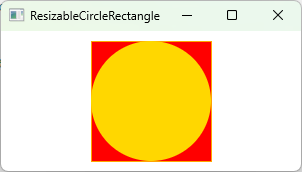

```java
import javafx.application.Application;
import javafx.scene.paint.Color;
import javafx.scene.shape.Circle;
import javafx.scene.shape.Rectangle;
import javafx.stage.Stage;
import javafx.scene.Scene;
import javafx.scene.layout.StackPane;

public class ResizableCircleRectangle extends Application {
  
  private Circle circle = new Circle(60);
  private Rectangle rectangle = new Rectangle(120, 120);
  private StackPane pane = new StackPane();
  
  @Override
  public void start(Stage primaryStage) {       
    circle.setFill(Color.GOLD);
    rectangle.setFill(Color.RED);
    rectangle.setStroke(Color.ORANGE);
    pane.getChildren().addAll(rectangle, circle);
    
    Scene scene = new Scene(pane, 300, 140);
    primaryStage.setTitle("ResizableCircleRectangle"); 
    primaryStage.setScene(scene);
    primaryStage.show();
    
    pane.widthProperty().addListener(ov -> resize());
    pane.heightProperty().addListener(ov -> resize());
  }
  
  private void resize() {
    double length = Math.min(pane.getWidth(), pane.getHeight());
    circle.setRadius(length / 2 - 15);
    rectangle.setWidth(length - 30);
    rectangle.setHeight(length - 30);
  }
  
  public static void main(String[] args) {
    launch(args);
  }
}

```


Animation
---

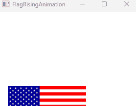

* JavaFX provides an abstract [Animation class](https://openjfx.io/javadoc/11/javafx.graphics/javafx/animation/Animation.html)
  * with the core functionality for all animations
* Animation class hierarchy
  ```
  Animation <- Transition <- PathTransition, FadeTransition, RotateTransition
            |<- Timeline
  ```
  
[PathTransition](https://openjfx.io/javadoc/11/javafx.graphics/javafx/animation/PathTransition.html)
---
* animates the moves of a node along a path from one end to the other over a given time

Animate a rectangle moving along the circle
---

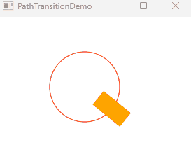

```java
import javafx.animation.*;
import javafx.application.Application;
import javafx.scene.Scene;
import javafx.scene.image.ImageView;
import javafx.scene.layout.Pane;
import javafx.scene.shape.Line;
import javafx.stage.Stage;
import javafx.util.Duration;

public class FlagRisingAnimation extends Application {
  @Override
  public void start(Stage primaryStage) {
    Pane pane = new Pane();
    
    ImageView imageView = new ImageView("us.gif");
    pane.getChildren().add(imageView);
    
    PathTransition pt = new PathTransition(Duration.millis(10000),
      new Line(100, 200, 100, 0), imageView);
    pt.setCycleCount(Timeline.INDEFINITE);
    pt.play();
    
    Scene scene = new Scene(pane, 250, 200);
    primaryStage.setTitle("FlagRisingAnimation");
    primaryStage.setScene(scene);
    primaryStage.show();
  }
  
  public static void main(String[] args) {
    launch(args);
  }
}
```

Rising US flag
---
* Download the  and save it in the same folder as FlagRisingAnimation.class


```java
import javafx.animation.*;
import javafx.application.Application;
import javafx.scene.Scene;
import javafx.scene.image.ImageView;
import javafx.scene.layout.Pane;
import javafx.scene.shape.Line;
import javafx.stage.Stage;
import javafx.util.Duration;

public class FlagRisingAnimation extends Application {
  @Override
  public void start(Stage primaryStage) {
    Pane pane = new Pane();
    
    ImageView imageView = new ImageView("us.gif");
    Line line = new Line(100, 200, 100, 0);
    pane.getChildren().add(imageView);
    // pane.getChildren().add(line);
    
    PathTransition pt = new PathTransition(Duration.millis(10000),
     line , imageView);
    pt.setCycleCount(100);
    pt.play();
    
    Scene scene = new Scene(pane, 250, 200);
    primaryStage.setTitle("FlagRisingAnimation");
    primaryStage.setScene(scene);
    primaryStage.show();
  }
  
  public static void main(String[] args) {
    launch(args);
  }
}
```

Practice
---
* Uncomment the line in the code and run it again
  ```java
  pane.getChildren().add(line);
  ```

[FadeTransition](https://openjfx.io/javadoc/11/javafx.graphics/javafx/animation/FadeTransition.html)
---
* animates the change of the opacity in a node over a given time

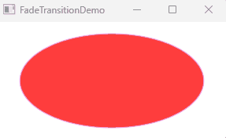

```java
import javafx.animation.FadeTransition;
import javafx.animation.Timeline;
import javafx.application.Application;
import javafx.scene.Scene;
import javafx.scene.layout.Pane;
import javafx.scene.paint.Color;
import javafx.scene.shape.Ellipse;
import javafx.stage.Stage;
import javafx.util.Duration;

public class FadeTransitionDemo extends Application {
  @Override
  public void start(Stage primaryStage) {
    Pane pane = new Pane();
    Ellipse ellipse = new Ellipse(10, 10, 100, 50);
    ellipse.setFill(Color.RED); 
    ellipse.setStroke(Color.VIOLET);
    ellipse.centerXProperty().bind(pane.widthProperty().divide(2));
    ellipse.centerYProperty().bind(pane.heightProperty().divide(2));    
    ellipse.radiusXProperty().bind(
      pane.widthProperty().multiply(0.4));    
    ellipse.radiusYProperty().bind(
      pane.heightProperty().multiply(0.4)); 
    pane.getChildren().add(ellipse);
    
    FadeTransition ft = 
      new FadeTransition(Duration.millis(3000), ellipse);
    ft.setFromValue(1.0);
    ft.setToValue(0.1);
    ft.setCycleCount(Timeline.INDEFINITE);
    ft.setAutoReverse(true);
    ft.play();
    
    ellipse.setOnMousePressed(e -> ft.pause());
    ellipse.setOnMouseReleased(e -> ft.play());
    
    Scene scene = new Scene(pane, 200, 150);
    primaryStage.setTitle("FadeTransitionDemo");
    primaryStage.setScene(scene);
    primaryStage.show();
  }
  
  public static void main(String[] args) {
    launch(args);
  }
}
```

[Timeline](https://openjfx.io/javadoc/11/javafx.graphics/javafx/animation/Timeline.html)
---
* programs any animation using one or more [KeyFrames](https://openjfx.io/javadoc/11/javafx.graphics/javafx/animation/KeyFrame.html)
  * Each KeyFrame is executed sequentially at a specified time interval

Flashing text
---

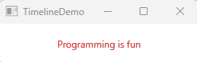

```java
import javafx.animation.Animation;
import javafx.application.Application;
import javafx.stage.Stage;
import javafx.animation.KeyFrame;
import javafx.animation.Timeline;
import javafx.event.ActionEvent;
import javafx.event.EventHandler;
import javafx.scene.Scene;
import javafx.scene.layout.StackPane;
import javafx.scene.paint.Color;
import javafx.scene.text.Text;
import javafx.util.Duration;

public class TimelineDemo extends Application {
  @Override
  public void start(Stage primaryStage) {
    StackPane pane = new StackPane();
    Text text = new Text(20, 50, "Programming if fun");
    text.setFill(Color.RED);
    pane.getChildren().add(text);

    EventHandler<ActionEvent> eventHandler = e -> {
      if (text.getText().length() != 0) {
        text.setText("");
      }
      else {
        text.setText("Programming is fun");
      }
    };
    
    // The eventHandler is called when the duration for the key frame elapsed
    Timeline animation = new Timeline(new KeyFrame(Duration.millis(500), eventHandler));
    animation.setCycleCount(Timeline.INDEFINITE);
    animation.play();

    text.setOnMouseClicked(e -> {
      if (animation.getStatus() == Animation.Status.PAUSED) {
        animation.play();
      }
      else {
        animation.pause();
      }
    });
    
    Scene scene = new Scene(pane, 250, 50);
    primaryStage.setTitle("TimelineDemo");
    primaryStage.setScene(scene);
    primaryStage.show();
  }

  public static void main(String[] args) {
    launch(args);
  }
}
```

A running clock
---

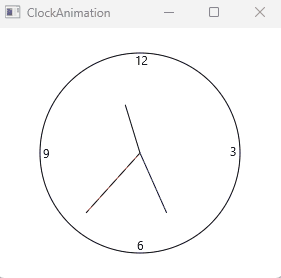

* [source code](./demos/ClockAnimation.java)


Case Study: Bouncing Ball
---

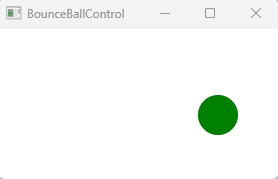

* source code
  * [BallPane](./demos/BallPane.java)
  * [BounceBallControl](./demos/BounceBallControl.java)

# Reference textbooks
* [Introduction to Java Programming, Comprehensive, 12/E](https://media.pearsoncmg.com/bc/abp/cs-resources/products/product.html#product,isbn=0136519350)
  * [Student resources](https://media.pearsoncmg.com/ph/esm/ecs_liang_ijp_12/cw/)
  * [Source code](https://media.pearsoncmg.com/ph/esm/ecs_liang_ijp_12/cw/content/source-code.php)
* [JavaFX API documentation](https://openjfx.io/javadoc/11/)
  * [JavaFX Documentation Project](https://fxdocs.github.io/docs/html5/)
* [JavaFX 11: IllegalAccessError when creating Label](https://stackoverflow.com/questions/54291958/javafx-11-illegalaccesserror-when-creating-label)
* [Handling JavaFX Events](https://docs.oracle.com/javafx/2/events/processing.htm)
* [Make GIF in Linux with one simple command](https://averagelinuxuser.com/make-gif-in-linux-with-one-simple-command/)
* [ScreenToGif](https://www.screentogif.com/)