# cop3809

Online resources and examples

# Module 3: JavaFX GUI programming
Chapter 14-16

## JavaFX Basics

First JavaFX Program
---
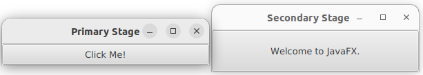

```java
import javafx.application.Application;
import javafx.stage.Stage;
import javafx.scene.Scene;
import javafx.scene.control.Button;

public class MyJavaFX extends Application {
   
  // the JVM constructs an instance of MyJavaFX using its no-arg constructor 
  // and invokes its start method
  @Override
  public void start(Stage primaryStage) {

    Button btOK = new Button("Click Me!");
    Scene scene = new Scene(btOK, 300, 30);
    primaryStage.setTitle("Primary Stage"); 
    primaryStage.setScene(scene); 
    primaryStage.show(); 

    Stage stage1 = new Stage();
    stage1.setTitle("Secondary Stage");
    stage1.setScene(new Scene(new Button("Welcome to JavaFX."), 300, 60));
    stage1.show();
  }
  
  /**
   * The main method is only needed for the IDE with limited
   * JavaFX support. Not needed for running from the command line.
   */
  public static void main(String[] args) { 
    launch(args);
  }
}
```

JavaFX
---
* Abstract Windows Toolkit(AWT) --> Swing --> JavaFX
* Basic Structure of JavaFX
  * Application
    * Override the start(Stage) method
  * Stage
    * A Stage object is a window
  * Scene 
    * A Scene object is a container for the JavaFX scene graph
  * Node
    * A node is a visual component 


Panes, Groups, UI Controls, and Shapes
---
* Panes, Groups, UI controls, and shapes are subtypes of Node
* Panes
  * automatically lay out the nodes in desired locations and sizes
* A group is a container that groups a collection of nodes 
  * Applying transformations or effects to a group automatically applies to all the children in the group
* [Hierarchy For All Packages](https://openjfx.io/javadoc/11/overview-tree.html)

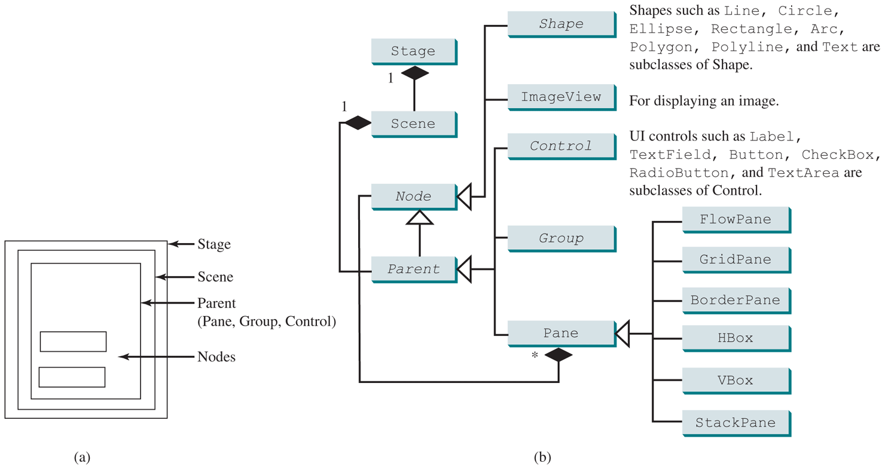

* (a) Panes and groups are used to hold nodes. 
* (b) Nodes can be shapes, image views, UI controls, groups, and panes.

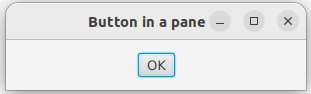

```java
import javafx.application.Application;
import javafx.stage.Stage;
import javafx.scene.Scene;
import javafx.scene.layout.StackPane;
import javafx.scene.control.Button;

public class ButtonInPane extends Application {
  @Override
  public void start(Stage primaryStage) {
    StackPane pane = new StackPane();
    pane.getChildren().add(new Button("OK"));    
    Scene scene = new Scene(pane, 300, 50);
    primaryStage.setTitle("Button in a pane");
    primaryStage.setScene(scene);
    primaryStage.show();
  }
  
  public static void main(String[] args) {
    launch(args);
  }
}
``` 


Display a Shape
---
* A circle is displayed in the center of the scene

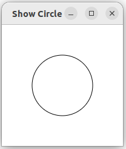

* Will the circle be centered after the window is resized?
  * No. Can be fixed with Binding Properties

```java
import javafx.application.Application;
import javafx.scene.Scene;
import javafx.scene.layout.Pane;
import javafx.scene.paint.Color;
import javafx.scene.shape.Circle;
import javafx.stage.Stage;

public class ShowCircle extends Application {
  @Override
  public void start(Stage primaryStage) {
    Circle circle = new Circle();

    // measurement units for graphics in Java are all in pixels
    circle.setCenterX(100);
    circle.setCenterY(100);
    circle.setRadius(50);
    circle.setStroke(Color.BLACK);
    circle.setFill(null);
    
    Pane pane = new Pane();
    pane.getChildren().add(circle);
    
    Scene scene = new Scene(pane, 200, 200);
    primaryStage.setTitle("Show Circle"); 
    primaryStage.setScene(scene); 
    primaryStage.show(); 
  }
  
  public static void main(String[] args) {
    launch(args);
  }
}
```


The Java coordinate system
---
* is measured in pixels, with (0, 0) at its upper-left corner

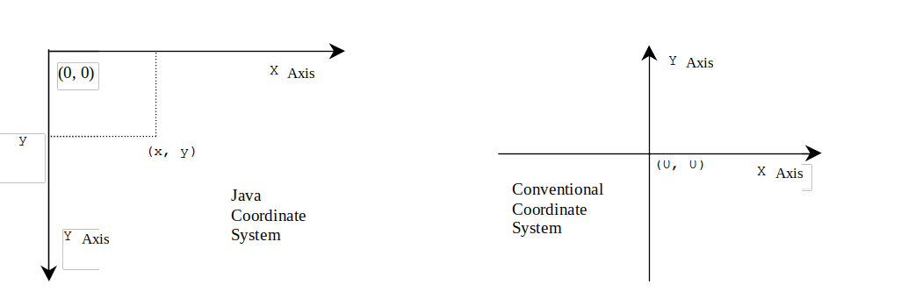


Binding Properties
---
* enables a target object to be bound to a source object
* the target property is changed automatically when the value in the source object changes
  * The target object is called a binding object or a binding property
    * is an instance of [javafx.beans.property.Property](https://openjfx.io/javadoc/11/javafx.base/javafx/beans/property/Property.html)
  * the source object is called a bindable object or observable object
    * is an instance of the [javafx.beans.value.ObservableValue interface](https://openjfx.io/javadoc/11/javafx.base/javafx/beans/value/ObservableValue.html)

```java
import javafx.application.Application;
import javafx.scene.Scene;
import javafx.scene.layout.Pane;
import javafx.scene.paint.Color;
import javafx.scene.shape.Circle;
import javafx.stage.Stage;

public class ShowCircleCentered extends Application {
  @Override 
  public void start(Stage primaryStage) {    

    Pane pane = new Pane();

    Circle circle = new Circle();

    // property binding
    // numeric binding property contain the add, subtract, multiply, and divide methods
    circle.centerXProperty().bind(pane.widthProperty().divide(2));
    circle.centerYProperty().bind(pane.heightProperty().divide(2));

    circle.setRadius(50);
    circle.setStroke(Color.BLACK); 
    circle.setFill(Color.WHITE);
    pane.getChildren().add(circle); 

    Scene scene = new Scene(pane, 200, 200);
    primaryStage.setTitle("Show Circle Centered");
    primaryStage.setScene(scene); 
    primaryStage.show();
  }
  
  public static void main(String[] args) {
    launch(args);
  }
}

```


Binding Property: getter, setter, and property getter
---
* JavaFX defines [binding properties for primitive types and strings](https://openjfx.io/javadoc/11/javafx.base/javafx/beans/property/package-summary.html)
  * double/float/long/int/boolean <--> DoubleProperty/FloatProperty/LongProperty/IntegerProperty/BooleanProperty
  * String <--> StringProperty
* these properties are also subtypes of ObservableValue
  * can be used as both source and target in a binding

```java
// Syntax
public class SomeClassName {
  private PropertyType x;

  public propertyValueType getX() { ... }
  public void setX(propertyValueType value) { ... }

  public class PropertyType xProperty() { ... }
}

// Example
public class Circle {
  private DoubleProperty centerX;

  public double getCenterX() { ... }
  public void setCenterX(double value) { ... }

  public class DoubleProperty centerXProperty() { ... }
}
```


Uni/Bidirectional Binding
---
* unidirectional binding: *target.bind(source)*
  * source --> target, target reflects source
* bidirectional binding: 
  * source <--> target, target and source are synchronized

```java
// BindingDemo.java: unidirectional binding
import javafx.beans.property.DoubleProperty;
import javafx.beans.property.SimpleDoubleProperty;

public class BindingDemo {
  public static void main(String[] args) {      
    DoubleProperty d1 = new SimpleDoubleProperty(1);
    DoubleProperty d2 = new SimpleDoubleProperty(2);
    d1.bind(d2); // Bind d1 with d2
    System.out.println("d1 is " + d1.getValue() 
      + " and d2 is " + d2.getValue());
    d2.setValue(70.2);
    System.out.println("d1 is " + d1.getValue() 
      + " and d2 is " + d2.getValue());
  }
}

// BidirectionalBindingDemo.java
import javafx.beans.property.DoubleProperty;
import javafx.beans.property.SimpleDoubleProperty;

public class BidirectionalBindingDemo {
  public static void main(String[] args) {       
    DoubleProperty d1 = new SimpleDoubleProperty(1);
    DoubleProperty d2 = new SimpleDoubleProperty(2);
    d1.bindBidirectional(d2);
    System.out.println("d1 is " + d1.getValue() 
      + " and d2 is " + d2.getValue());
    d1.setValue(50.1);
    System.out.println("d1 is " + d1.getValue() 
      + " and d2 is " + d2.getValue());
    d2.setValue(70.2);
    System.out.println("d1 is " + d1.getValue() 
      + " and d2 is " + d2.getValue());
  }
}
```

* DoubleProperty/FloatProperty/LongProperty/IntegerProperty/BooleanProperty are *abstract* classes
* Their *concrete subclasses* SimpleDoubleProperty, SimpleFloatProperty, SimpleLongProperty, SimpleIntegerProperty, and SimpleBooleanProperty are used to create instances of these properties
  * are very much like wrapper classes Double, Float, Long, Integer, and Boolean with additional features for property binding.


Common Properties and Methods for [Nodes](https://openjfx.io/javadoc/11/javafx.graphics/javafx/scene/Node.html)
---
* style: set a [JavaFX CSS style](https://openjfx.io/javadoc/19/javafx.graphics/javafx/scene/doc-files/cssref.html)
  * similar to cascading style sheets (CSS)
* setRotate(n)
  * Rotate a node by n degrees clockwise for n>0
* contains(double x, double y) method
  * test whether a point (x,y) is inside the boundary of a node and 
* setScaleX(double scale), setScaleY(double scale)
  * scale a node

```java
import javafx.application.Application;
import javafx.scene.Scene;
import javafx.scene.control.Button;
import javafx.stage.Stage;
import javafx.scene.layout.StackPane;

public class NodeStyleRotateDemo extends Application {
  @Override 
  public void start(Stage primaryStage) {
    
    StackPane pane = new StackPane();
    Button btOK = new Button("Style & Rotate 30° Clockwise");
    btOK.setStyle("-fx-border-color: blue;");
    pane.getChildren().add(btOK);    
    
    /* rotate: specify an angle in degrees for rotating a node from its center
      positive degree is clockwise, negative counterclockwise
    */
    pane.setRotate(30);

    // style: similar to cascading style sheets (CSS)
    pane.setStyle("-fx-border-color: red; -fx-background-color: lightblue;");
    // equivalent to
    pane.setBorder(Border.stroke(Color.RED));
    pane.setBackground(Background.fill(Color.LIGHTBLUE));
    
    Scene scene = new Scene(pane, 350, 200);
    primaryStage.setTitle("Node Style Rotate Demo"); 
    primaryStage.setScene(scene); 
    primaryStage.show(); 
  }
  
  public static void main(String[] args) {
    launch(args);
  }
}
```


Paint, Color and Font
---
* The abstract [Paint](https://openjfx.io/javadoc/11/javafx.graphics/javafx/scene/paint/Paint.html) class paints a node
* [javafx.scene.paint.Color](https://openjfx.io/javadoc/11/javafx.graphics/javafx/scene/paint/Color.html) is a concrete subclass of Paint
  * constructor: 
    * Color​(double red, double green, double blue, double opacity)
    * uses [RGBA model](http://liveexample.pearsoncmg.com/dsanimation/FigureSection14_7.html)
* A [javafx.scene.text.Font](https://openjfx.io/javadoc/11/javafx.graphics/javafx/scene/text/Font.html) describes font name, weight, posture and size

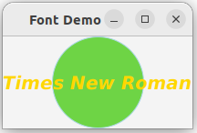

```java
import javafx.application.Application;
import javafx.stage.Stage;
import javafx.scene.Scene;
import javafx.scene.layout.*;
import javafx.scene.paint.Color;
import javafx.scene.shape.Circle;
import javafx.scene.text.*;
import javafx.scene.control.*;


public class FontDemo extends Application {
  @Override 
  public void start(Stage primaryStage) {    
    
    // A StackPane places the nodes in the center 
    // and nodes are placed on top of each other
    Pane pane = new StackPane();
    
    Circle circle = new Circle();
    circle.setRadius(50);
    circle.setStroke(Color.LIGHTBLUE); 
    circle.setFill(new Color(0.3, 0.8, 0.1, 0.8));
    pane.getChildren().add(circle); 

    
    Label label = new Label("Times New Roman");
    label.setTextFill(Color.GOLD);
    // A Font object is immutable
    label.setFont(Font.font("Times New Roman", FontWeight.BOLD, FontPosture.ITALIC, 20));
    pane.getChildren().add(label);

    Scene scene = new Scene(pane);
    primaryStage.setTitle("Font Demo"); 
    primaryStage.setScene(scene); 
    primaryStage.show(); 
  }
  
  public static void main(String[] args) {
    launch(args);
  }
}
```


Image and ImageView
---
* [javafx.scene.image.Image](https://openjfx.io/javadoc/11/javafx.graphics/javafx/scene/image/Image.html) class represents a graphical image
  * can be shared by multiple ImageView objects
* [javafx.scene.image.ImageView](https://openjfx.io/javadoc/11/javafx.graphics/javafx/scene/image/ImageView.html) is a node for displaying an image
  * can't be placed into a pane or scene multiple times

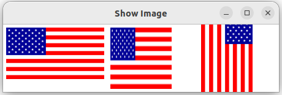

```java
import javafx.application.Application;
import javafx.scene.Scene;
import javafx.scene.layout.HBox;
import javafx.scene.layout.Pane;
import javafx.geometry.Insets;
import javafx.stage.Stage;
import javafx.scene.image.Image;
import javafx.scene.image.ImageView;

public class ShowImage extends Application {
  @Override 
  public void start(Stage primaryStage) {
    
    // HBox place nodes in a row horizontally
    Pane pane = new HBox(10);
    pane.setPadding(new Insets(5, 5, 5, 5));

    // from an online image by URL
    // Image image = new Image("https://upload.wikimedia.org/wikipedia/commons/5/57/Golden_Pheasant%2C_Tangjiahe_Nature_Reserve%2C_Sichuan.jpg");

    // from a local image in the folder images
    Image image = new Image("images/us.gif");
    pane.getChildren().add(new ImageView(image));
    
    ImageView imageView2 = new ImageView(image);
    imageView2.setFitHeight(100);
    imageView2.setFitWidth(100);
    pane.getChildren().add(imageView2);   

    ImageView imageView3 = new ImageView(image);
    imageView3.setRotate(90);
    pane.getChildren().add(imageView3);     
    
    Scene scene = new Scene(pane);
    primaryStage.setTitle("Show Image"); 
    primaryStage.setScene(scene); 
    primaryStage.show(); 
  }
  
  public static void main(String[] args) {
    launch(args);
  }
}
```


Layout Panes and Groups
---
* Panes and groups are the containers for holding nodes
  * [Panes](https://openjfx.io/javadoc/11/javafx.graphics/javafx/scene/layout/Pane.html) automatically lay out nodes in desired locations and sizes
  * The [Group](https://openjfx.io/javadoc/11/javafx.graphics/javafx/scene/Group.html) class groups nodes and to performs transformation and scale
  * Panes and UI control objects are resizable 
    * but group, shape, and text objects are not resizable


| Class      | Description                                                                                                                   |
| ---------- | ----------------------------------------------------------------------------------------------------------------------------- |
| Pane       | Base class for layout panes. It contains the getChildren() method for returning a list (ObservableList) of nodes in the pane. |
| StackPane  | Places the nodes on top of each other in the center of the pane.                                                              |
| FlowPane   | Places the nodes row-by-row horizontally or column-by-column vertically.                                                      |
| GridPane   | Places the nodes in the cells in a two-dimensional grid.                                                                      |
| BorderPane | Places the nodes in the top, right, bottom, left, and center regions.                                                         |
| HBox       | Places the nodes in a single row.                                                                                             |
| VBox       | Places the nodes in a single column.                                                                                          |


[FlowPane](https://openjfx.io/javadoc/11/javafx.graphics/javafx/scene/layout/FlowPane.html)
---
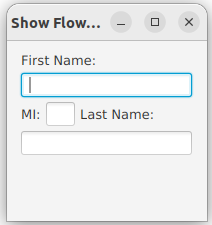

```java
import javafx.application.Application;
import javafx.geometry.Insets;
import javafx.scene.Scene;
import javafx.scene.control.Label;
import javafx.scene.control.TextField;
import javafx.scene.layout.FlowPane;
import javafx.stage.Stage;

public class ShowFlowPane extends Application {
  @Override 
  public void start(Stage primaryStage) {
    
    FlowPane pane = new FlowPane();
    pane.setPadding(new Insets(11, 12, 13, 14));
    pane.setOrientation(Orientation.HORIZONTAL);
    pane.setHgap(5);
    pane.setVgap(5);

    pane.getChildren().addAll(new Label("First Name:"), new TextField(), new Label("MI:"));
    TextField tfMi = new TextField();
    tfMi.setPrefColumnCount(1);
    pane.getChildren().addAll(tfMi, new Label("Last Name:"), new TextField());
    
    Scene scene = new Scene(pane, 280, 180);
    primaryStage.setTitle("Show FlowPane"); 
    primaryStage.setScene(scene); 
    primaryStage.show(); 
  }
  
  public static void main(String[] args) {
    launch(args);
  }
}
```

[GridPane](https://openjfx.io/javadoc/11/javafx.graphics/javafx/scene/layout/GridPane.html)
---
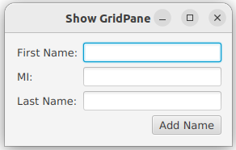 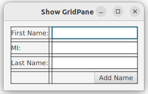

```java
import javafx.application.Application;
import javafx.geometry.HPos;
import javafx.geometry.Insets;
import javafx.geometry.Pos;
import javafx.scene.Scene;
import javafx.scene.control.Button;
import javafx.scene.control.Label;
import javafx.scene.control.TextField;
import javafx.scene.layout.GridPane;
import javafx.stage.Stage;

public class ShowGridPane extends Application {
  @Override 
  public void start(Stage primaryStage) {
    
    GridPane pane = new GridPane();
    // place the nodes in the center of the grid pane
    // resize the window and have a look
    pane.setAlignment(Pos.CENTER);
    pane.setPadding(new Insets(11.5, 12.5, 13.5, 14.5));
    pane.setHgap(5.5);
    pane.setVgap(5.5);
    
    pane.add(new Label("First Name:"), 0, 0);
    pane.add(new TextField(), 1, 0);
    pane.add(new Label("MI:"), 0, 1); 
    pane.add(new TextField(), 1, 1);
    pane.add(new Label("Last Name:"), 0, 2);
    pane.add(new TextField(), 1, 2);
    Button btAdd = new Button("Add Name");
    pane.add(btAdd, 1, 3);
    GridPane.setHalignment(btAdd, HPos.RIGHT);

    //pane.setGridLinesVisible(true);

    Scene scene = new Scene(pane);
    primaryStage.setTitle("Show GridPane"); 
    primaryStage.setScene(scene); 
    primaryStage.show(); 
  }
  
  public static void main(String[] args) {
    launch(args);
  }
} 
```


[BorderPane](https://openjfx.io/javadoc/11/javafx.graphics/javafx/scene/layout/BorderPane.html)
---
* lays out children in top, left, right, bottom, and center positions

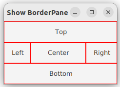 

```java
import javafx.application.Application;
import javafx.geometry.Insets;
import javafx.scene.Scene;
import javafx.scene.control.Label;
import javafx.scene.layout.BorderPane;
import javafx.scene.layout.StackPane;
import javafx.stage.Stage;

public class ShowBorderPane extends Application {
  @Override 
  public void start(Stage primaryStage) {
    
    BorderPane pane = new BorderPane();
 
    pane.setTop(new CustomPane("Top")); 
    pane.setRight(new CustomPane("Right"));
    pane.setBottom(new CustomPane("Bottom"));
    pane.setLeft(new CustomPane("Left"));
    pane.setCenter(new CustomPane("Center")); 

    // To remove a node from the center region, invoke setCenter(null). 
    // If a region is not occupied, no space will be allocated for this region
    // pane.setCenter(null);
    // Resize the window, what will be seen?

    // How about removing an edge corner?
    // pane.setTop(null);

    Scene scene = new Scene(pane);
    primaryStage.setTitle("Show BorderPane"); 
    primaryStage.setScene(scene); 
    primaryStage.show(); 
  }

  public static void main(String[] args) {
    launch(args);
  }
} 

class CustomPane extends StackPane {
  public CustomPane(String location) {
    getChildren().add(new Label(location));
    setStyle("-fx-border-color: red");
    setPadding(new Insets(11.5, 12.5, 13.5, 14.5));
  }
}
```

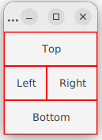 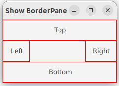 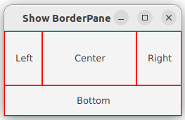


HBox and VBox
---
* An HBox or a VBox can lay out children only in one row or one column
* FlowPane can lay out its children in multiple rows or multiple columns 


## Event-Driven Programming and Animations


## JavaFX UI Controls and Multimedia


# Reference textbooks
* [Introduction to Java Programming, Comprehensive, 12/E](https://media.pearsoncmg.com/bc/abp/cs-resources/products/product.html#product,isbn=0136519350)
  * [Student resources](https://media.pearsoncmg.com/ph/esm/ecs_liang_ijp_12/cw/)
  * [Source code](https://media.pearsoncmg.com/ph/esm/ecs_liang_ijp_12/cw/content/source-code.php)
* [JavaFX Documentation Project](https://fxdocs.github.io/docs/html5/)
* [JavaFX 11: IllegalAccessError when creating Label](https://stackoverflow.com/questions/54291958/javafx-11-illegalaccesserror-when-creating-label)