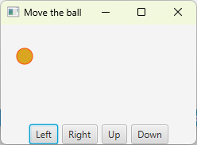
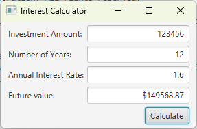
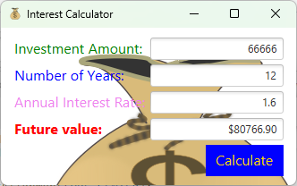

# Assignment3: Event-driving programming

## Q1: Move the ball (textbook 15.3)
Write a program that moves the ball in a pane. You should define a pane class for displaying the ball and provide the methods for moving the ball left, right, up, and down, as shown here. 

Check the boundary to prevent the ball from moving out of sight completely.

## Q2: Create an investment-value calculator (textbook 15.5)
Write a program that calculates the future value of an investment at a given interest rate for a specified number of years. The formula for the calculation is

$$futureValue = investmentAmount × (1 + monthlyInterestRate)^{years×12}$$

Use text fields for the investment amount, number of years, and annual interest rate. Display the future amount in a text field when the user clicks the Calculate button, as shown here.

## Extra credits (10%)
To beautify the previous investment calculator, you may 
* (2%) Customize its application icon with your own image
* (5%) Customize the font and color of all labels and the button
* (3%) Add an background image

# References
* [JavaFX Label](https://jenkov.com/tutorials/javafx/label.html)
* [open clipart](https://openclipart.org/)
* [How to set the JavaFX Scene Background](https://edencoding.com/scene-background/)