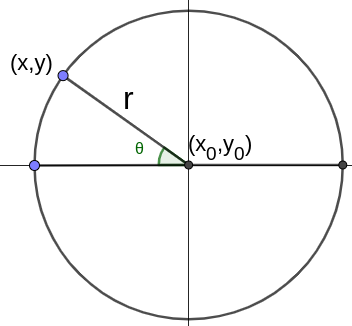
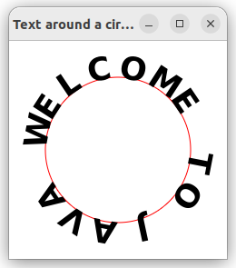

# Lab2: JavaFX Basics

## Q1: Display three distinct random cards (textbook Q14.3)
Write a program that displays three cards randomly selected from a deck of 52, as shown below. 

The card image files are named 1.png, 2.png, . . . , 52.png and stored in the [image/card directory](https://github.com/ufidon/java/tree/main/bookmedia/image/card). All three cards are distinct and selected randomly. 

HINT: You can select random cards by storing the numbers 1–52 to an array list, perform a random shuffle introduced in textbook [Section 11.12](../../mod1/Array.md), and use the first three numbers in the array list as the file names for the image.

## Q2: Display a string around a circle (textbook Q14.5)
Write a program that displays a string “Welcome to Java” around a circle, as shown below. 

HINT: You need to display each character in the right location with appropriate rotation using a loop, add a blank space to separate the head and tail.

In Java, the trigonometric functions like sin, cos, their parameter is an angle in radians, following normal mathematical convention, i.e, positive angle runs anticlockwise while negative angle runs clockwise. So, to distribute n characters evenly around a circle clockwise, negative angles are convenient. If we start the text at the left side of the circle with radius $r$, then the coordinates of the location of a character with angle $θ$ away from west can be calculated as below:

| Character                                | Location coordinates                                      |
| ---------------------------------------- | --------------------------------------------------------- |
|  | $x = x_0 + r × \cos(π-θ)$   $y = y_0 – r × \sin(π-θ)$ |

By default, the origin or location of a character is its bottom-left corner.

To distribute $n$ character around a circle, then the angle between two consecutive characters is $\frac{2π}{n}$, counting clockwise from the west character (the 0-th character), the angle of the i-th character from west would be $i×\frac{2π}{n}$, so its angle for calculation is $π - i×\frac{2π}{n}$, its coordinates are

|                                          |
| ---------------------------------------- |
| $x = x_0 + r × \cos(π - i×\frac{2π}{n})$ |
| $y = y_0 – r × \sin(π - i×\frac{2π}{n})$ |

After distributing the characters around a circle, it looks like below

Next we need to rotate each character to stand on the circle by calling its setRotate(double angle) method. However, here the angle is in degree, positive angle rotate clockwise while negative angle rotate counterclockwise which is contrary to mathematical convention. The first character needs to be rotated 90 degree counterclockwise, i.e. rotate $-90$ degree, the next character needs to be rotated $-90+\frac{360}{n}$, the i-th character needs to be rotated $-90+i×\frac{360}{n}$. After all characters are rotated, we get an acceptable layout as required shown at the beginning.

However, there is a subtle defect, if we show the circle, the defect becomes clear as below

If we don't rotate characters, it looks like

The defect comes from:

* The location of a character is its bottom-left corner
* The rotation pivot point is the center of the character

10% Extra credits are given for fixing the defect:

