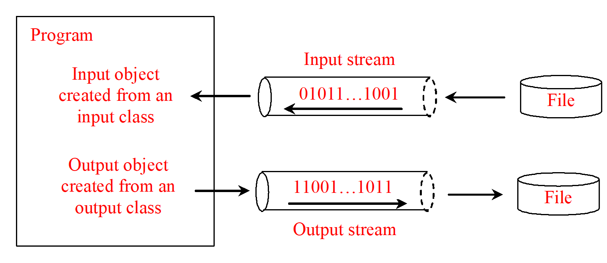

# File I/O

Objectives
---
* Describe how I/O is processing in Java
  * Compare text I/O and binary I/O
  * Read and write bytes using FileInputStream and FileOutputStream
  * Read and write primitive values and strings using DataInputStream/DataOutputStream
  * Read and write at any location of a file using the RandomAccessFile 
* Understand how objects are serialized and what kind of objects can be serialized 
  * Store and restore objects using ObjectOutputStream and ObjectInputStream
  * Make objects serializable by implementing the Serializable interface  
  * Serialize arrays 


Text file vs binary file
---
Text file
---
* There is only binary file saved on disk or loaded in memory
* Text file
  * read/write by humans
  * create and edit in text editors
  * Each one or several consecutive bytes can be decoded (ASCII, Unicode, etc.) to be a human readable character
  * for example: java source code file
* Binary file
  * read/write by programs
  * many bytes can't be decoded to be human readable characters

  * for example: java class file


Practice
---
Use [online hex editor](https://hexed.it/)

* Open a java source code and check its content
* Open a java class file and check its content


Text I/O vs Binary I/O
---



* A File object encapsulates the properties of a file or a path
* Text data are read using the Scanner class and written using the PrintWriter class
  * Requires encoding for writing and decoding for reading in [ASCII](https://en.wikipedia.org/wiki/ASCII), [Unicode](https://en.wikipedia.org/wiki/Unicode), etc. 
  * [list of Unicode characters](https://en.wikipedia.org/wiki/List_of_Unicode_characters)
* Binary I/O does not involve encoding or decoding 
  * thus is more efficient than text I/O
* An input object reads a stream of data from a file 
* An output object writes a stream of data to a file

```java
import java.io.*;
import java.util.Scanner;

public class TextIO {
    public static void main(String[] args) throws Exception {
        PrintWriter output = new PrintWriter(new File("./temp.txt"));
        output.println("text input and output");
        output.close();

        Scanner input = new Scanner(new File("./temp.txt"));
        System.out.println(input.nextLine());
        input.close();
    }
}
```


Binary I/O Classes
---


* [InputStream](https://devdocs.io/openjdk~11/java.base/java/io/inputstream)
* [OutputStream](https://devdocs.io/openjdk~11/java.base/java/io/outputstream)


FileInputStream and FileOutputStream
---
* associates a binary input/output stream with an external file
* A [FileInputStream](https://devdocs.io/openjdk~11/java.base/java/io/fileinputstream) obtains input bytes from a file in a file system
* A [FileOutputStream](https://devdocs.io/openjdk~11/java.base/java/io/fileoutputstream) is an output stream for writing data to a File or to a FileDescriptor
* All the methods in FileInputStream/FileOuptputStream are inherited from its superclasses

```java
import java.io.*;

public class TestFileStream {
  public static void main(String[] args) throws IOException {
    try ( 
      // try-with-resources to declare and create input and output streams 
      // so they will be automatically closed after they are used
      FileOutputStream output = new FileOutputStream("temp.dat");
    ) {
      for (int i = 1; i <= 10; i++)
        output.write(i);
    }

    try (
      FileInputStream input = new FileInputStream("temp.dat");
    ) {
      int value;
      while ((value = input.read()) != -1) // -1 specified the end of the file
        System.out.print(value + " ");
    }
  }
}
```


[FilterInputStream](https://devdocs.io/openjdk~11/java.base/java/io/filterinputstream) and [FilterOutputStream](https://devdocs.io/openjdk~11/java.base/java/io/filteroutputstream)
---
* enables you to read integers, doubles, and strings instead of bytes and characters
* the base classes for filtering/converting data
  * Use subclass DataInputStream/DataOutputStream to read/write primitive numeric types


DataInputStream and DataOutputStream
---
* [DataInputStream](https://devdocs.io/openjdk~11/java.base/java/io/datainputstream) extends FilterInputStream and implements the [DataInput](https://devdocs.io/openjdk~11/java.base/java/io/datainput) interface
* [DataOutputStream](https://devdocs.io/openjdk~11/java.base/java/io/dataoutputstream) extends FilterOutputStream and implements the [DataOutput](https://devdocs.io/openjdk~11/java.base/java/io/dataoutput) interface
* the Unicode encoding scheme is a modified [UTF-8](https://en.wikipedia.org/wiki/UTF-8)

```java
import java.io.*;

public class TestDataStream {
  public static void main(String[] args) throws IOException {
    try (
      DataOutputStream output = new DataOutputStream(new FileOutputStream("temp.dat"));
    ) {
      output.writeUTF("John"); // using modifeid UTF-8
      output.writeDouble(85.5);
      output.writeUTF("Jim");
      output.writeDouble(185.5);
      output.writeUTF("George");
      output.writeDouble(105.25);
    }
    
    try (
      DataInputStream input = new DataInputStream(new FileInputStream("temp.dat"));
    ) {
      System.out.println(input.readUTF() + " " + input.readDouble());
      System.out.println(input.readUTF() + " " + input.readDouble());
      System.out.println(input.readUTF() + " " + input.readDouble());
    }
  }
}
```


* read the data in the same order and same format in which they are stored
* check the end of a file by input.available()
  * input.available() == 0 indicates the end of a file

```java
import java.io.*;

public class DetectEndOfFile {
    public static void main(String[] args) {
        try {
            try (DataOutputStream output = new DataOutputStream(new FileOutputStream("test.dat"))) {
                output.writeDouble(4.5);
                output.writeDouble(43.25);
                output.writeDouble(3.2);
            }

            try (DataInputStream input = new DataInputStream(new FileInputStream("test.dat"))) {
                while (true) {
                    //practice: change true to input.available() != 0
                    System.out.println(input.readDouble());
                }
            }
        } catch (EOFException ex) {
            System.out.println("All data were read");
        } catch (IOException ex) {
            ex.printStackTrace();
        }
    }
}
```

Practice ✏️
---
* In the previous code, change true to input.available() != 0
  * do you still get an EOFException?


[BufferedInputStream](https://devdocs.io/openjdk~11/java.base/java/io/bufferedinputstream) and [BufferedOutputStream](https://devdocs.io/openjdk~11/java.base/java/io/bufferedoutputstream)
---
*  add functionality to another input/output stream 
   *  to buffer the input/output
      *  read/write in block instead of byte
      *  improve read/write efficiency
   *  to support the mark and reset methods


Case Studies: Copy File 🎉
---
* copy a source file to a target file and displays the number of bytes in the file
  ```bash
  java Copy sourceFile targetFile
  ```
* If the source does not exist, tell the user the file is not found 
* If the target file already exists, tell the user the file already exists

```java
import java.io.*;

public class Copy {
    public static void main(String[] args) throws IOException {
        if (args.length != 2) {
            System.out.println("Usage: java Copy sourceFile targetfile");
            System.exit(1);
        }

        File sourceFile = new File(args[0]);
        if (!sourceFile.exists()) {
            System.out.println("Source file " + args[0] + " does not exist");
            System.exit(2);
        }

        File targetFile = new File(args[1]);
        if (targetFile.exists()) {
            System.out.println("Target file " + args[1] + " already exists");
            System.exit(3);
        }

        try (
                BufferedInputStream input = new BufferedInputStream(new FileInputStream(sourceFile));
                BufferedOutputStream output = new BufferedOutputStream(new FileOutputStream(targetFile));) {
            int r, numberOfBytesCopied = 0;
            while ((r = input.read()) != -1) {
                output.write((byte) r);
                numberOfBytesCopied++;
            }

            System.out.println(numberOfBytesCopied + " bytes copied");
        }
    }
}
```


Object I/O
---
- DataInputStream/DataOutputStream enables you to perform I/O for primitive type values and strings. 
- ObjectInputStream/ObjectOutputStream enables you to perform I/O for objects in addition for primitive type values and strings

```java
import java.io.*;

public class TestObjectIO {
    public static void main(String[] args) throws ClassNotFoundException, IOException {
        try (
                ObjectOutputStream output = new ObjectOutputStream(new FileOutputStream("object.dat"));) {
            output.writeUTF("John");
            output.writeDouble(85.5);
            output.writeObject(new java.util.Date());
        }

        try (
                ObjectInputStream input = new ObjectInputStream(new FileInputStream("object.dat"));) {
            String name = input.readUTF();
            double score = input.readDouble();
            java.util.Date date = (java.util.Date) (input.readObject());
            System.out.println(name + " " + score + " " + date);
        }
    }
}
```


The [Serializable](https://devdocs.io/openjdk~11/java.base/java/io/serializable) Interface
---
* a marker interface without methods
* objects that can be written to an object stream is said to be serializable 
  * not all objects can be written to an output stream
* A serializable object is an instance of the java.io.Serializable interface 
  * so the class of a serializable object must implement Serializable
  * an instance of Serializable that contains non-serializable instance data fields can't be serialized
    * use the *transient* keyword to mark these data fields to tell the JVM to ignore these fields when writing the object to an object stream

```java
public class Foo implements java.io.Serializable {  
  private int v1; // serializable
  private static double v2; // static variable is not serializable
  private transient A v3 = new A(); // ignored. 
  // If v3 were not marked transient, a java.io.NotSerializableException would occur.
}
class A { } // A is not serializable
```

* An array is serializable if all its elements are serializable

```java
import java.io.*;

public class TestObjectStreamForArray {
  public static void main(String[] args)
      throws ClassNotFoundException, IOException {
    int[] numbers = {1, 2, 3, 4, 5};
    String[] strings = {"John", "Susan", "Kim"};

    try (
      ObjectOutputStream output = new ObjectOutputStream(new 
        FileOutputStream("array.dat", true));
    ) {
      output.writeObject(numbers);
      output.writeObject(strings);
    }

    try (
      ObjectInputStream input =
        new ObjectInputStream(new FileInputStream("array.dat"));
    ) {
      int[] newNumbers = (int[])(input.readObject());
      String[] newStrings = (String[])(input.readObject());
  
      for (int i = 0; i < newNumbers.length; i++)
        System.out.print(newNumbers[i] + " ");
      System.out.println();
  
      for (int i = 0; i < newStrings.length; i++)
        System.out.print(newStrings[i] + " ");
    }
  }
}
```


Random Access Files
---
* the [RandomAccessFile](https://devdocs.io/openjdk~11/java.base/java/io/randomaccessfile) class 
  * allows a file to be read from and write to at random locations
* but input/output streams are read-only/write-only streams 
  * the external files of these streams are sequential files 
    * cannot be updated without creating a new file


```java
import java.io.*;

public class TestRandomAccessFile {
  public static void main(String[] args) throws IOException {
    try (
      RandomAccessFile inout = new RandomAccessFile("inout.dat", "rw");
    ) {
      inout.setLength(0); // clear old contents
  
      for (int i = 0; i < 200; i++)
        inout.writeInt(i);
  
      System.out.println("Current file length is " + inout.length());
      System.out.println("Current file pointer " + inout.getFilePointer());
  
      inout.seek(0);
      System.out.println("Current file pointer " + inout.getFilePointer());
      System.out.println("The first number is " + inout.readInt());
      System.out.println("Current file pointer " + inout.getFilePointer());
  
      inout.seek(1 * 4);
      System.out.println("The second number is " + inout.readInt());
  
      inout.seek(9 * 4);
      System.out.println("The tenth number is " + inout.readInt());
  
      inout.writeInt(555);
  
      inout.seek(inout.length());
      inout.writeInt(999);
  
      System.out.println("The new length is " + inout.length());
  
      inout.seek(10 * 4);
      System.out.println("The eleventh number is " + inout.readInt());
    }
  }
}
```


# Reference textbooks
* [Introduction to Java Programming, Comprehensive, 12/E](https://media.pearsoncmg.com/bc/abp/cs-resources/products/product.html#product,isbn=0136519350)
  * [Student resources](https://media.pearsoncmg.com/ph/esm/ecs_liang_ijp_12/cw/)
  * [Source code](https://media.pearsoncmg.com/ph/esm/ecs_liang_ijp_12/cw/content/source-code.php)
* [online hex editor](https://hexed.it/)