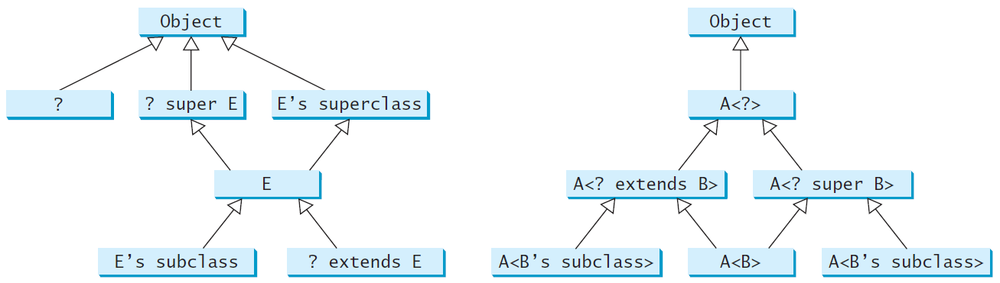

# Generics

Objectives
---
- Explain the benefits of generics 
  - can improve reliability and readability
- Declare, use, design and implement 
  - generic classes and interfaces 
  - generic methods and bounded generic types 
  - wildcard types 
- Understand that
  - generic type information is erased by the compiler and all instances of a generic class share the same runtime class file 
  - certain restrictions on generic types caused by type erasure 


Generics
---
- Generics is the capability to parameterize types
- A class or a method with generic types 
  - allows the generic types be substituted with allowable concrete types by the compiler
    - Replacing a generic type with a concrete type is called generic instantiation
  - substitutions with incompatible objects cause compile errors
- benefits
  - enable errors to be detected at compile time rather than at runtime
  - improve readability

```java
package java.lang;
// prior to JDK 1.5, no generics
public interface Comparable {
  public int compareTo(Object o)
}

Comparable c = new Date();
System.out.println(c.compareTo("red")); // runtime error

// JDK 1.5+, generics introduced

public interface Comparable<T> {// <T> - formal generic type
  public int compareTo(T o)
}
Comparable<Date> c = new Date(); // <Date> - actual concrete type
System.out.println(c.compareTo("red")); // compile error
```

* Generic types must be reference types
  * Example: [generic ArrayList\<E\>](https://devdocs.io/openjdk~11/java.base/java/util/arraylist)
    ```java
    ArrayList<Double> list = new ArrayList<>(); // right
    // ArrayList<double> list = new ArrayList<>(); // wrong!
    list.add(5.5); // 5.5 is automatically converted to new Double(5.5)
    list.add(3.0); // 3.0 is automatically converted to new Double(3.0)
    Double doubleObject = list.get(0); // No casting is needed
    double d = list.get(1); // Automatically converted to double
    // Auto boxing and unboxing happened implicitly
    ```


Declaring Generic Classes and Interfaces 
---

```java
public class GenericStack<E> {
  private java.util.ArrayList<E> list = new java.util.ArrayList<>();

  public int getSize() {
    return list.size();
  }

  public E peek() {
    return list.get(getSize() - 1);
  }

  public void push(E o) {
    list.add(o);
  }

  public E pop() {
    E o = list.get(getSize() - 1);
    list.remove(getSize() - 1);
    return o;
  }

  public boolean isEmpty() {
    return list.isEmpty();
  }
  
  @Override
  public String toString() {
	return "stack: " + list.toString();
  }
  public static void main(String[] args) {
    GenericStack<String> cities = new GenericStack<>();
    System.out.println(cities);
    
    cities.push("New York");
    System.out.println(cities);

    cities.push("Miami"); cities.push("Orlando");
    System.out.println(cities);

    cities.pop();
    System.out.println(cities);
  }
}
```


Generic Static Methods
---

```java
public class GenericMethodDemo {
  public static void main(String[] args ) {
    Integer[] integers = {1, 2, 3, 4, 5};
    String[] strings = {"London", "Paris", "New York", "Austin"};

    // compare the generic static method instantiation with
    // generic class instantiation
    GenericMethodDemo.<Integer>print(integers); // compare with GenericStack<String> cities
    GenericMethodDemo.<String>print(strings);

    // or simply
    print(integers);
    print(strings);
  }

  public static <E> void print(E[] list) {
    for (int i = 0; i < list.length; i++)
      System.out.print(list[i] + " ");
    System.out.println();
  }
}
```


Bounded Generic Type
---
- No inheritance in generic types
  - Comparable<Circle> is NOT a subtype of Comparable<GeometricObject> 
- A generic type specified as a subtype of another type is called bounded
  - An unbounded generic type \<E\> is the same as \<E extends Object\>

```java
public class BoundedTypeDemo {
    public static void main(String[] args) {
        GeometricObject rectangle = new Rectangle(2, 2);
        GeometricObject circle = new Circle(2);

        System.out.println("Same area? " +
                equalArea(rectangle, circle));
    }

    public static <E extends GeometricObject> boolean equalArea(
            E object1, E object2) {
        return object1.getArea() == object2.getArea();
    }
}

abstract class GeometricObject {
    public abstract double getArea();
}

class Circle extends GeometricObject {
    private double radius = 1;

    public Circle(double radius){
        this.radius = radius;
    }
    @Override
    public double getArea() {
        return Math.PI * radius * radius;
    }
}

class Rectangle extends GeometricObject {
    private double width, height;

    public Rectangle(double width, double height){
        this.width  =width;
        this.height = height;
    }

    @Override
    public double getArea() {
        return width * height;
    }
}
```


Case Study: Sorting an Array of Comparable Objects
---

```java
public class GenericSort {
  public static void main(String[] args) {
    Integer[] intArray = {2, Integer.valueOf(4), 3};
    Double[] doubleArray = {3.7, 2.8, Double.valueOf(6.9)};
    //Character[] charArray = {'☘', '⚽', Character.valueOf('⚾')};
    Character[] charArray = {'S', 'P', Character.valueOf('X')};

    String[] stringArray = {"Tom", "Susan", "Kim"};

    sort(intArray);
    sort(doubleArray);
    sort(charArray);
    sort(stringArray);

    System.out.print("Sorted Integer objects: ");
    printList(intArray);
    System.out.print("Sorted Double objects: ");
    printList(doubleArray);
    System.out.print("Sorted Character objects: ");
    printList(charArray);
    System.out.print("Sorted String objects: ");
    printList(stringArray);
  }

  public static <E extends Comparable<E>> void sort(E[] list) {
    E currentMin;
    int currentMinIndex;

    for (int i = 0; i < list.length - 1; i++) {
      currentMin = list[i];
      currentMinIndex = i;

      for (int j = i + 1; j < list.length; j++) {
        if (currentMin.compareTo(list[j]) > 0) {
          currentMin = list[j];
          currentMinIndex = j;
        }
      }

      if (currentMinIndex != i) {
        list[currentMinIndex] = list[i];
        list[i] = currentMin;
      }
    }
  }

  public static void printList(Object[] list) {
    for (int i = 0; i < list.length; i++)
      System.out.print(list[i] + " ");
    System.out.println();
  }
}
```


Raw Types and Backward Compatibility
---
- A generic type used without a type parameter is called a raw type
  - raw types are unsafe
  - raw type demo
  ```java
  // raw type
  ArrayList list = new ArrayList(); 
  // is roughly equivalent to 
  ArrayList<Object> list = new ArrayList<Object>(); 
  ```
- Using raw types allows for backward compatibility with earlier versions of Java
  - but, raw types are unsafe
  ```java
  public class Max {
      public static void main(String[] args) {
          // no compile error
          Comparable c = max("Hello", 2023); // runtime error
          System.out.println(c);
      }
      public static Comparable max(Comparable o1, Comparable o2) {
        // compile with -Xlint:unchecked to show the warning
          if (o1.compareTo(o2) > 0)
              return o1;
          else
              return o2;
      }
  }
  ```


Avoiding Unsafe Raw Types 
---
- [proper usage of generic types](./demos/TestArrayListNew.java)
  ```java
  // Use 
  new ArrayList<ConcreteType>()
  // Instead of 
  new ArrayList();
  ```
- Make Max safe
  ```java
  public class Max {
    public static void main(String[] args) {
        Comparable c = max("Hello", 2023); // compile error
        System.out.println(c);
    }
    public static <E extends Comparable<E>> E max(E o1, E o2) {
        if (o1.compareTo(o2) > 0)
            return o1;
        else
            return o2;
    }
  }
  ```
- No compile error but with warning
  ```java
  public class TestStack {
    public static void main(String[] args) {
      // compile with -Xlint:unchecked to show the warning
      GenericStack stack;
      stack = new GenericStack<String>();
      stack.push("Welcome to Java");
      stack.push(Integer.valueOf(2));
      System.out.print(stack);
    }
  }
  ```


Wildcard Generic Types
---
- specify a range for a generic type
  ```java
  // Why do we need wildcard generic types?
  public class WildCardNeedDemo {
    public static void main(String[] args) {
      GenericStack<Integer> intStack = new GenericStack<>();
      intStack.push(1); // 1 is autoboxed into new Integer(1)
      intStack.push(2);
      intStack.push(-2);

      // compile error: GenericStack<Integer> is NOT a subtype of GenericStack<Number>
      System.out.print("The max number is " + max(intStack));
    }
 
    public static Number max(GenericStack<Number> stack) 
    {
    // practice: change the above line to be
    // public static double max(GenericStack<? extends Number> stack) 
      double max = stack.pop().doubleValue(); // initialize max

      while (!stack.isEmpty()) {
        double value = stack.pop().doubleValue();
        if (value > max)
          max = value;
      }

      return max;
    }
  }
  ```
- three forms
  ```java
  // 1- unbounded wildcards: ?, the same as ? extends Object.
  // AnyWildCardDemo.java
  public class AnyWildCardDemo {
    public static void main(String[] args ) {
      GenericStack<Number> intStack = new GenericStack<>();
      intStack.push(1);
      intStack.push(2.3);
      intStack.push(-2/11.);
      intStack.push(-2/11);

      print(intStack);
    }

    public static void print(GenericStack<?> stack) {
      while (!stack.isEmpty()) {
        System.out.print(stack.pop() + " ");
      }
    }
  }

  // 2- bounded wildcards: ? extends T, represents T or a subtype of T.
  public static void print(GenericStack<? extends Object> stack);
  // is equivalent to
  public static void print(GenericStack<?> stack);

  // 3- lower bound wildcards: ? super T, denotes T or a supertype of T
  // SuperWildCardDemo.java
  public class SuperWildCardDemo {
    public static void main(String[] args) {
      GenericStack<String> stack1 = new GenericStack<String>();
      GenericStack<Object> stack2 = new GenericStack<Object>();
      stack2.push("Java");
      stack2.push(2);
      stack1.push("Sun");
      add(stack1, stack2);
      AnyWildCardDemo.print(stack2);
    }

    public static <T> void add(GenericStack<T> stack1,
        GenericStack<? super T> stack2) {
      while (!stack1.isEmpty())
        stack2.push(stack1.pop());
    }
    public static <T> void add2(GenericStack<T> stack1,
        GenericStack<? extends T> stack2) {
      while (!stack2.isEmpty())
        stack1.push(stack2.pop());
    }     
  }
  ```
- Generic Types and Wildcard Types




Erasure and Restrictions on Generics
---
- Generics are implemented using *type erasure*
- Generic type information is used to compile the code
  - it is erased afterwards so not available at runtime
  - this enables the generic code to be backward-compatible with the legacy code that uses raw types
    - a generic class is shared by all its instances regardless of its actual generic type
    ```java
    GenericStack<String> stack1 = new GenericStack<>();
    GenericStack<Integer> stack2 = new GenericStack<>();
    // only one class GenericStack loaded into the JVM
    ```
- Compile Time Checking
  ```java
  // 1. an unbounded generic type is replaced with the Object type
  ArrayList<String> list = new ArrayList<>();
  list.add("Oklahoma");
  String state = list.get(0);
  // is compiled into 
  ArrayList list = new ArrayList();
  list.add("Oklahoma");
  String state = (String)(list.get(0));

  public static <E> void print(E[] list){
    for (E e : list) {
      System.out.print(e+" ");
    }
    System.out.println();
  }
  // is compiled into 
  public static void print(Object[] list){
    for (Object e : list) {
      System.out.print(e+" ");
    }
    System.out.println();
  }

  // 2. a generic bounded type is replaced with the bounded type
  public static <E extends Number> boolean equalValue(E n1, E n2){
    return n1.equals(n2);
  }
  // is compiled into
  public static boolean equalValue(Number n1, Number n2){
    return n1.equals(n2);
  }

  // 3. runtime type checking
  System.out.println(list1 instanceof ArrayList); // => true
  System.out.println(list2 instanceof ArrayList); // => true
  list1 instanceof ArrayList<String>; // Wrong! No ArrayList<String> at runtime
  ```


Restrictions on Generics
---
- Cannot create an instance of a generic type. (i.e., new E()).
  ```java
  E object = new E(); // Wrong! No type E at runtime
  ```
- Generic array creation is not allowed. (i.e., new E[100]).
  ```java
  E[] elements = new E[capacity]; // Wrong! No type E at runtime
  // a circumvent
  E[] elements = (E[])new Object[capacity]; // OK! but casting to (E[]) causes an unchecked compile warning

  ArrayList<String>[] list = new ArrayList<String>[10]; // Wrong! No type ArrayList<String> at runtime
  // a circumvent
  ArrayList<String>[] list = (ArrayList<String>[])new ArrayList[10]; // OK! but casting to (ArrayList<String>[]) causes an unchecked compile warning
  ```
- A generic type parameter of a class is not allowed in a static context
  - The class's type parameters are only in scope for instance methods and instance fields
  ```java
  public class Test<E> {
    public static void m(E o1) {  // Illegal
    }
    public static E o1; // Illegal

    static {
      E o2; // Illegal
    }
  }
  ```
- Exception classes cannot be generic.
  ```java
  public class MyException<T> extends Exception {   } // illegal! because try-catch needs runtime info
  ```


Case Study: Generic Matrix Class
---
- [GenericMatrix](./demos/GenericMatrix.java)
- [IntegerMatrix](./demos/IntegerMatrix.java)
  - [TestIntegerMatrix](./demos/TestIntegerMatrix.java)
- [RationalMatrix](./demos/RationalMatrix.java)
  - [TestRationalMatrix](./demos/TestRationalMatrix.java)


# Reference textbooks
* [Introduction to Java Programming, Comprehensive, 12/E](https://media.pearsoncmg.com/bc/abp/cs-resources/products/product.html#product,isbn=0136519350)
  * [Student resources](https://media.pearsoncmg.com/ph/esm/ecs_liang_ijp_12/cw/)
  * [Source code](https://media.pearsoncmg.com/ph/esm/ecs_liang_ijp_12/cw/content/source-code.php)
* [OpenJDK 11.0.11 Documentation](https://devdocs.io/openjdk~11/)
* _old JDK documentations_
  * [Java 2 SDK, Standard Edition](https://nick-lab.gs.washington.edu/java/jdk1.4.2/index.html)
  * [JDK 5.0 Documentation](https://web.mit.edu/java_v1.5.0_22/distrib/share/docs/index.html)
* [How do I compile with -Xlint:unchecked?](https://stackoverflow.com/questions/8215781/how-do-i-compile-with-xlintunchecked)
* [Static method in a generic class?](https://stackoverflow.com/questions/936377/static-method-in-a-generic-class)
