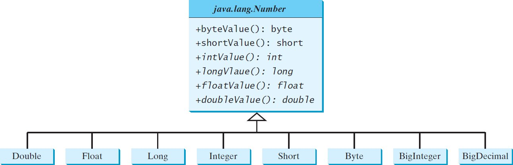

# cop3809

Online resources and examples

# Module 4: Generics
Chapter 13,19

## Abstract Classes and Interfaces

**Abstract classes**

* An abstract class cannot be used to create objects. 
  * It contains abstract methods that are implemented in concrete subclasses
  * It cannot be contained in a nonabstract class
  * It cannot be static
* A class that contains abstract methods must be abstract
  * it is possible to define an abstract class that doesn’t contain any abstract methods
  * A non-abstract method can be overridden to abstract
* A subclass can be abstract even if its superclass is concrete, 
  * for example, Object is concrete, but GeometricObject is abstract

```java
// GeometricObject.java
public abstract class GeometricObject {
  // abstract methods are defined without implementation
  public abstract double getArea();
  public abstract double getPerimeter();

  private String color = "white";
  private boolean filled;
  private java.util.Date dateCreated;

  // protected constructors are used only by subclasses
  protected GeometricObject() {
    dateCreated = new java.util.Date();
  }
  protected GeometricObject(String color, boolean filled) {
    dateCreated = new java.util.Date();
    this.color = color;
    this.filled = filled;
  }

  public String getColor() { return color; }
  public void setColor(String color) { this.color = color; }

  public boolean isFilled() { return filled; }
  public void setFilled(boolean filled) { this.filled = filled; }

  public java.util.Date getDateCreated() { return dateCreated; }

  public String toString() {
    return "created on " + dateCreated + "\ncolor: " + color +
      " and filled: " + filled;
  }
}

// Rectangle.java
public class Rectangle extends GeometricObject {
  ...
}

// Circle.java
public class Circle extends GeometricObject {
  ...
}

// TestGeometricObject.java
public class TestGeometricObject {
  public static void main(String[] args) {
    // Declare and initialize two geometric objects
    GeometricObject geoObject1 = new Circle(5);
    GeometricObject geoObject2 = new Rectangle(5, 3);

    displayGeometricObject(geoObject1);
    displayGeometricObject(geoObject2);

    System.out.println("The two objects have the same area? " +
      equalArea(geoObject1, geoObject2));

    // The purpose of abstract class is using it as a generic type
    GeometricObject[] geos = new GeometricObject[]{geoObject1, geoObject2};
  }

  public static boolean equalArea(GeometricObject object1, GeometricObject object2) {
    return object1.getArea() == object2.getArea();
  }

  public static void displayGeometricObject(GeometricObject object) {
    System.out.println();
    System.out.println("The area is " + object.getArea());
    System.out.println("The perimeter is " + object.getPerimeter());
  }
}

```

**The Abstract Number Class**

The [Number](https://docs.oracle.com/en/java/javase/12/docs/api/java.base/java/lang/Number.html) class is an abstract superclass for Double, Float, Long, Integer, Short, Byte, ­BigInteger, and BigDecimal.



```java
import java.util.ArrayList;
import java.math.*;

public class LargestNumbers {
  public static void main(String[] args) {
    ArrayList<Number> list = new ArrayList<Number>();
    list.add(45); // Add an integer
    list.add(3445.53); // Add a double
    // Add a BigInteger
    list.add(new BigInteger("3432323234344343101")); 
    // Add a BigDecimal
    list.add(new BigDecimal("2.0909090989091343433344343")); 
    
    System.out.println("The largest number is " + 
      getLargestNumber(list));
  }
  
  public static Number getLargestNumber(ArrayList<Number> list) {
    if (list == null || list.size() == 0) 
      return null;
    
    Number number = list.get(0);
    for (int i = 1; i < list.size(); i++)
      if (number.doubleValue() < list.get(i).doubleValue()) 
        number = list.get(i);
    
    return number;
  }
}
```

**Calendar and GregorianCalendar**

[GregorianCalendar](https://docs.oracle.com/en/java/javase/11/docs/api/java.base/java/util/GregorianCalendar.html) is a concrete subclass of the abstract class [Calendar](https://docs.oracle.com/en/java/javase/11/docs/api/java.base/java/util/Calendar.html).

```java
import java.util.*;

public class TestCalendar {
  public static void main(String[] args) {
    // Construct a Gregorian calendar for the current date and time
    Calendar calendar = new GregorianCalendar();
    System.out.println("Current time is " + new Date());
    System.out.println("YEAR:\t" + calendar.get(Calendar.YEAR));
    System.out.println("MONTH:\t" + calendar.get(Calendar.MONTH));
    System.out.println("DATE:\t" + calendar.get(Calendar.DATE));
    System.out.println("HOUR:\t" + calendar.get(Calendar.HOUR));
    System.out.println("HOUR_OF_DAY:\t" + 
      calendar.get(Calendar.HOUR_OF_DAY));
    System.out.println("MINUTE:\t" + calendar.get(Calendar.MINUTE));
    System.out.println("SECOND:\t" + calendar.get(Calendar.SECOND));
    System.out.println("DAY_OF_WEEK:\t" + 
      calendar.get(Calendar.DAY_OF_WEEK));
    System.out.println("DAY_OF_MONTH:\t" + 
      calendar.get(Calendar.DAY_OF_MONTH));
    System.out.println("DAY_OF_YEAR: " + 
      calendar.get(Calendar.DAY_OF_YEAR));
    System.out.println("WEEK_OF_MONTH: " + 
      calendar.get(Calendar.WEEK_OF_MONTH));
    System.out.println("WEEK_OF_YEAR: " + 
      calendar.get(Calendar.WEEK_OF_YEAR));
    System.out.println("AM_PM: " + calendar.get(Calendar.AM_PM));
    
    // Construct a calendar for January 17, 2023
    Calendar calendar1 = new GregorianCalendar(2023, 1, 17);
    System.out.println("January 17, 2023 is a " + 
      dayNameOfWeek(calendar1.get(Calendar.DAY_OF_WEEK)));
  }
  
  public static String dayNameOfWeek(int dayOfWeek) {
    switch (dayOfWeek) {
      case 1: return "Sunday";
      case 2: return "Monday";
      case 3: return "Tuesday";
      case 4: return "Wednesday";
      case 5: return "Thursday";
      case 6: return "Friday";
      case 7: return "Saturday";
      default: return null;
    }
  }
}
```

**Interaces**

* An interface is for defining common behavior for classes (including unrelated classes)
  * For example, specify that the objects are comparable, edible, and/or cloneable.
    ```java
    // 1. syntax
    modifier interface InterfaceName {
      /** Constant declarations */
      /** Abstract method signatures */
    }
    // 2. example
    public interface Edible {
      /** Describe how to eat */
      public abstract String howToEat();
    }
    ```
  * An interface is treated like a special abstract class in Java
    * Each interface is compiled into a separate bytecode file, just like a regular class. 
    * You can use an interface more or less the same way you use an abstract class
    * you cannot create an instance from an interface using the new operator

**Examples**

```java
// Edible.java
public interface Edible {
  /** Describe how to eat */
  public abstract String howToEat();
}

// TestEdible.java
public class TestEdible {
  public static void main(String[] args) {
    Object[] objects = {new Tiger(), new Chicken(), new Apple()};
    for (int i = 0; i < objects.length; i++) {
      if (objects[i] instanceof Edible)
        System.out.println(((Edible)objects[i]).howToEat());

      if (objects[i] instanceof Animal) {
        System.out.println(((Animal)objects[i]).sound());
      }
    }
  }
}

abstract class Animal {
  /** Return animal sound */
  public abstract String sound();
}

class Chicken extends Animal implements Edible {
  @Override
  public String howToEat() {
    return "Chicken: Fry it";
  }
    
  @Override
  public String sound() {
    return "Chicken: cock-a-doodle-doo";
  }
}

class Tiger extends Animal {
  @Override
  public String sound() {
    return "Tiger: RROOAARR";
  }
}

abstract class Fruit implements Edible {
  // Data fields, constructors, and methods omitted here
}

class Apple extends Fruit {
  @Override
  public String howToEat() {
    return "Apple: Make apple cider";
  }
}

class Orange extends Fruit {
  @Override
  public String howToEat() {
    return "Orange: Make orange juice";
  }
}
```

* The modifiers *public static final* on data fields and the modifiers *public abstract* on methods can be omitted in an interface, so
  ```java
  public interface T{
    public static final double PI=3.1415;
    public abstract void m();
  }
  // is equivalent to
  public interface T{
    double PI=3.1415;
    void m();
  }
  ```
* Introduced by Java 8/9, a method in an interface may 
  * have a default implementation for a method
  * have public static methods
  * have private methods

```java
public interface Java89Interface {
  /** default method in Java 8*/
  public default void doSomething() {
    System.out.println("Do something");
  }

  /** static method in Java 8*/
  public static int getAValue() {
    return 0;
  }

  /** private static method Java 9 */
  private static int getAStaticValue() {
    return 0;
  }

  /** private instance method Java 9 */
  private void performPrivateAction() {
  }
}
```

**The Comparable Interface**
* The [Comparable interface](https://docs.oracle.com/en/java/javase/11/docs/api/java.base/java/lang/Comparable.html) defines the compareTo method for comparing objects
  * equals and compareTo should be overridden in a consistent way
  ```java
  // 1. Interface for comparing objects, defined in java.lang
  package java.lang;
  // E is a generic type
  public interface Comparable<E> { // is a generic interface
    public int compareTo(E e); // returns <0, =0, >0 when this <,=,> e
  }
  // 2. implement Comparable to define a natural order 
  public class Date extends Object implements Comparable<Date>{
    ...
    @Override
    public int compareTo(Date d){ ... }
  }
  // 3. comparing dates
  Date d1 = new Date(2022,2,2);
  Date d2 = new Date(2023,3,3);
  d1.compareTo(d2); //=> -1
  d1.compareTo(d1); //=> 0
  d2.compareTo(d1); //=>1

  d1 instanceof Comparable; //=>true

  // 4. java.util.Arrays.sort(Object[]) method in the Java API 
  // uses the compareTo method to compare and sorts the objects in an array
  import java.math.*;

  public class SortComparableObjects {
    public static void main(String[] args) {
      String[] cities = {"Savannah", "Boston", "Atlanta", "Tampa"};
      java.util.Arrays.sort(cities);
      for (String city: cities)
        System.out.print(city + " "); 
      System.out.println();
      
      BigInteger[] hugeNumbers = {new BigInteger("2323231092923992"),
        new BigInteger("432232323239292"), 
        new BigInteger("54623239292")};    
      java.util.Arrays.sort(hugeNumbers);
      for (BigInteger number: hugeNumbers)
        System.out.print(number + " "); 
    }
  }
  ```

**Make Rectangles comparable by area**

```java
// ComparableRectangle.java
public class ComparableRectangle extends Rectangle 
    implements Comparable<ComparableRectangle> {
  public ComparableRectangle(double width, double height) {
    super(width, height);
  }

  @Override 
  public int compareTo(ComparableRectangle o) {
    if (getArea() > o.getArea())
      return 1;
    else if (getArea() < o.getArea())
      return -1;
    else
      return 0;
  }
}

// SortRectangles.java
public class SortRectangles {
  public static void main(String[] args) {
    ComparableRectangle[] rectangles = {
      new ComparableRectangle(3.4, 5.4), 
      new ComparableRectangle(13.24, 55.4),
      new ComparableRectangle(7.4, 35.4),
      new ComparableRectangle(1.4, 25.4)};

    java.util.Arrays.sort(rectangles);

    for (Rectangle rectangle: rectangles) {
      System.out.print(rectangle + " "); 
      System.out.println();
    }
  }
}
```

**The Cloneable Interface**
* The [Cloneable](https://docs.oracle.com/en/java/javase/11/docs/api/java.base/java/lang/Cloneable.html) interface specifies that an object can be cloned.
  ```java
  package java.lang;
  // it is EMPTY!
  public interface Cloneable {
  }
  ```
* An interface with an empty body is referred to as a *marker interface*. 
  * it is used to denote that a class possesses certain desirable properties. 
  * A class that implements the Cloneable interface is marked cloneable
    * its objects can be cloned using the clone() method defined in the Object class  

```java
Calendar c1=new GregorianCalendar();
Calendar c2=c1;
Calendar c3=(Calendar)c1.clone();
c1==c2; //=>true
c1==c3; //=>false
c1.equals(c3); //=>true

ArrayList<Double> l1=new ArrayList<>();
l1.add(1.1); l1.add(2.2); l1.add(3.3); //l1:{1.1,2.2,3.3}
ArrayList<Double> l2=(ArrayList<Double>)l1.clone(); //l2:{1.1,2.2,3.3}
ArrayList<Double> l3 = l1; //l3==l1
l2.add(4.4); //l2:{1.1,2.2,3.3,4.4}
l3.remove(2.2); //l1,l3:{1.1,3.3}

int[] il1={1,2};
int[] il2=il1.clone(); 
//the return type of the clone() method for an array is 
// the same as the type of the array
il1[0]=-1; // il1:{-1,2}
il2[0]=-2; // il2:{-2,2}
```

**Implementing Cloneable Interface**

To define a custom class that implements the Cloneable interface, the class must override the clone() method in the Object class.

```java
// The header for the clone method defined in the Object class is
protected native Object clone() throws CloneNotSupportedException;

// House.java
public class House implements Cloneable, Comparable<House> {
  @Override /** Override the protected clone method defined in 
    the Object class, and strengthen its accessibility */
  public Object clone() throws CloneNotSupportedException {
    // Perform a shallow copy
    House houseClone = new House(id, area); 
    // Deep copy on whenBuilt
    houseClone.whenBuilt = new java.util.Date();
    houseClone.getWhenBuilt().setTime(whenBuilt.getTime()); 

    return houseClone;
  }

  @Override // Implement the compareTo method defined in Comparable
  public int compareTo(House o) {
    if (area > o.area)
      return 1;
    else if (area < o.area)
      return -1;
    else
      return 0;
  }

  // data fields
  private int id;
  private double area;
  private java.util.Date whenBuilt;
  
  public House(int id, double area) {
    this.id = id;   this.area = area;
    whenBuilt = new java.util.Date();
  }
  
  public int getId() { return id; }  
  public double getArea() { return area; }
  public java.util.Date getWhenBuilt() { return whenBuilt; }
}
```

**Questions**
* 1.Why is the clone method in the Object class defined protected, not public? 
  * Not every object can be cloned
  * Force cloneable subclasses to override it
* 2.Why is the clone method not defined in the Cloneable interface?
  * Because clone is abstract, can be fixed with default implementation
* 3.Why doesn’t the Object class implement the Cloneable interface?
  * Same as Q1
* 4.What would happen if the House class did not implement Cloneable?
* 5.Implement clone without super
    ```java
      public Object clone() {
        try {
          // Perform a shallow copy
          House houseClone = (House)super.clone();
          // Deep copy on whenBuilt
          houseClone.whenBuilt = (java.util.Date)(whenBuilt.clone());
          return houseClone;
        }
        catch (CloneNotSupportedException ex) {
          return null;
        }
      }
    ```
  * The clone method in the Object class automatically performs a shallow copy of all the data fields

## Generics


# Reference textbooks
* [Introduction to Java Programming, Comprehensive, 12/E](https://media.pearsoncmg.com/bc/abp/cs-resources/products/product.html#product,isbn=0136519350)
  * [Student resources](https://media.pearsoncmg.com/ph/esm/ecs_liang_ijp_12/cw/)
  * [Source code](https://media.pearsoncmg.com/ph/esm/ecs_liang_ijp_12/cw/content/source-code.php)