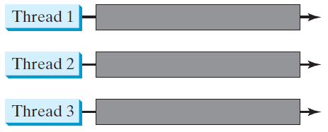
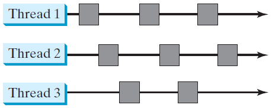
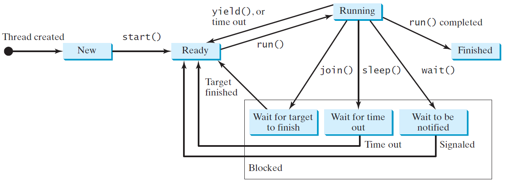
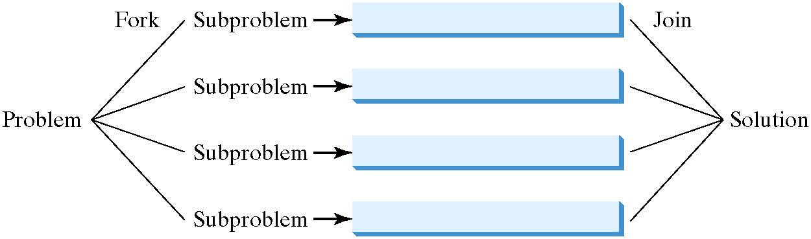

# Module 5: Multithreading and parallel programming
[Chapter 32](../bookextra/ch32.pdf)


Objectives
---
- describe the life cycle of a thread 
- Exploit multithreading
  - develop task classes by implementing the Runnable interface 
  - create threads to run tasks using the Thread class 
    - control threads using the methods in the Thread class
    - control animations using threads and use Platform.runLater 
  - execute tasks in a thread pool
- Use synchronized methods or blocks to synchronize threads to avoid race conditions
  - use blocking queues to synchronize access to an array queue, linked queue, and priority queue 
- facilitate thread communications using conditions on locks
- restrict the number of accesses to a shared resource using semaphores
  - use the resource-ordering technique to avoid deadlocks
- create synchronized collections using the static methods in the Collections class
- develop parallel programs using the Fork/Join Framework 


Multithreading
---
- enables multiple tasks in a program to be executed concurrently
- A thread is the flow of execution, from beginning to end, of a task

| Multiple threads on multiple CPUs | Multiple threads sharing a single CPU |
| --------------------------------- | ------------------------------------- |
|         |             |


Creating Tasks and Threads
---
- A task class must implement the [Runnable interface](https://devdocs.io/openjdk~11/java.base/java/lang/runnable)
  -  a SAM, contains only the run() method
- A task must be run from a [thread](https://devdocs.io/openjdk~11/java.base/java/lang/thread)

```java
// custom task class
public class MyTask implements Runnable{
  public MyTask(...) {...}
  @Override // implement the run method in Runnable
  public void run(){ // tell system how to run custom thread
    ...
  }
}

// client class
public class Client{
  public void someMethod(){
    MyTask task = new MyTask(...);
    Thread thread1 = new Thread(task);
    thread1.start();

    Thread thread2 = new Thread(task);
    thread2.start();
  }
}
```


Example: create and run three threads
---
```java
public class TaskThreadDemo {
  public static void main(String[] args) {
    Runnable printA = new PrintChar('a', 100);
    Runnable printB = new PrintChar('b', 100);
    Runnable print100 = new PrintNum(100);

    Thread thread1 = new Thread(printA);
    Thread thread2 = new Thread(printB);
    Thread thread3 = new Thread(print100);

    thread1.start();
    thread2.start();
    thread3.start();
  }
}

class PrintChar implements Runnable {
  private char charToPrint;
  private int times;

  public PrintChar(char c, int t) {
    charToPrint = c;
    times = t;
  }

  @Override
  public void run() {
    for (int i = 0; i < times; i++) {
      System.out.print(charToPrint);
    }
  }
}

class PrintNum implements Runnable {
  private int lastNum;

  public PrintNum(int n) {
    lastNum = n;
  }

  @Override
  public void run() {
    for (int i = 1; i <= lastNum; i++) {
      System.out.print(" " + i);
    }
  }
}
```

The [Thread Class](https://devdocs.io/openjdk~11/java.base/java/lang/thread)
---
- contains the constructors for creating threads for tasks and 
- the methods for controlling threads

| method                    | purpose                                                                 |
| ------------------------- | ----------------------------------------------------------------------- |
| Thread.yield()            | causes a thread to pause temporarily and allow other threads to execute |
| Thread.sleep(miliseconds) | puts the thread to sleep for the specified time in milliseconds         |
| join()                    | forces one thread to wait for another thread to finish                  |
| isAlive()                 | tests whether the thread is currently running                           |
| interrupt()               | interrupts this thread                                                  |
| isInterrupted()           | tests whether the thread is interrupted                                 |

- deprecated methods: stop(), suspend(), and resume()
  - inherently unsafe
- assign null to a Thread variable to indicate that it is stopped rather than use the stop() method


Practice✏️
---
```java
// 1. yield
public void run() {
  for (int i = 1; i <= lastNum; i++) {
    System.out.print(" " + i);
    Thread.yield();
  }
}

// 2. sleep
public void run() {
  try{
    for (int i = 1; i <= lastNum; i++) {
      System.out.print(" " + i);
      if(i >= lastNum/2) Thread.sleep(1);
    }    
  }catch(InterruptedException ex){
  }
}

// 3. join
public void run() throws Throwable {
  Thread t = new Thread(new PrintChar('*', 50));
  t.start();
  for (int i = 1; i <= lastNum; i++) {
    System.out.print(" " + i);
    if(i == lastNum/2) t4.join(); // join may throw InterruptedException
  }
}
```


Thread Priority
---
- A thread inherits the priority of the thread that spawned it
- The main thread is assigned a default priority of Thread.NORM_PRIORITY 
  - can be changed with setPriority(int priority)
  - priority range 1 to 10
- Some constants for priorities include 
  - Thread.MIN_PRIORITY (1)
  - Thread.NORM_PRIORITY (5)
  - Thread.MAX_PRIORITY (10)


Animation Using Threads and the [Platform.runLater Method](https://openjfx.io/javadoc/11/javafx.graphics/javafx/application/Platform.html)
---
- JavaFX GUI runs from the JavaFX application thread
- The code in a nonapplication thread cannot update GUI in the application thread
- Invoking Platform.runLater(Runnable r) tells the system to run this Runnable object in the application thread


Example: Flashing Text
---


```java
import javafx.application.Application;
import javafx.application.Platform;
import javafx.scene.Scene;
import javafx.scene.control.Label;
import javafx.scene.layout.StackPane;
import javafx.stage.Stage;

public class FlashText extends Application {
  private String text = "";
  
  @Override
  public void start(Stage primaryStage) {   
    StackPane pane = new StackPane();
    Label lblText = new Label("Programming is fun");
    pane.getChildren().add(lblText);
    
    new Thread(new Runnable() {
      @Override
      public void run() {
        try {
          while (true) {
            if (lblText.getText().trim().length() == 0)
              text = "Welcome";
            else
              text = "";
            
            Platform.runLater(()-> lblText.setText(text));
            
            Thread.sleep(200);
          }
        }
        catch (InterruptedException ex) {
        }
      }
    }).start();
    
    Scene scene = new Scene(pane, 200, 50);
    primaryStage.setTitle("FlashText");
    primaryStage.setScene(scene);
    primaryStage.show();
  }

  public static void main(String[] args) {
    launch(args);
  }
}
```


Practice✏️
---
```java
//-- Exercise 1
// Replace 
Platform.runLater(()-> lblText.setText(text));
// with 
lblText.setText(text);
// Is the animation still working?

//-- Exercise 2
// Put the text modification code in Platform.runLater as well
```


Thread Pools
---
- execute a large number of tasks efficiently
  - Starting a new thread for each task could limit throughput and cause poor performance
-  the [Executor interface](https://devdocs.io/openjdk~11/java.base/java/util/concurrent/executor) is used for executing tasks in a thread pool 
   -  the [ExecutorService interface](https://devdocs.io/openjdk~11/java.base/java/util/concurrent/executorservice) for managing and controlling tasks
   -  ExecutorService is a subinterface of Executor
- Executor and ExecutorService objects are created with class [Executors](https://devdocs.io/openjdk~11/java.base/java/util/concurrent/executors)


```java
import java.util.concurrent.*;

public class ExecutorDemo {
  public static void main(String[] args) {
    // practices: 
    // 1. change 3 to 1 below, what will happen?
    // 2. replace newFixedThreadPool(3) with newCachedThreadPool(), what will happen?
    ExecutorService executor = Executors.newFixedThreadPool(3);

    executor.execute(new PrintChar('a', 100));
    executor.execute(new PrintChar('b', 100));
    executor.execute(new PrintNum(100));

    executor.shutdown();
  }
}
```


Thread Synchronization
---
- coordinates the execution of dependent threads
- A shared resource may be corrupted if it is accessed simultaneously by multiple threads
  - For example, two unsynchronized threads accessing the same bank account may cause conflict
  - This is a common problem known as a *race condition* in multithreaded programs
  - A class is said to be *thread-safe* if its objects do not cause a race condition in multiple threading

```java
import java.util.concurrent.*;

public class AccountWithoutSync {
  private static Account account = new Account();

  public static void main(String[] args) {
    ExecutorService executor = Executors.newCachedThreadPool();

    for (int i = 0; i < 100; i++) {
      executor.execute(new AddAPennyTask());
    }

    executor.shutdown();

    while (!executor.isTerminated()) {// Wait until all tasks are finished
    }

    System.out.println("What is balance? " + account.getBalance());
  }

  private static class AddAPennyTask implements Runnable {
    public void run() {
      account.deposit(1);
    }
  }

  private static class Account {
    private int balance = 0;

    public int getBalance() {
      return balance;
    }

    public void deposit(int amount) {
      int newBalance = balance + amount;

      try {
        Thread.sleep(5);
      }
      catch (InterruptedException ex) {
      }

      balance = newBalance;
    }
  }
}
```


The synchronized keyword
---
- To avoid race conditions, more than one thread must be prevented from simultaneously entering certain part of the program, known as *critical region*
- the synchronized keyword synchronizes a method so that only one thread can access the method at a time
- A synchronized method acquires a lock before it executes
  - the lock is on the object for an instance method
  - on the class for a static method
- lock acquired -> method executed -> lock released


Synchronizing Statements 
---
- A synchronized statement can be used to acquire a lock on any object
  - not just this object
- When executing a block of the code in a method, this block is referred to as a synchronized block
  ```java
  // The general form of a synchronized statement 
  synchronized (expr){ // expr must evaluate to an object reference
    statements;
  }
  ```
- Any synchronized instance method can be converted into a synchronized statement
  ```java
  public synchronized void aMethod(){
    // method body
  } 
  // is equivalent to
  public void aMethod(){
    synchronized (this){
      // method body
    }
  }
  ```


Synchronization Using Locks 
---
- A synchronized instance method implicitly acquires a lock on the instance before it executes the method
- That locks can be acquired explicitly are flexible and gives you more control for coordinating threads
  - A lock is an instance of the [Lock interface](https://devdocs.io/openjdk~11/java.base/java/util/concurrent/locks/lock)
    - which declares the methods for acquiring and releasing locks. 
    - A lock may also use the newCondition() method to create any number of Condition objects 
      - which can be used for thread communications


Fairness Policy
---
- [ReentrantLock](https://devdocs.io/openjdk~11/java.base/java/util/concurrent/locks/reentrantlock) is a concrete implementation of Lock for creating mutual exclusive locks
- a lock can be created with the specified fairness policy
  - True fairness policies guarantee the longest-wait thread to obtain the lock first
  - False fairness policies grant a lock to a waiting thread without any access order
- Fair locks may 
  - have poor overall performance than those using the default setting
  - but have smaller variances in times to obtain locks and guarantee lack of starvation

```java
import java.util.concurrent.*;
import java.util.concurrent.locks.*;

public class AccountWithSyncUsingLock {
  private static Account account = new Account();

  public static void main(String[] args) {
    ExecutorService executor = Executors.newCachedThreadPool();

    for (int i = 0; i < 100; i++) {
      executor.execute(new AddAPennyTask());
    }

    executor.shutdown();

    while (!executor.isTerminated()) {
    }

    System.out.println("What is balance ? " + account.getBalance());
  }

  public static class AddAPennyTask implements Runnable {
    public void run() {
      account.deposit(1);
    }
  }

  public static class Account {
    private static Lock lock = new ReentrantLock();
    private int balance = 0;

    public int getBalance() {
      return balance;
    }

    public void deposit(int amount) {
      lock.lock();

      try {
        int newBalance = balance + amount;

        Thread.sleep(5);

        balance = newBalance;
      }
      catch (InterruptedException ex) {
      }
      finally {
        lock.unlock();
      }
    }
  }
}
```


Cooperation Among Threads
---
- Conditions can be used to facilitate communications among threads
  - A thread can specify what to do under a certain [condition](https://devdocs.io/openjdk~11/java.base/java/util/concurrent/locks/condition)
- Conditions are objects created by invoking the newCondition() method on a Lock object
  - they have three popular methods
    - await() method causes the current thread to wait until the condition is signaled
    - signal() method wakes up one waiting thread
    - signalAll() method wakes all waiting threads


Example: Thread Cooperation 
---

```java
import java.util.concurrent.*;
import java.util.concurrent.locks.*;

public class ThreadCooperation {
  private static Account account = new Account();

  public static void main(String[] args) {
    ExecutorService executor = Executors.newFixedThreadPool(2);
    executor.execute(new DepositTask());
    executor.execute(new WithdrawTask());
    executor.shutdown();

    System.out.println("Thread 1\t\tThread 2\t\tBalance");
  }

  public static class DepositTask implements Runnable {
    public void run() {
      try {
        while (true) {
          account.deposit((int)(Math.random() * 10) + 1);
          Thread.sleep(1000);
        }
      }
      catch (InterruptedException ex) {
        ex.printStackTrace();
      }
    }
  }

  public static class WithdrawTask implements Runnable {
    public void run() {
      while (true) {
        account.withdraw((int)(Math.random() * 10) + 1);
      }
    }
  }

  private static class Account {
    private static Lock lock = new ReentrantLock();

    private static Condition newDeposit = lock.newCondition();

    private int balance = 0;

    public int getBalance() {
      return balance;
    }

    public void withdraw(int amount) {
      lock.lock();
      try {
        // Practice: what will happen if we changed while below to if?
        while (balance < amount) {
          System.out.println("\t\t\tWait for a deposit");
          newDeposit.await();
        }
        balance -= amount;
        System.out.println("\t\t\tWithdraw " + amount +
          "\t\t" + getBalance());
      }
      catch (InterruptedException ex) {
        ex.printStackTrace();
      }
      finally {
        lock.unlock();
      }
    }

    public void deposit(int amount) {
      lock.lock();
      try {
        balance += amount;
        System.out.println("Deposit " + amount +
          "\t\t\t\t\t" + getBalance());

        newDeposit.signalAll();
      }
      finally {
        lock.unlock();
      }
    }
  }
}
```

---

Java’s Built-in Monitors (Optional)
---
- Old features prior to Java 5
  - A monitor is an object with mutual exclusion and synchronization capabilities
  - Only one thread can execute a method at a time in the monitor
  - A thread enters the monitor by acquiring a lock on the monitor and exits by releasing the lock
  - Any object can be a monitor
    - An object becomes a monitor once a thread locks it
  - Locking is implemented using the synchronized keyword on a method or a block
    - A thread must acquire a lock before executing a synchronized method or block
    - A thread can wait in a monitor if the condition is not right for it to continue executing in the monitor
- Locks and conditions are more powerful and flexible than the built-in monitor

```java
synchronized (anObject){
  try{
    while(!condition){
      anObject.wait(); // release the lock then blocked until receive notification
    }
    // do its job when condition is true
  }
  catch (InterruptedException ex){
    ex.printStackTrace();
  }
}

synchronized (anObject){
  // When condition becomes true
  anObject.notify(); // anObject.notifyAll();
}
```

wait(), notify(), and notifyAll()
---
- must be called in a synchronized method or a synchronized block on the calling object of these methods
  - Otherwise, an IllegalMonitorStateException will occur
- wait() lets the thread wait until some condition occurs
  - When wait() is invoked, it pauses the thread and simultaneously releases the lock on the object 
    - When the thread is restarted after being notified, the lock is automatically reacquired
  - When it occurs, you can use the notify() or notifyAll() methods to notify the waiting threads to resume normal execution
  - The notifyAll() method wakes up all waiting threads
  - while notify() picks up only one thread from a waiting queue
- The wait(), notify(), and notifyAll() methods on an object are analogous to the await(), signal(), and signalAll() methods on a condition


Case study: producer/consumer
---
- Using two conditions
  - notFull
  - notEmpty
  - [source code](./demos/ConsumerProducer.java)
- Using Blocking Queues
  - [source code](./demos/ConsumerProducerUsingBlockingQueue.java)

```java
// task for producing an int
while(count == CAPACITY)
  notFull.await();
// add an int to the buffer
notEmpty.signal();

// task for consuming an int
while(count == 0)
  notEmpty.await();
// delete an int from the buffer
notFull.signal();
```


[Blocking Queues](https://devdocs.io/openjdk~11/java.base/java/util/concurrent/blockingqueue)
---
- causes a thread to block when you try to add an element to a full queue 
  - or to remove an element from an empty queue
- Three concrete blocking queues defined in package java.util.concurrent 
  - [ArrayBlockingQueue](https://devdocs.io/openjdk~11/java.base/java/util/concurrent/arrayblockingqueue)
    - implements a blocking queue using an array
  - [LinkedBlockingQueue](https://devdocs.io/openjdk~11/java.base/java/util/concurrent/linkedblockingqueue)
    - implements a blocking queue using a linked list
  - [PriorityBlockingQueue](https://devdocs.io/openjdk~11/java.base/java/util/concurrent/priorityblockingqueue)
  - The last two could be bounded or unbounded


[Semaphores](https://devdocs.io/openjdk~11/java.base/java/util/concurrent/semaphore)
---
- used to restrict the number of threads that access a shared resource
- Before accessing the resource, a thread must acquire a permit from the semaphore
- After finishing with the resource, the thread must return the permit back to the semaphore

```java
// A thread accessing a shared resource
// Acquire a permit from a semaphore, wait if the permit is not available
semaphore.acquire();
// Access the resource
// Release the permit to the semaphore
semaphore.release();
```


Deadlock
---
- caused when two or more threads need to acquire the locks on several shared objects
  - each thread has the lock on one of the objects and is waiting for the lock on the other object
  - these threads wait for each other to release in order to get the lock, and neither can continue to run

```java
// thread 1 waits for thread 2 to release the lock on object 2
synchronized (object1){
  // do something here
  synchronized (object2){
    // do something here
  }
}

// thread 2 waits for thread 1 to release the lock on object 1
synchronized (object2){
  // do something here
  synchronized (object1){
    // do something here
  }
}
```


Preventing Deadlock
---
- resource ordering
  - assign an order on all the objects whose locks must be acquired 
  - ensure that each thread acquires the locks in that order
- resource yielding
  - one or more threads yield their locked resources for a random amount of time


Thread States
---
- five states: New, Ready, Running, Blocked, or Finished




[Synchronized Collections](https://devdocs.io/openjdk~11/java.base/java/util/collections)
---
- The classes in the Java Collections Framework are not thread-safe, i.e., 
  - their contents may be corrupted if they are accessed and updated concurrently by multiple threads
- protected by locking the collection or using synchronized collections
- six static methods are provided for wrapping a collection into
  - synchronization wrapper implemented using the synchronized keyword
  - replace old Vector, Stack and Hashtable with ArrayList, LinkedList and Map respectively
- the iterator is fail-fast by throwing java.util.ConcurrentModificationException
  - avoid by creating a synchronized collection object and acquiring a lock on the object when traversing it
  ```java
  Set mySet = Collections.synchronizedSet(new HashSet());
  synchronized(mySet){
    Iterator ite = mySet.iterator();
    while(ite.hasNext()){
      System.out.println(ite.next());
    }
  }
  ```


The Fork/Join Framework
---
- utilizes multicore processors for parallel programming
- a fork can be viewed as an independent task that runs on a thread
  - a task is defined as [ForkJoinTask](https://devdocs.io/openjdk~11/java.base/java/util/concurrent/forkjointask)
  - a task is executed in an instance of [ForkJoinPool](https://devdocs.io/openjdk~11/java.base/java/util/concurrent/forkjoinpool)




Examples
---
- [ParallelMergeSort](./demos/ParallelMergeSort.java)
- [ParallelMax](./demos/ParallelMax.java)


# Reference textbooks
* [Introduction to Java Programming, Comprehensive, 12/E](https://media.pearsoncmg.com/bc/abp/cs-resources/products/product.html#product,isbn=0136519350)
  * [Student resources](https://media.pearsoncmg.com/ph/esm/ecs_liang_ijp_12/cw/)
  * [Source code](https://media.pearsoncmg.com/ph/esm/ecs_liang_ijp_12/cw/content/source-code.php)
* [OpenJDK 11.0.11 Documentation](https://devdocs.io/openjdk~11/)