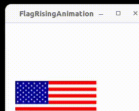

# Assignment4: Multithreading and parallel programming

## Q1: Raise flag (textbook programming exercises 32.3)
Rewrite the rising flag animation below **using a thread** to MANUALLY animate the flag being raised.

- You can NOT use any animation classes such as PathTransition, FadeTransition, Timeline, etc.
- Manual animation is changing the visual effect of nodes manually and gradually
  - Raising a flag
    - decreasing the $y$ coordinate of the imageView of a flag
  - Lowering a flag
    - increasing the $y$ coordinate of the imageView of a flag
  - Fading out
    - increasing transparency, or the $\alpha$ channel value
  - Inflating a circle
    - increasing its radius
- Using Thread.sleep to adjust the animation speed

```java
import javafx.animation.*;
import javafx.application.Application;
import javafx.scene.Scene;
import javafx.scene.image.ImageView;
import javafx.scene.layout.Pane;
import javafx.scene.shape.Line;
import javafx.stage.Stage;
import javafx.util.Duration;

public class FlagRisingAnimation extends Application {
  @Override
  public void start(Stage primaryStage) {
    Pane pane = new Pane();
    
    ImageView imageView = new ImageView("image/us.gif");
    
    double flagHeight = imageView.getLayoutBounds().getHeight();
    Line line = new Line(100, 200+flagHeight/2, 100, -flagHeight/2);
    pane.getChildren().add(imageView);
    // pane.getChildren().add(line);
    
    PathTransition pt = new PathTransition(Duration.millis(2000), line , imageView);
    pt.setCycleCount(Timeline.INDEFINITE);
    pt.play();
    
    Scene scene = new Scene(pane, 250, 200);
    primaryStage.setTitle("FlagRisingByPathTransition");
    primaryStage.setScene(scene);
    primaryStage.show();
  }
  
  public static void main(String[] args) {
    launch(args);
  }
}
```

Hints
---
- The flag size is $160\times 84$ pixel by pixel
- The flag moves 200+84 pixels in 2 seconds, i.e. the rising speed is about 7 milliseconds per pixel
  - or 0.142 pixel per millisecond
- so in the thread, the flag is raising 1 pixel in about 7 milliseconds
- however, it will move slower than the animation above due to thread scheduling overhead
- Could you change the speed to make the flag rise as fast as the animation?


Sample output
---



## Extra credit (10%) Rewrite Q1 with speed adjustment by arrow keys
- up arrow key: speed up
- down arrow key: slow down