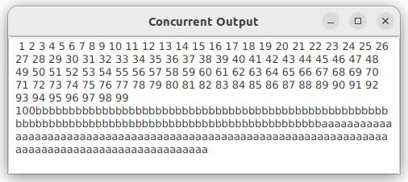
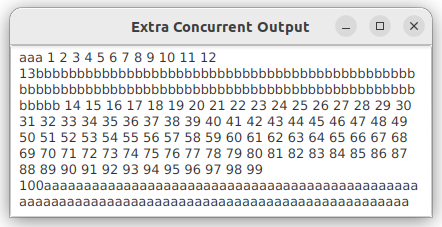

# Lab3: Multithreading and parallel programming

## Q1: Concurrent output (textbook Programming exercises 32.1)

Rewrite the example multithreading program below to display output in a text area, as
shown in the sample output.

```java
public class TaskThreadDemo {
  public static void main(String[] args) {
    Runnable printA = new PrintChar('a', 100);
    Runnable printB = new PrintChar('b', 100);
    Runnable print100 = new PrintNum(100);

    Thread thread1 = new Thread(printA);
    Thread thread2 = new Thread(printB);
    Thread thread3 = new Thread(print100);

    thread1.start();
    thread2.start();
    thread3.start();
  }
}

class PrintChar implements Runnable {
  private char charToPrint;
  private int times;

  public PrintChar(char c, int t) {
    charToPrint = c;
    times = t;
  }

  @Override
  public void run() {
    for (int i = 0; i < times; i++) {
      System.out.print(charToPrint);
    }
  }
}

class PrintNum implements Runnable {
  private int lastNum;

  public PrintNum(int n) {
    lastNum = n;
  }

  @Override
  public void run() {
    for (int i = 1; i <= lastNum; i++) {
      System.out.print(" " + i);
    }
  }
}
```

Sample output
---
- Note: your output could be different



Hints
---
- You may use keyword synchronized to protect the text area when a thread is trying to update it.
  - Platform.runLater is unnecessary here
  ```java
  synchronized (textArea) {
    textArea.appendText("" + char_or_number); 
  }
  ```
- You may also use Platform.runLater, then synchronized is unnecessary
  ```java
  Platform.runLater(() -> textArea.appendText("" + char_or_number));
  ```
- You may refer to a similar program [Typing Characters](./demos/TypeCharacter.java)

## Extra credit (10%) Rewrite Q1 with thread pool.

Sample output
---
- Note: your output could be different



# References
- [JavaFX Integration Strategies](https://www.oracle.com/technical-resources/articles/java/javafxinteg.html)