# Module 6: Network programming
[Chapter 33](../bookextra/ch33.pdf)


Objectives
---
- To explain terms
  - TCP, IP, domain name, and domain name server 
  - stream-based communications (TCP) and packet-based communications (UDP)
- develop client/server application
  -  using server sockets and client sockets 
  -  using stream sockets 
  -  develop servers for multiple clients 
- obtain Internet addresses using the InetAddress class 
- send and receive objects on a network
- develop an interactive tic-tac-toe game played on the Internet 


Client/Server Communications
---

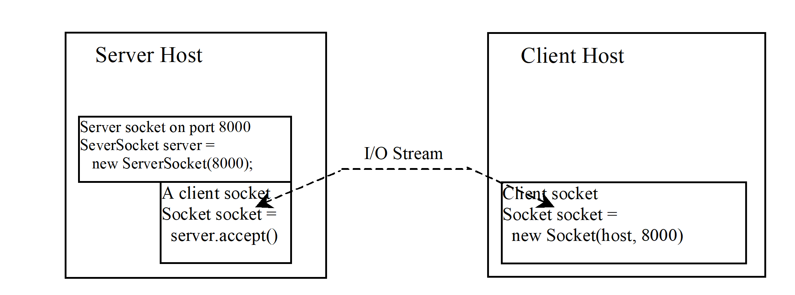

- The server starts and waits for a connection request from a client
  - A server is established with a server socket and attached to a port listening for connections
- The client requests a connection to a server
- After the server accepts the connection, communication between server and client is conducted the same as for I/O streams


```java
// 1. server establishes a socket
ServerSocket sSocket = new ServerSocket(port);
// 2. server listens on a port
Socket socket = sSocket.accept();
// 3. client request a connection to a server
Socket socket = new Socket(serverHost, port);
```

- serverHost could be a
  - fqdn (fully qualified domain name) name: 
    - google.com, [localhost](https://en.wikipedia.org/wiki/Localhost)
  - ip address: 
    - 142.250.217.206
    - 172.0.0.1


Data Transmission through Sockets 
---

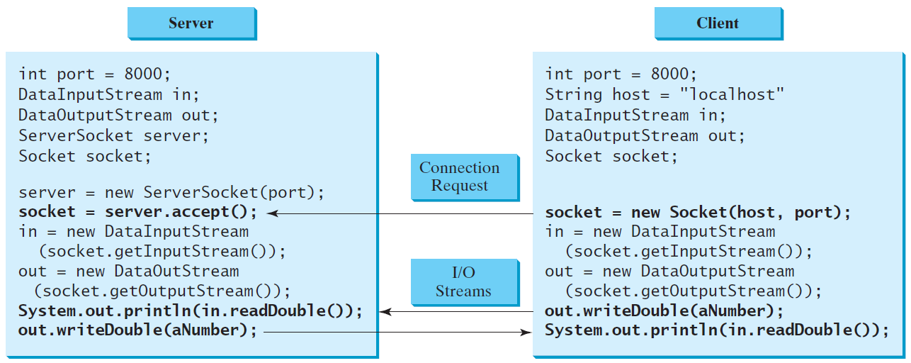

- [server source code](./demos/cmdServer.java)
- [client source code](./demos/cmdClient.java)

A Client/Server Example
---

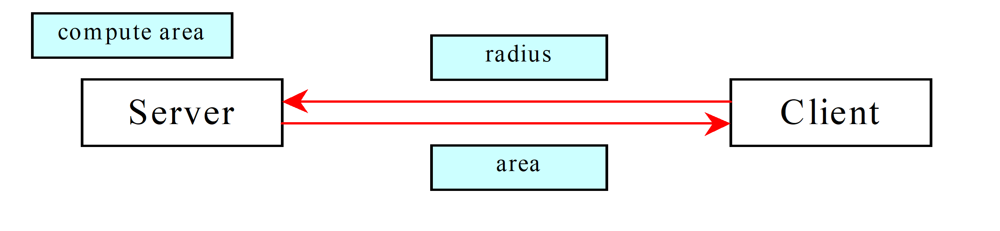

| server                           | client                           |
| -------------------------------- | -------------------------------- |
| 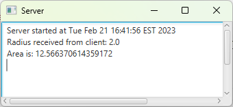 | 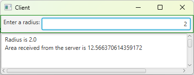 |

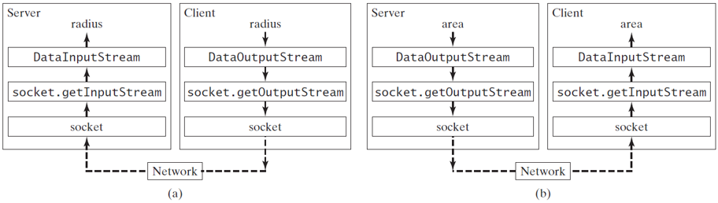


```java
// Server.java
import java.io.*;
import java.net.*;
import java.util.Date;
import javafx.application.Application;
import javafx.application.Platform;
import javafx.scene.Scene;
import javafx.scene.control.ScrollPane;
import javafx.scene.control.TextArea;
import javafx.stage.Stage;

public class Server extends Application {
  @Override
  public void start(Stage primaryStage) {
    TextArea ta = new TextArea();

    Scene scene = new Scene(new ScrollPane(ta), 450, 200);
    primaryStage.setTitle("Server");
    primaryStage.setScene(scene);
    primaryStage.show();
    
    new Thread( () -> {
      try {
        ServerSocket serverSocket = new ServerSocket(8000);
        Platform.runLater(() -> ta.appendText("Server started at " + new Date() + '\n'));
  
        Socket socket = serverSocket.accept();
  
        DataInputStream inputFromClient = new DataInputStream(
          socket.getInputStream());
        DataOutputStream outputToClient = new DataOutputStream(
          socket.getOutputStream());
  
        while (true) {
          double radius = inputFromClient.readDouble();  
          double area = radius * radius * Math.PI;  
          outputToClient.writeDouble(area);
  
          Platform.runLater(() -> {
            ta.appendText("Radius received from client: " + radius + '\n');
            ta.appendText("Area is: " + area + '\n'); 
          });
        }
      }
      catch(IOException ex) {
        ex.printStackTrace();
      }
    }).start();
  }

  public static void main(String[] args) {
    launch(args);
  }
}
```

```java
// Client.java
import java.io.*;
import java.net.*;
import javafx.application.Application;
import javafx.geometry.Insets;
import javafx.geometry.Pos;
import javafx.scene.Scene;
import javafx.scene.control.Label;
import javafx.scene.control.ScrollPane;
import javafx.scene.control.TextArea;
import javafx.scene.control.TextField;
import javafx.scene.layout.BorderPane;
import javafx.stage.Stage;

public class Client extends Application {
  DataOutputStream toServer = null;
  DataInputStream fromServer = null;

  @Override
  public void start(Stage primaryStage) {
    BorderPane paneForTextField = new BorderPane();
    paneForTextField.setPadding(new Insets(5, 5, 5, 5)); 
    paneForTextField.setStyle("-fx-border-color: green");
    paneForTextField.setLeft(new Label("Enter a radius: "));
    
    TextField tf = new TextField();
    tf.setAlignment(Pos.BOTTOM_RIGHT);
    paneForTextField.setCenter(tf);
    
    BorderPane mainPane = new BorderPane();
    TextArea ta = new TextArea();
    mainPane.setCenter(new ScrollPane(ta));
    mainPane.setTop(paneForTextField);
    
    Scene scene = new Scene(mainPane, 450, 200);
    primaryStage.setTitle("Client");
    primaryStage.setScene(scene);
    primaryStage.show();
    
    tf.setOnAction(e -> {
      try {
        double radius = Double.parseDouble(tf.getText().trim());
  
        toServer.writeDouble(radius);
        toServer.flush();
  
        double area = fromServer.readDouble();
  
        ta.appendText("Radius is " + radius + "\n");
        ta.appendText("Area received from the server is " + area + '\n');
      }
      catch (IOException ex) {
        System.err.println(ex);
      }
    });
  
    try {
      Socket socket = new Socket("localhost", 8000);
      fromServer = new DataInputStream(socket.getInputStream());
      toServer = new DataOutputStream(socket.getOutputStream());
    }
    catch (IOException ex) {
      ta.appendText(ex.toString() + '\n');
    }
  }

  public static void main(String[] args) {
    launch(args);
  }
}
```


The [InetAddress Class](https://devdocs.io/openjdk~11/java.base/java/net/inetaddress)
---
- models an IP address
  - used to find the client's host name and IP address by the server
    ```java
    InetAddress inetAddress = socket.getInetAddress();
    System.out.println("Client's host name is " + inetAddress.getHostName());
    System.out.println("Client's IP Address is " + inetAddress.getHostAddress());
    ```

```java
import java.net.*;

public class IdentifyHostNameIP {
  public static void main(String[] args) {
    for (int i = 0; i < args.length; i++) {
      try {
        InetAddress address = InetAddress.getByName(args[i]);
        System.out.print("Host name: " + address.getHostName() + " ");
        System.out.println("IP address: " + address.getHostAddress());
      }
      catch (UnknownHostException ex) {
        System.err.println("Unknown host or IP address " + args[i]);
      }
    }
  }
}
```

```powershell
> javac .\IdentifyHostNameIP.java
> java IdentifyHostNameIP www.whitehouse.gov 142.250.217.206
Host name: www.whitehouse.gov IP address: 192.0.66.168
Host name: mia07s61-in-f14.1e100.net IP address: 142.250.217.206
```


Serving Multiple Clients 
---
- A server socket can have many connections from clients all over the Internet
  - creates a thread for each connection to handle them simultaneously

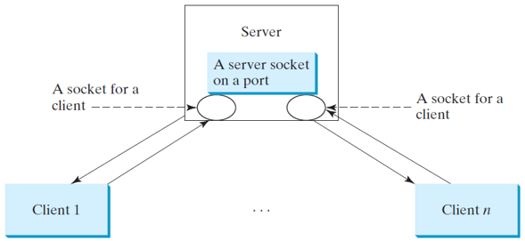

```java
while (true) {
  Socket socket = serverSocket.accept();
  Thread thread = new ThreadClass(socket);
  thread.start();
}
```

| server                      | client                                                        |
| --------------------------- | ------------------------------------------------------------- |
| 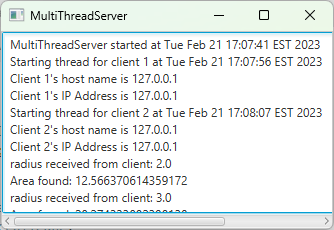 | 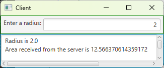 <br/> 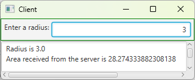 |

- source code
  - [MultiThreadServer](./demos/MultiThreadServer.java)

Case study: Passing Objects in Network Programs
---
- A program can send and receive objects from another program
  - using ObjectOutputStream and ObjectInputStream on socket streams
  - the objects must be serializable

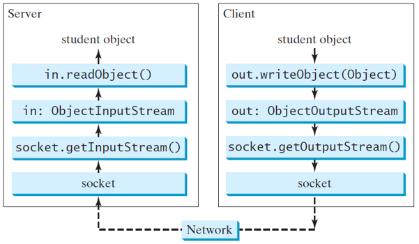

| server                                                                      | client                                        |
| --------------------------------------------------------------------------- | --------------------------------------------- |
| > java StudentServer <br/>Server started<br/>A new student object is stored | 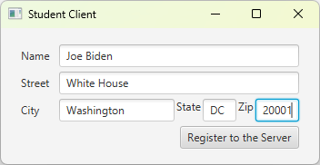 |

- source code
  - [StudentAddress](./demos/StudentAddress.java)
  - [StudentServer](./demos/StudentServer.java)
  - [StudentClient](./demos/StudentClient.java)


Case Study: Distributed TicTacToe Games
---
-  enables two players to play the tic-tac-toe game on the Internet
-  using multithreads and networking with socket streams
-  The server creates a server socket and accepts connections from every two players to form a session 
   -  Each session is a thread that communicates with the two players and determines the status of the game
- The client is responsible for interacting with the players
  - It creates a user interface with nine cells and displays the game title and status
  - It does not determine the game status (win or draw)
  - it simply passes the moves to the server and receives the game status from the server

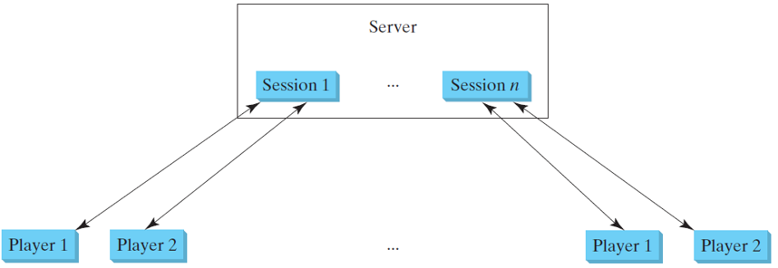

| server                                | clients                                                                              |
| ------------------------------------- | ------------------------------------------------------------------------------------ |
| 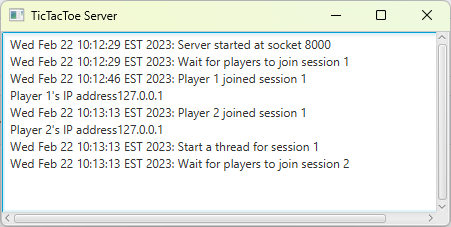 | 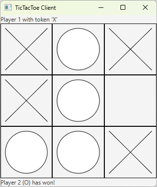<br/> 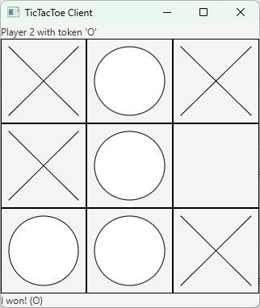 |

- source code
  - [TicTacToeServer](./demos/TicTacToeServer.java)
  - [TicTacToeClient](./demos/TicTacToeClient.java)
  - [TicTacToeConstants](./demos/TicTacToeConstants.java)

---

Stream Socket vs. Datagram Socket  
---
- Stream Socket
  - A dedicated point-to-point channel between a client and server
  - Use TCP (Transmission Control Protocol) for data transmission
  - Lossless and reliable
  - Sent and received in the same order
- Datagram Socket
  - No dedicated point-to-point channel between a client and server
  - Use UDP (User Datagram Protocol) for data transmission
  - May lose data and not 100% reliable
  - Data may not be received in the same order as sent


[DatagramPacket](https://devdocs.io/openjdk~11/java.base/java/net/datagrampacket)
---
- represents a datagram packet
- used to implement a connectionless packet delivery service
- routed based solely on packet information


[DatagramSocket](https://devdocs.io/openjdk~11/java.base/java/net/datagramsocket)
---
- represents a socket for sending and receiving datagram packets
  - is the sending or receiving point for a packet delivery service
- Each packet sent or received on a datagram socket is individually addressed and routed
- Multiple packets sent from one machine to another 
  - may be routed differently
  - may arrive in any order

```java
// 1. Create a server DatagramSocket
DatagramSocket ds = DatagramSocket(port);
// 2. Create a client DatagramSocket
DatagramSocket dc = DatagramSocket();
// 3. send data after filling in a DatagramPacket with the Internet address and port number for the receiver
// invoke the send(packet) method on a DatagramSocket
dc.send(packet);
// 4. receive data with an empty packet and invoke the receive(packet) method on a DatagramSocket
ds.receive(packet)
```


Datagram Programming
---
- different from stream socket programming in the sense that 
  - there is no concept of a ServerSocket for datagrams
- Both client and server use DatagramSocket to send and receive packets
- Source code
  - [DatagramServer](./demos/DatagramServer.java)
  - [DatagramClient](./demos/DatagramClient.java)

| server                              | client                              |
| ----------------------------------- | ----------------------------------- |
| 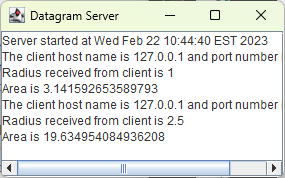 | 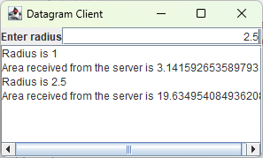 |

# Reference textbooks
* [Introduction to Java Programming, Comprehensive, 12/E](https://media.pearsoncmg.com/bc/abp/cs-resources/products/product.html#product,isbn=0136519350)
  * [Student resources](https://media.pearsoncmg.com/ph/esm/ecs_liang_ijp_12/cw/)
  * [Source code](https://media.pearsoncmg.com/ph/esm/ecs_liang_ijp_12/cw/content/source-code.php)
* [OpenJDK 11.0.11 Documentation](https://devdocs.io/openjdk~11/)