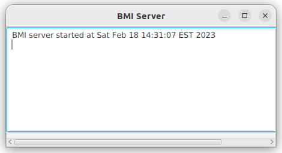
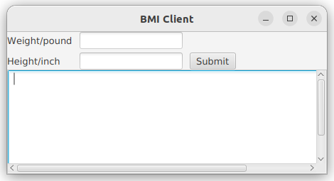
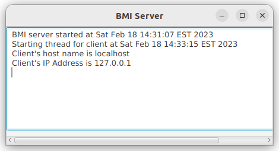
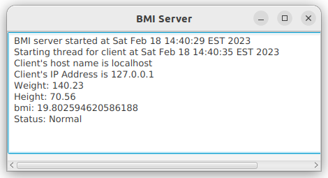
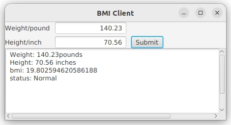

# Assignment5: Network programming

## Q1: BMI server (textbook programming exercises 33.2)

- Write a server computing BMI (Body Mass Index) and test it with the given [BMIClient](./code/BMIClient.class)
  - **Note**: the server must be able to handle multiple clients simultaneously with multiple threads
  - port number: 8000
  - **Note: How to run the BMIClient?**
    - Download the given [BMIClient](./code/BMIClient.class) and save it in your current working folder where you save your BMIServer.java
    - Open a command prompt window, *cd* into your working folder
    - type command *dir*, if you see *BMIClient.class* then you are in the right folder
    - run BMIClient
      ```cmd
      :: 1. run a single instance of BMIClient
      java BMIClient
      :: 2. run 4 instances of BMIClient
      for /L %i in (0,1,3) do start /b java BMIClient
      ```
    - If you forgot how to run java program from command prompt, please watch [this video]((https://youtu.be/oWIGI9AUYqU)) from 13:47 to 17:32
  - Run multiple clients from command prompt
    ```cmd
    :: (start, step, end)
    for /L %i in (0,1,3) do start /b java BMIClient
    :: NOTE: these clients overlapped, use mouse to drag and re-arrange
    ```
  - Run multiple client from Powershell
    ```powershell
    # start 3 clients at the same time
    # NOTE: these clients overlapped, use mouse to drag and re-arrange
    # you may change 3 below to whatever number you want
    for ($i=0; $i -lt 3; $i++) {Start-Process "java" -ArgumentList BMIClient -NoNewWindow}
    ```
  - The client sends the weight (send firstly) and height (send secondly) for a person to the server 
  - The server computes BMI  and sends back to the client
    - a double number bmi (send first)
    - a string that reports the BMI (send second)
      - Hint: use method [writeUTF of a DataOutputStream](https://devdocs.io/openjdk~11/java.base/java/io/dataoutputstream)
    - computing BMI is given below

$$bmi = \dfrac{weightInKilograms}{heightInMeters \times heightInMeters} = \dfrac{weightInKilograms}{heightInMeters^2}$$

- Status can be determined based on the bmi

| bmi             | status      |
| --------------- | ----------- |
| bmi < 18.5      | Underweight |
| 18.5 ≤ bmi < 25 | Normal      |
| 25 ≤ bmi < 30   | Overweight  |
| 30 ≤ bmi        | Obese       |

```java
class BMI {
  private double weight, height;

  final double KILOGRAMS_PER_POUND = 0.45359237;
  final double METERS_PER_INCH = 0.0254;

  public BMI(double weight, double height) {
    this.weight = weight;
    this.height = height;
  }

  public double getBMI() {
    double weightInKilograms = weight * KILOGRAMS_PER_POUND;
    double heightInMeters = height * METERS_PER_INCH;
    double bmi = weightInKilograms / (heightInMeters * heightInMeters);
    return bmi;
  }

  public String getStatus() {
    double bmi = getBMI();
    String status = "Normal";

    if (bmi < 18.5)
      status = "Underweight";
    else if (bmi < 25)
      status = "Normal";
    else if (bmi < 30)
      status = "Overweight";
    else
      status = "Obese";

    return status;
  }
}
```

Sample output
---
- Run the BMIServer first



- Run the given client from command line 
  ```bash
  java BMIClient
  ```



- BMI server accepts the client and prints its info



- In the BMIClient, fill the weight and height of a person, click button 'submit' to send them to the server
- BMIServer computes the bmi and status, prints them in its text area and sends to BMIClient



- The BMIClient receives the bmi and status from the server
  - prints in its text area



## Extra credit (10%) Implement BMIClient
- Implement a BMIClient.java that functions exactly as the given BMIClient.class


# References
- [ncat](https://nmap.org/ncat/)
- [Unicode Characters in the 'Symbol, Math' Category](https://www.classe.cornell.edu/~dms79/LectureNotes/formulae/list-of-math-symbols-extended.htm)
- [What does it mean to say "Java Modified UTF-8 Encoding"?](https://stackoverflow.com/questions/7921016/what-does-it-mean-to-say-java-modified-utf-8-encoding)
- [TIL - Adding mp4 mov to Github markdown files/blog posts](https://sbulav.github.io/til/til-adding-video-to-github-markdown/)
- [How can I crop a video with ffmpeg?](https://video.stackexchange.com/questions/4563/how-can-i-crop-a-video-with-ffmpeg)