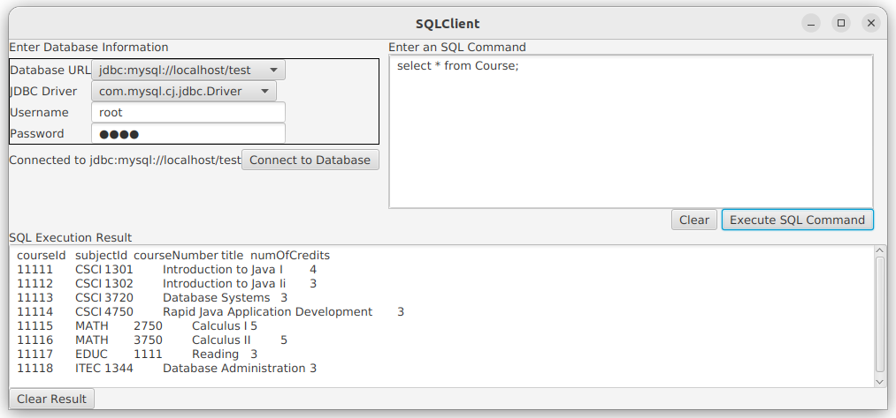
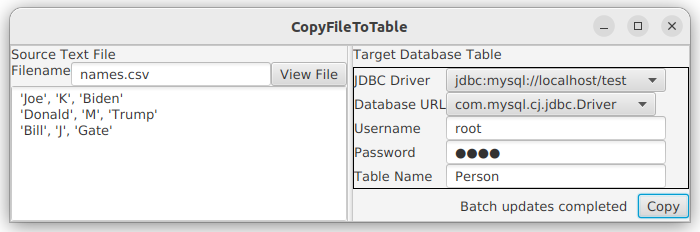
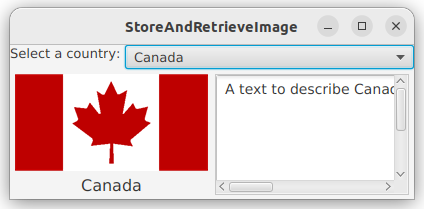

# Advanced Java Database Programming
- [Chapter 35](../bookextra/ch35.pdf)

Objectives
---
- create a universal SQL client for accessing local or remote database
- execute SQL statements in a batch mode
- process updatable and scrollable result sets
- simplify Java database programming using RowSet
- store and retrieve images in JDBC


Practice 📝 Create an interactive SQL client
---



- Connect to any JDBC data source
- Entering and executing SQL commands interactively
- The execution result is displayed for the SELECT queries
- the execution status is displayed for the non-SELECT commands
- [source code](./demos/SQLClient.java)


Explore 🔎
---
- Explore [JDBC Driver list for all leading database](https://www.benchresources.net/jdbc-driver-list-and-url-for-all-databases/)
  - It is necessary to check DBMS official website for recent info


Practice 📝
---
- Install and use [MySQL Database Client in VS Code](https://marketplace.visualstudio.com/items?itemName=cweijan.vscode-mysql-client2)


Batch Update
---
- consist of a sequence of non-select SQL commands
- these commands are collected in a batch and submitted to the database all together
  ```java
  Statement statement = conn.createStatement();
   
  // Add SQL commands to the batch
  statement.addBatch("create table T (C1 integer, C2 varchar(15))");
  statement.addBatch("insert into T values (100, 'Smith')");
  statement.addBatch("insert into T values (200, 'Jones')");
   
  // Execute the batch
  int count[] = statement.executeBatch();
  /* return the number of the rows affected by each SQL command
  count[0]=0 because it is a DDL command
  others return 1 because only one row is affected
  */
  ```


Practice 📝 Copy Text File to Table
---



- The text file is a csv (comma-separated values) file
- string values are enclosed in single quotes
- View File button
  - show the csv file content
- Copy button
  - copy the text to the table
    - The table is already defined in the database
- prerequisites:
  ```sql
  -- 1. create table Person
  create table Person(firstName varchar(20), mi char(1), lastName varchar(20));
  ```

  ```bash
  # 2. create a csv file with the following sample contents
  'Joe', 'K', 'Biden'
  'Donald', 'M', 'Trump'
  'Bill', 'J', 'Gate'
  ```
- [source code](./demos/CopyFileToTable.java)


Scrollable and Updatable Result Set
---
- JDBC 1 supports only sequential forward reading in its result sets
  - A result set maintains a cursor pointing to its current row of data
    - initial position is before the first row 
  - The next() method moves the cursor forward to the next row
- JDBC 2 supports scrollable and updatable result sets, which can
  - scroll the rows both forward and backward 
  - move the cursor to a desired location using 
    - the first, last, next, previous, 
    - absolute, or relative method
  - insert, delete, or update a row in the result set 
    - the changes automatically reflect in the database


Create [Scrollable Statements](https://devdocs.io/openjdk~11/java.sql/java/sql/resultset)
---
- Create a statement with an appropriate type and concurrency mode
  - to obtain a scrollable or updatable result set
  ```java
  // 1.a For a static statement
  Statement statement = connection.createStatement
  (int resultSetType, int resultSetConcurrency);

  // 1.b For a prepared statement
  PreparedStatement statement = connection.prepareStatement
  (String sql, int resultSetType, int resultSetConcurrency);

  // 2. The resulting set is scrollable
  ResultSet resultSet = statement.executeQuery(query);
  ```
- resultSetType could be
  - TYPE_FORWARD_ONLY 
  - TYPE_SCROLL_INSENSITIVE 
  - TYPE_SCROLL_SENSITIVE ✅
- resultSetConcurrency
  - CONCUR_READ_ONLY 
  - CONCUR_UPDATABLE ✅


Practice 📝
---
- Explore "Scrollable and Updatable Result Set"
- prerequisites:
  ```sql
  -- in database test, create table StateCapital
  create table StateCapital(state varchar(40), capital varchar(40));
  alter table StateCapital add primary key(state);
  insert into StateCapital values('United Kindom','London'), ('United States','Washington'), ('Japan','Tokyo'), ('China','Beijing');
  ```
- [source code](./demos/ScrollUpdateResultSet.java)


[RowSet](https://devdocs.io/openjdk~11/java.sql/javax/sql/rowset) basics
---


- introduced in JDBC 2 for simplifying database programming 
- combines Connection, Statement, and ResultSet into one interface
- extends java.sql.ResultSet with additional capabilities to 
  - connect to a JDBC url, username, password
  - set and execute SQL command, 
    - retrieve the execution result
- has two types: 
  - connected such as JdbcRowSet 
  - disconnected such as CachedRowSet


connected RowSet
---
- makes a connection with a data source 
- maintains that connection throughout its life cycle
  - sends the changes back to data source automatically
- JdbcRowSet is neither serializable nor cloneable


disconnected RowSet
---
- makes a connection with a data source, 
- executes a query to get data from the data source, 
- then closes the connection
- makes change to its data while it is disconnected 
  - then send the changes back to the original source of the data
    - it must reestablish a connection to do so
- CachedRowSet is both serializable and cloneable


Practice 📝
---

```java
import javax.sql.rowset.*;

public class SimpleRowSet {
  public static void main(String[] args) {
    try {
      Class.forName("com.mysql.cj.jdbc.Driver");
      System.out.println("Driver loaded");

      CachedRowSet rowSet = RowSetProvider.newFactory().createCachedRowSet();

      rowSet.setUrl("jdbc:mysql://localhost/test");
      rowSet.setUsername("root");
      rowSet.setPassword("your_password");
      rowSet.setCommand("select firstName, mi, lastName " +
          "from Student where lastName = 'Trump'");
      rowSet.execute();

      while (rowSet.next())
        System.out.println(rowSet.getString(1) + "\t" +
            rowSet.getString(2) + "\t" + rowSet.getString(3));

      rowSet.close();
    } catch (Exception e) {
      System.out.println(e.getMessage());
    }
  }
}
```


RowSet for PreparedStatement
---
- RowSet supports parameterized SQL statements
-  RowSet extends ResultSet
   -  so all the methods in ResultSet can be used in RowSet 
      -  For example, obtaining ResultSetMetaData using the getMetaData() 


Practice 📝
---
```java
import java.sql.*;
import javax.sql.rowset.*;

public class RowSetPreparedStatement {
  public static void main(String[] args)
      throws SQLException, ClassNotFoundException {
    Class.forName("com.mysql.cj.jdbc.Driver");
    System.out.println("Driver loaded");

    JdbcRowSet rowSet = RowSetProvider.newFactory().createJdbcRowSet();

    rowSet.setUrl("jdbc:mysql://localhost/test");
    rowSet.setUsername("root");
    rowSet.setPassword("dees");
    rowSet.setCommand("select * from Student where lastName = ? " +
      "and mi = ?");
    rowSet.setString(1, "Trump");
    rowSet.setString(2, "M");
    rowSet.execute();

    ResultSetMetaData rsMetaData = rowSet.getMetaData();
    for (int i = 1; i <= rsMetaData.getColumnCount(); i++)
      System.out.printf("%-12s\t", rsMetaData.getColumnName(i));
    System.out.println();

    while (rowSet.next()) {
      for (int i = 1; i <= rsMetaData.getColumnCount(); i++)
        System.out.printf("%-12s\t", rowSet.getObject(i));
      System.out.println();
    }

    rowSet.close();
  }
}
```


RowSet Scrolling and Updating 
---
- By default, a ResultSet object is neither scrollable nor updatable
- However, a RowSet object is both


Practice 📝
---
- use [JdbcRowSet](https://devdocs.io/openjdk~11/java.sql.rowset/javax/sql/rowset/jdbcrowset)
  - sends the changes back to data source automatically
```java
import java.sql.*;
import javax.sql.RowSet;
import javax.sql.rowset.*;

public class ScrollUpdateRowSet {
  public static void main(String[] args)
      throws SQLException, ClassNotFoundException {
    Class.forName("com.mysql.cj.jdbc.Driver");
    System.out.println("Driver loaded");

    JdbcRowSet rowSet = RowSetProvider.newFactory().createJdbcRowSet();

    rowSet.setUrl("jdbc:mysql://localhost/test");
    rowSet.setUsername("root");
    rowSet.setPassword("your_password");
    
    rowSet.setCommand("select state, capital from StateCapital");
    rowSet.execute();

    System.out.println("Before update ");
    displayRowSet(rowSet);

    rowSet.absolute(2);
    rowSet.updateString("state", "New S");
    rowSet.updateString("capital", "New C");
    rowSet.updateRow();

    rowSet.last();
    rowSet.moveToInsertRow();
    rowSet.updateString("state", "Florida");
    rowSet.updateString("capital", "Tallahassee");
    rowSet.insertRow();
    rowSet.moveToCurrentRow();

    rowSet.absolute(4);
    rowSet.deleteRow();

    System.out.println("After update ");
    displayRowSet(rowSet);

    rowSet.close();
  }

  private static void displayRowSet(RowSet rowSet)
      throws SQLException {
    ResultSetMetaData rsMetaData = rowSet.getMetaData();
    rowSet.beforeFirst();
    while (rowSet.next()) {
      for (int i = 1; i <= rsMetaData.getColumnCount(); i++)
        System.out.printf("%-12s\t", rowSet.getObject(i));
      System.out.println();
    }
  }
}
```

- use [CachedRowSet](https://devdocs.io/openjdk~11/java.sql.rowset/javax/sql/rowset/cachedrowset)
  - manually call acceptChanges() to sends the changes back to data source

```java
import java.sql.*;
import javax.sql.RowSet;
import javax.sql.rowset.*;

public class ScrollUpdateRowSet {
  public static void main(String[] args) {
    try {
      Class.forName("com.mysql.cj.jdbc.Driver");
      System.out.println("Driver loaded");

      Connection conn = DriverManager.getConnection(
        "jdbc:mysql://localhost/test", "root", "your_password");
      conn.setAutoCommit(false);
      CachedRowSet rowSet = RowSetProvider.newFactory().createCachedRowSet();

      rowSet.setCommand("select state, capital from StateCapital");
      rowSet.execute(conn);

      System.out.println("Before update ");
      displayRowSet(rowSet);
      System.out.println("\n--------------------------------------\n");

      rowSet.absolute(2);
      rowSet.updateString("state", "Texas");
      rowSet.updateString("capital", "Austin");
      rowSet.updateRow();

      rowSet.last();
      rowSet.moveToInsertRow();
      rowSet.updateString("state", "Florida");
      rowSet.updateString("capital", "Tallahassee");
      rowSet.insertRow();
      rowSet.moveToCurrentRow();

      rowSet.absolute(1);
      rowSet.deleteRow();

      rowSet.acceptChanges();
      System.out.println("After update ");
      displayRowSet(rowSet);

      rowSet.close();
    } catch (Exception e) {
      System.out.println(e.getMessage());
    }
  }

  private static void displayRowSet(RowSet rowSet)
      throws SQLException {
    ResultSetMetaData rsMetaData = rowSet.getMetaData();
    rowSet.beforeFirst();
    while (rowSet.next()) {
      for (int i = 1; i <= rsMetaData.getColumnCount(); i++)
        System.out.printf("%-12s\t", rowSet.getObject(i));
      System.out.println();
    }
  }
}
```


[RowSetEvent](https://devdocs.io/openjdk~11/java.sql/javax/sql/rowsetevent)
---
- A RowSet object fires a RowSetEvent whenever the object’s 
  - cursor has moved,
  - a row has changed, or 
  - the entire row set has changed
- The handlers in interface RowSetListener are 
  - cursorMoved(RowSetEvent),
  - rowChanged(RowSetEvent), and
  - cursorSetChanged(RowSetEvent)


Practice 📝
---
```java
import java.sql.*;
import javax.sql.*;
import javax.sql.rowset.*;

public class TestRowSetEvent {
  public static void main(String[] args)
      throws SQLException, ClassNotFoundException {
    Class.forName("com.mysql.cj.jdbc.Driver");
    System.out.println("Driver loaded");

    RowSet rowSet = RowSetProvider.newFactory().createJdbcRowSet();
    rowSet.addRowSetListener(new RowSetListener() {
      public void cursorMoved(RowSetEvent e) {
        System.out.println("Cursor moved");
      }
      
      public void rowChanged(RowSetEvent e) {
        System.out.println("Row changed");
      }
      
      public void rowSetChanged(RowSetEvent e) {
        System.out.println("row set changed");
      }
    });

    rowSet.setUrl("jdbc:mysql://localhost/test");
    rowSet.setUsername("root");
    rowSet.setPassword("your_password");
    rowSet.setCommand("select * from Student");
    rowSet.execute(); 

    rowSet.last();
    rowSet.updateString("lastName", "Trump");
    rowSet.updateRow();
    
    rowSet.close();
  }
}
```


SQL BLOB and CLOB Types
---
- [BLOB (Binary Large OBject)](http://www.herongyang.com/JDBC/MySQL-BLOB-Large-Object.html) 
  - stores binary data, which can be used to store images
    ```java
    create table Country(name varchar(30), flag blob, description varchar(255));
    ```
  - supported by interface [java.sql.Blob](https://devdocs.io/openjdk~11/java.sql/java/sql/blob)
- [CLOB (Character Large OBject)](http://www.herongyang.com/JDBC/MySQL-CLOB-Columns-CREATE-TABLE.html)
  - stores a large text in the character format
  - supported by interface [java.sql.Clob](https://devdocs.io/openjdk~11/java.sql/java/sql/clob)
- supported by the methods of interfaces ResultSet and PreparedStatement
  - getBlob, setBlob, setBinaryStream, getClob, and setClob


Storing and Retrieving Images in JDBC
---

```java
// 1. define a prepared statement
PreparedStatement pstmt = connection.prepareStatement("insert into Country values(?, ?, ?)"); 

// 2. Store image 
File file = new File(imageFilenames[i]);
InputStream inputImage = new FileInputStream(file);
pstmt.setBinaryStream(2, inputImage, (int)(file.length()));

// 3. Retrieve image
Blob blob = rs.getBlob(1);
ImageIcon imageIcon = new ImageIcon(blob.getBytes(1, (int)blob.length()));
```


Practice 📝 Store and Retrieve Images
---
- create a table country
  - retrieve and display images
- columns : name, flag, and description
  - flag is an image field



- [source code](./demos/StoreAndRetrieveImage.java)
- Prerequisites:
  - copy [book images](https://github.com/ufidon/java/tree/main/bookmedia/image) save in a folder 'image' under the folder containing the source code
    ```java
    -- in database test, create table Country
    create table Country(name varchar(30), flag blob, description varchar(255));
    alter table Country add primary key(name);
    -- insert manually
    -- insert into Country values('Cananda', LOAD_FILE('./image/ca.gif'), 'Canada description');
    ``` 


# References
* [Introduction to Java Programming, Comprehensive, 12/E](https://media.pearsoncmg.com/bc/abp/cs-resources/products/product.html#product,isbn=0136519350)
  * [Student resources](https://media.pearsoncmg.com/ph/esm/ecs_liang_ijp_12/cw/)
  * [Source code](https://media.pearsoncmg.com/ph/esm/ecs_liang_ijp_12/cw/content/source-code.php)
* [OpenJDK 11.0.11 Documentation](https://devdocs.io/openjdk~11/)
* [sqlite](https://www.sqlite.org)
  * [SQLite Java](https://www.sqlitetutorial.net/sqlite-java/)
  * [DB Browser for SQLite](https://sqlitebrowser.org/)
  * [SQLite JDBC Driver](https://github.com/xerial/sqlite-jdbc)
* [Connect to mysql in a docker container from the host](https://stackoverflow.com/questions/33001750/connect-to-mysql-in-a-docker-container-from-the-host)
  ```bash
  mysql -h localhost -P 3306 --protocol=tcp -u root -p
  ```
* [How to insert image in mysql database(table)?](https://stackoverflow.com/questions/14704559/how-to-insert-image-in-mysql-databasetable)
  ```java
  insert into Country values('Cananda', LOAD_FILE('./image/ca.gif'), 'Canada');
  ```
- [Inserting a row into a ResultSet in a JDBC application](https://www.ibm.com/docs/en/db2-for-zos/11?topic=sqlj-inserting-row-into-resultset-in-jdbc-application)
- [JAVA ERROR : package com.sun.rowset is not visible : com.sun.rowset is declared in module java.sql.rowset, which does not export it](https://stackoverflow.com/questions/48129475/java-error-package-com-sun-rowset-is-not-visible-com-sun-rowset-is-declared)
- [JDBC Tutorials - Herong's Tutorial Examples](http://www.herongyang.com/JDBC/index.html)