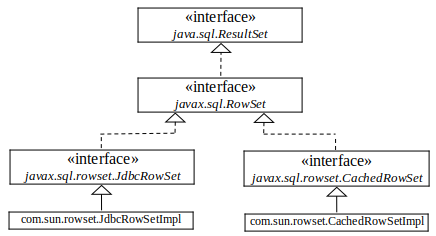

# Advanced Java Database Programming
- [Chapter 35](../bookextra/ch35.pdf)

Objectives
---
- create a universal SQL client for accessing local or remote database
- execute SQL statements in a batch mode
- process updatable and scrollable result sets
- simplify Java database programming using RowSet
- store and retrieve images in JDBC


Practice 📝 Create an interactive SQL client
---


- Connect to any JDBC data source
- Entering and executing SQL commands interactively
- The execution result is displayed for the SELECT queries
- the execution status is displayed for the non-SELECT commands
- [source code](./demos/SQLClient.java)


Batch Update
---
- consist of a sequence of non-select SQL commands
- these commands are collected in a batch and submitted to the database all together
  ```java
  Statement statement = conn.createStatement();
   
  // Add SQL commands to the batch
  statement.addBatch("create table T (C1 integer, C2 varchar(15))");
  statement.addBatch("insert into T values (100, 'Smith')");
  statement.addBatch("insert into T values (200, 'Jones')");
   
  // Execute the batch
  int count[] = statement.executeBatch();
  /* return the number of the rows affected by each SQL command
  count[0]=0 because it is a DDL command
  others return 1 because only one row is affected
  */
  ```


Practice 📝 Copy Text Files to Table
---


- The text file is a csv (comma-separated values) file
- string values are enclosed in single quotes
- View File button
  - show the csv file content
- Copy button
  - copy the text to the table
    - The table is already defined in the database
- prerequisites:
  ```sql
  -- 1. create table Person
  create table Person(firstName varchar(20), mi char(1), lastName varchar(20));
  ```

  ```bash
  # 2. create a csv file with the following contents
  'Joe', 'K', 'Biden'
  'Donald', 'M', 'Trump'
  'Bill', 'J', 'Gate'
  ```
- [source code](./demos/CopyFileToTable.java)


Scrollable and Updatable Result Set
---
- JDBC 1 supports only sequential forward reading
  - A result set maintains a cursor pointing to its current row of data
    - initial position is before the first row 
  - The next() method moves the cursor forward to the next row
- JDBC 2
  - can scroll the rows both forward and backward 
  - move the cursor to a desired location using 
    - the first, last, next, previous, 
    - absolute, or relative method
  - can insert, delete, or update a row in the result set 
    - the changes automatically reflect in the database


Create [Scrollable Statements](https://devdocs.io/openjdk~11/java.sql/java/sql/resultset)
---
- must first create a statement with an appropriate type and concurrency mode
  ```java
  // For a static statement
  Statement statement = connection.createStatement
  (int resultSetType, int resultSetConcurrency);

  // For a prepared statement
  PreparedStatement statement = connection.prepareStatement
  (String sql, int resultSetType, int resultSetConcurrency);

  // The resulting set is scrollable
  ResultSet resultSet = statement.executeQuery(query);
  ```
- resultSetType could be
  - TYPE_FORWARD_ONLY 
  - TYPE_SCROLL_INSENSITIVE 
  - TYPE_SCROLL_SENSITIVE ✅
- resultSetConcurrency
  - CONCUR_READ_ONLY 
  - CONCUR_UPDATABLE ✅


Practice 📝
---
- Explore "Scrollable and Updatable Result Set"
- prerequisites:
  ```sql
  -- in database test, create table StateCapital
  create table StateCapital(state varchar(40), capital varchar(40));
  alter table StateCapital add primary key(state);
  insert into StateCapital values('United Kindom','London'), ('United States','Washington'), ('Japan','Tokyo'), ('China','Beijing');
  ```
- [source code](./demos/ScrollUpdateResultSet.java)


RowSet: JdbcRowSet and CachedRowSet
---



- introduced in JDBC 2 for simplifying database programming 
- extends java.sql.ResultSet with additional capabilities of 
  - connecting to a JDBC url, username, password, set a SQL command, execute the command 
  - retrieving the execution result


SQL BLOB and CLOB Types
---
- BLOB (Binary Large OBject) 
  - stores binary data, which can be used to store images
    ```java
    create table Country(name varchar(30), flag blob, description varchar(255));
    ```
  - supported by interface java.sql.Blob
- CLOB (Character Large OBject) 
  - stores a large text in the character format
  - supported by interface java.sql.Clob
- supported by the methods of interfaces ResultSet and PreparedStatement
  - getBlob, setBlob, setBinaryStream, getClob, and setClob


Storing and Retrieving Images in JDBC
---

```java
// 1. define a prepared statement
PreparedStatement pstmt = connection.prepareStatement("insert into Country values(?, ?, ?)"); 

// 2. Store image 
File file = new File(imageFilenames[i]);
InputStream inputImage = new FileInputStream(file);
pstmt.setBinaryStream(2, inputImage, (int)(file.length()));

// 3. Retrieve image
Blob blob = rs.getBlob(1);
ImageIcon imageIcon = new ImageIcon(blob.getBytes(1, (int)blob.length()));
```


Practice 📝 Scroll and Update Table
---
- create a table country
  - retrieve and display images
- columns : name, flag, and description
  - flag is an image field


- [source code](./demos/StoreAndRetrieveImage.java)
- Prerequisites:
  - copy [book images](https://github.com/ufidon/java/tree/main/bookmedia/image) save in a folder 'image' under the folder containing the source code
    ```java
    -- in database test, create table Country
    create table Country(name varchar(30), flag blob, description varchar(255));
    alter table Country add primary key(name);
    ``` 


# References
* [Introduction to Java Programming, Comprehensive, 12/E](https://media.pearsoncmg.com/bc/abp/cs-resources/products/product.html#product,isbn=0136519350)
  * [Student resources](https://media.pearsoncmg.com/ph/esm/ecs_liang_ijp_12/cw/)
  * [Source code](https://media.pearsoncmg.com/ph/esm/ecs_liang_ijp_12/cw/content/source-code.php)
* [OpenJDK 11.0.11 Documentation](https://devdocs.io/openjdk~11/)
* [sqlite](https://www.sqlite.org)
  * [SQLite Java](https://www.sqlitetutorial.net/sqlite-java/)
  * [DB Browser for SQLite](https://sqlitebrowser.org/)
  * [SQLite JDBC Driver](https://github.com/xerial/sqlite-jdbc)
* [Connect to mysql in a docker container from the host](https://stackoverflow.com/questions/33001750/connect-to-mysql-in-a-docker-container-from-the-host)
  ```bash
  mysql -h localhost -P 3306 --protocol=tcp -u root -p
  ```
* [How to insert image in mysql database(table)?](https://stackoverflow.com/questions/14704559/how-to-insert-image-in-mysql-databasetable)
  ```java
  insert into Country values('Cananda', LOAD_FILE('./image/ca.gif'), 'Canada');
  ```