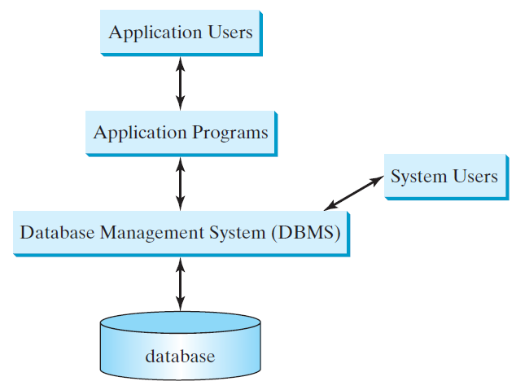
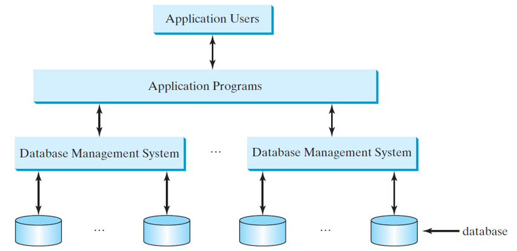
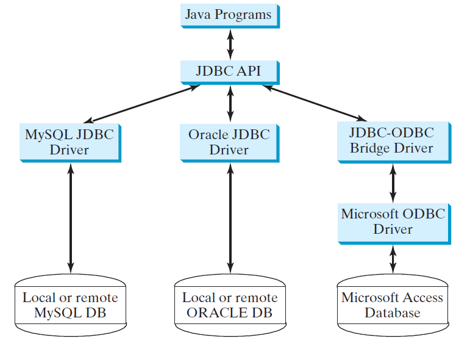
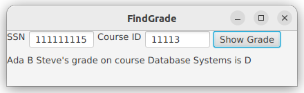
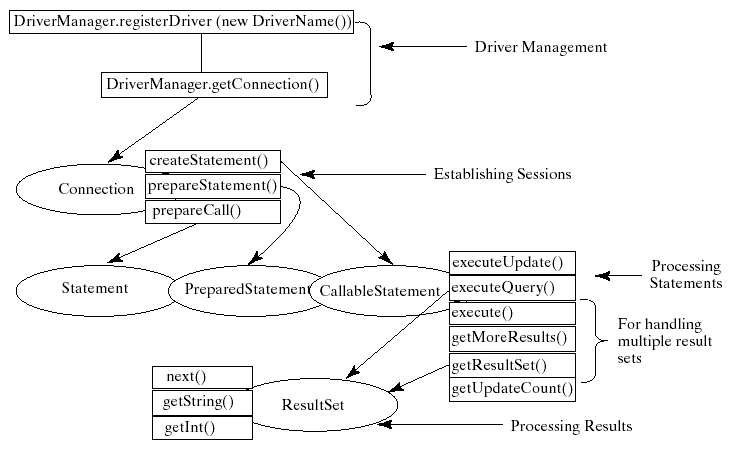
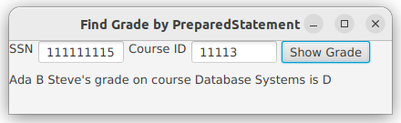

# Java Database Programming
- [Chapter 34](../bookextra/ch34.pdf)

Prerequisites: Setup MySQL
---
- Download and install [XAMPP](https://www.apachefriends.org/download.html)
  - Setup with all default options, close XAMPP Control Panel if it runs after installation
  - Run XAMPP Control Panel as Administrator , start MySQL, click Shell, setup a password for root
    ```cmd
    mysqladmin -u root password your_password
    :: If you want to change password, need to enter old password first
    mysqladmin -u root  password -p
    ```
  - Check MySQL works, in the previous shell 
    ```cmd
    mysql -u root -p
    :: enter your password
    :: if you see Welcome to the MariaDB monitor, MySQL works, 
    :: and you are inside MySQL console now
    :: then quit MySQL console, go back to shell
    exit;
    ```
- Create a folder testdb and cd into it, download [backup.sql](./resources/backup.sql) and save it in folder testdb
  - Load the test database
  ```bash
  # in the previous shell, cd into testdb
  mysql test < backup.sql -u root -p
  ```
- Download MySQL Connector/J  jar file from [here](./resources/mysql-connector-j-8.0.32.jar) or [here](https://repo1.maven.org/maven2/com/mysql/mysql-connector-j/8.0.32/mysql-connector-j-8.0.32.jar) and save it in the same folder as your source code for simplicity
- Run the sample Java program below to test the database development environment is setup completely.

```java
// test MySQL is accessible with MySQL Connector/J
// 0. put mysql-connector-j-8.0.32.jar in the same folder as TestCon.java
// 1. Run from Visual Studio Code:
// add  mysql-connector-j-8.0.32.jar to Java Projects -> Reference libraries
// 2. Run from command line:
// javac TestCon.java
// java -classpath ".;mysql-connector-j-8.0.32.jar"   TestCon
import java.sql.*;

class TestCon {
  public static void main(String args[]) {
    try {
      Class.forName("com.mysql.cj.jdbc.Driver");
      Connection con = DriverManager.getConnection(
          "jdbc:mysql://localhost:3306/test", "root", "your_password");
      if (con == null) {
        System.out.println("Something wrong with the database development environment.");
        return;
      } else {
        System.out.println("You are good to go.");
        con.close();
      }
    } catch (Exception e) {
      System.out.println(e);
    }
  }
}
```


Objectives
---
- Explain the concepts of
  - database and database management systems 
  - the relational data model
    - relational data structures, constraints, and languages 
- use SQL to create and drop tables
  - to retrieve and modify data
- load a driver, connect to a database, 
  - execute statements, and process result sets using JDBC 
  - use prepared statements to execute precompiled SQL statements 
  - use callable statements to execute stored SQL procedures and functions 
- explore database metadata using the DatabaseMetaData and ResultSetMetaData interfaces 


What is a Database System?
---




Database Application Systems
---




Rational Database based on Relational Data Model
---
- A relational data model has three key components: 
  - **Structure** defines the representation of the data
  - **Integrity** imposes constraints on the data
  - **Language** provides the means for accessing and manipulating data


Relational Structure
---
- A relational database consists of a set of relations
- A relation has two things:
  - a schema defines the relation 
  - an instance is the content of the relation at a given time 
    - nothing more than a table with rows and named columns 
    - simply refer instances of relations as just relations or tables


Integrity Constraints
---
- impose conditions that all legal relations must satisfy
- three types of constraints: 
  - A Domain constraint and a primary key constraint
    - intra-relational constraint
    - involves only one relation 
  - A foreign key constraint 
    - inter-relational
    - involves more than one relation


Domain constraints 
---
- specify the permissible values for an attribute
  - using standard data types such as 
    - integers, floating-point numbers, 
    - fixed-length strings, and variant-length strings. 
  - specify whether an attribute can be null


Domain Constraints Example
---

```sql
create table Course (
  courseId char(5),
  subjectId char(4) not null, 
  courseNumber integer, 
  title varchar(50) not null, 
  numOfCredits integer, 
  constraint greaterThanOne check (numOfCredits >= 1),
  primary key (courseId),
  /* primary key (subjectCode, courseNumber) */);
```


Keys
---
- *superkey*
  - an attribute or a set of attributes that uniquely identify the relation
    - a relation consists of a set of distinct tuples
      - no two tuples have the same values on the superkey
    - The set of all attributes in the relation forms a superkey
- *key* $K$ is a *minimal superkey*
  - any proper subset of $K$ is not a superkey
  - It is possible that a relation has several keys
    - each of the keys is called a *candidate key*
- *primary key* 
  - one of the candidate keys designated by the database designer
  - often used to identify tuples in a relation


Primary Key Constraints
---
- A primary key specifies that the primary key value of a tuple 
  - cannot be null 
  - no two tuples have the same value on the primary key
- The DBMS enforces the primary key constraint


Foreign Key Constraints
---
- A foreign key is a set of attributes $FK$ in a table $R$ that refers to the primary key of another table $T$
  - the attributes in $FK$ have the same domain as the primary key in $T$
  - A non-null value on $FK$ in $R$ must match a primary key value in $T$
- The referencing relation and the referenced relation may be the same table
- The foreign key is not necessary to have the same name as its referenced primary key  


Foreign Key Example
---

```sql
create table Enrollment (
  ssn char(9), 
  courseId char(5),
  dateRegistered date,  
  grade char(1),
  primary key (ssn, courseId),
  foreign key (ssn) references Student,
  foreign key (courseId) references Course
); 
```


Structured Query Language (SQL)
---
- the universal language for accessing relational database systems
  - DDL（Data Definition Language）
    - CREATE, ALTER, DROP, TRUNCATE, COMMENT, RENAME
  - DML（Data Manipulation Language）
    - INSERT, UPDATE, DELETE, MERGE, CALL, EXPLAIN PLAN, LOCK TABLE
  - DQL (Data Query Language)
    - SELECT
  - DCL（Data Control Language）
    - GRANT, REVOKE
  - TCL（Transaction Control Language）
    - BEGIN, COMMIT, SAVEPOINT, ROLLBACK, SET TRANSACTION
- Examples of simple SQL statements

```sql
-- double dashes start a single-line comment
/* this is a 
multiple-line
comment, just like Java's multiple-line comment
*/
-- 0. create database dbname
create database scratch;
use scratch;

--  1. create table tbname
create table Student (
  ssn char(9), 
  firstName varchar(25), 
  mi char(1), 
  lastName varchar(25), 
  birthDate date,  
  street varchar(25),  
  phone char(11),  
  zipCode char(5),
  deptId char(4),  
  primary key (ssn)
); 

CREATE TABLE `Course` (
  `courseId` char(5) NOT NULL,
  `subjectId` char(4) NOT NULL,
  `courseNumber` int DEFAULT NULL,
  `title` varchar(50) NOT NULL,
  `numOfCredits` int DEFAULT NULL,
  PRIMARY KEY (`courseId`)
);

-- 2. drop table tbname
drop table Enrollment;
drop table Course;
drop table Student;

use test; -- switch to database test
-- 3. select column-list from table-list [where condition];
select firstName, mi, lastName
from Student
where deptId = 'CS';

-- 3.1 Comparison and boolean operators, almost identical to Java
select firstName, mi, lastName 
from Student
where deptId = 'CS' and zipCode = '31411'; 

select * 
from Student
where deptId = 'CS' and zipCode = '31411';

-- 3.2 like, between-and, is null
-- s like p, s not like p
-- in pattern p, % matches 0+ characters, 
-- _ matches any single character
select * from Course where title like 'Ca%';
select * from Course where title not like 'Intro%';

-- v between v1 and v2; v not between v1 and v2;
-- v is null; v is not null;
select * from Enrollment where grade between 'A' and 'B';

-- 3.3 Column alias
-- select columnName [as] alias
select lastName as "Last Name", zipCode as "Zip Code" 
from Student where deptId = 'CS';

-- 3.4 Arithmetic operators: +,-,*,/
select title, 50*numOfCredits as "Lecture minutes per week" 
from Course where subjectId="CSCI";

-- 3.5 Display distinct tuples
select distinct subjectId as "Subject ID" from Course;
select distinct subjectId, title  from Course;

-- 3.6 Display sorted tuples
-- select column-list from table list [where condition]
-- [order by columns-to-be-sorted]
-- default order is ascending, asc could be omitted below
select lastName, firstName, deptId from Student 
where deptId = 'CS' 
order by lastName desc, firstName asc;

-- 3.7 Join tables
select distinct lastName, firstName, courseId 
from Student, Enrollment 
where Student.ssn = Enrollment.ssn and lastName='Biden';

-- 4. insert into tableName [(cola, colb, ..., coln)] 
-- values (vala, valb,..., valn)
insert into Course (courseId, subjectId, courseNumber, title) 
values ('11113', 'CSCI', '3720', 'Database Systems', 3);
-- the statement above has a syntax error, could you correct it?

-- 5. update tableName set cola=va [, colb=vb, ..., coln=vn] 
-- [where condition];
update Course 
set numOfCredits = 4
where title = 'Database Systems';

-- 6. delete from tableName [where condition];
delete Course 
where title = 'Database System';
-- the statement above has a syntax error, could you correct it?
```


Why Java for Database Programming?
---
- Java is platform independent
- accessing database systems from Java is built into Java API
- Java is among the top 3 of popular programming languages
- Examples: GUI, Client/Server, Server-Side programming


The Architecture of Java Database Connectivity (JDBC)
---
-  an application programming interface (API) for Java 
-  defines how a client may access a database 
   -  provides methods to query and update data in a database 
-  oriented toward relational databases




Developing JDBC Programs
---

```java
// 1. Loading drivers
Class.forName("JDBCDriverClass");

// 2. Establishing connections
Connection connection = DriverManager.getConnection(databaseURL);

// 3. Creating and executing statements
Statement statement = connection.createStatement();
statement.executeUpdate("create table Temp (col1 char(5), col2 char(5))");
ResultSet resultSet = statement.executeQuery
  ("select firstName, mi, lastName from Student where lastName "
    + " = 'Smith'")
// 4. Processing ResultSet
while (resultSet.next())
  System.out.println(resultSet.getString(1) + " " + resultSet.getString(2)
    + ". " + resultSet.getString(3));
```

JDBC Driver Classes and database URLs
---

| database | driver class |
| --- | --- |
| SQLite | [SQLite JDBC](https://mvnrepository.com/artifact/org.xerial/sqlite-jdbc) |
| Java DB | [Apache Derby Client JDBC Driver](https://mvnrepository.com/artifact/org.apache.derby/derbyclient) |
| Access | [UCanAccess](https://sourceforge.net/projects/ucanaccess/) |
| MariaDB | [MariaDB Java Client](https://mvnrepository.com/artifact/org.mariadb.jdbc/mariadb-java-client) |
| MySQL |  [MySQL Connector/J](https://mvnrepository.com/artifact/mysql/mysql-connector-java ) |
| Oracle | [Oracle JDBC Driver](https://mvnrepository.com/artifact/com.oracle/ojdbc14) |
| SQL Server | [Microsoft JDBC Driver For SQL Server](https://mvnrepository.com/artifact/com.microsoft.sqlserver/mssql-jdbc) |


A simple JDBC command line example
---

```java
import java.sql.*;

public class SimpleJDBC {
  public static void main(String[] args)
      throws SQLException, ClassNotFoundException {
    Class.forName("com.mysql.cj.jdbc.Driver");
    System.out.println("Driver loaded");

    Connection connection = DriverManager.getConnection("jdbc:mysql://localhost:3306/test", "root", "your_password");
    System.out.println("Database connected");

    Statement statement = connection.createStatement();

    // auto-commit vs manual commit [ setAutoCommit(false), commit(), rollback() ]
    ResultSet resultSet = statement.executeQuery("select firstName, mi, lastName from Student where lastName "
        + " = 'Trump'");

    while (resultSet.next())
      System.out.println(resultSet.getString(1) + "\t" +
          resultSet.getString(2) + "\t" + resultSet.getString(3));

    connection.close();
  }
}
```


Accessing Database from JavaFX
---
- Enter the SSN and the course ID to find a student’s grade
  - [source code](./demos/FindGrade.java)




JDBC interfaces and types
---
- statement interfaces
  - [Statement](https://devdocs.io/openjdk~11/java.desktop/java/beans/statement)
  - [PreparedStatement](https://devdocs.io/openjdk~11/java.sql/java/sql/preparedstatement)
  - [CallableStatement](https://devdocs.io/openjdk~11/java.sql/java/sql/callablestatement)
- types
  - [JDBC types](https://devdocs.io/openjdk~11/java.sql/java/sql/jdbctype)




Executing SQL statements with methods
---
- *execute* produces
  -  multiple result sets
  - multiple update counts
  - a combination of result sets and update counts
- *executeQuery* produces 
  - a single result set
    - such as the SQL select statement
- *executeUpdate* produces 
  - a single update count or no update count
    - such as a SQL INSERT, DELETE, UPDATE, or DDL statement


Interface PreparedStatement
---
- designed to execute 
  - dynamic SQL statements 
  - SQL-stored procedures with IN parameters
  - these statements and procedures are precompiled for efficient use when repeatedly executed

```java
Statement pstmt = connection.prepareStatement
  ("insert into Student (firstName, mi, lastName) +
    values (?, ?, ?)");
// the three question marks are placeholders for parameters representing
// values for firstName, mi, and lastName in a record of the Student table  

// use method setX(int parameterIndex, X value) 
// parameterIndex starts from 1
```


Practice 📝
---
- Use PreparedStatement to Execute Dynamic SQL Statements
  - [source code](./demos/FindGradeUsingPreparedStatement.java)




CallableStatement
---
-  executes SQL stored procedures
   -  the syntax of stored procedures is vendor specific
-  may have IN, OUT, or IN OUT parameters
-  created using the prepareCall(String call) method in the Connection interface
    ```java
    CallableStatement callableStatement = connection.prepareCall(
    "{? = call functionName(?, ?, ...)}"); // MySQL syntax

    // define a MySQL function
    // in MySQL console, set the following flag first
    // SET GLOBAL log_bin_trust_function_creators = 1;

    // then define your function
    use test;
    drop function if exists studentFound;

    delimiter //
    create function studentFound(first varchar(20), last varchar(20)) returns int
    begin
      declare result int;

      select count(*) into result
      from Student
      where Student.firstName= first and Student.lastName=last;

      return result;
    end;
    //

    // verify:  need MariaDB built with '--with-debug' to have it working
    SHOW FUNCTION CODE test.studentFound;
    ```

Practice 📝
---
- Call MySQL stored procedure from Java
- [source code](./demos/TestCallableStatement.java)


Retrieving Database Metadata
---
- Database metadata is the information about the database itself
- [DatabaseMetaData interface](https://devdocs.io/openjdk~11/java.sql/java/sql/databasemetadata)
  - obtained by
    ```java
    DatabaseMetaData dbMetaData = connection.getMetaData();
    ```
  - provides more than 100 methods for obtaining database metadata such as
    - general information
      - URL, username, product name, product version, 
      - driver name, driver version, 
      - available functions, available data types, etc.
    - database capabilities such as
      - advanced SQL commands and grammar
    - object descriptions such as
      - tables, views, and procedures
- [ResultSetMetaData interface](https://devdocs.io/openjdk~11/java.sql/java/sql/resultsetmetadata)
  - obtained by
    ```java
    ResultSetMetaData rsMetaData = resultSet.getMetaData();
    ```
  - obtains the information on the specific [ResultSet](https://devdocs.io/openjdk~11/java.sql/java/sql/resultset)


Practice 📝
---
- Run the following programs, analyze their outputs and source code
  - [Retrieve metadata](./demos/TestDatabaseMetaData.java)
  - [Obtain database tables](./demos/FindUserTables.java)
  - [Retrieve resultset metadata](./demos/TestResultSetMetaData.java)


# References
* [Introduction to Java Programming, Comprehensive, 12/E](https://media.pearsoncmg.com/bc/abp/cs-resources/products/product.html#product,isbn=0136519350)
  * [Student resources](https://media.pearsoncmg.com/ph/esm/ecs_liang_ijp_12/cw/)
  * [Source code](https://media.pearsoncmg.com/ph/esm/ecs_liang_ijp_12/cw/content/source-code.php)
* [OpenJDK 11.0.11 Documentation](https://devdocs.io/openjdk~11/)
* [XAMPP](https://www.apachefriends.org/download.html)
  * [How to Change Your MySQL Password in XAMPP](https://kinsta.com/knowledgebase/xampp-mysql-password)
  * [How do I allow remote access to mysql using xampp?](https://serverfault.com/questions/52794/how-do-i-allow-remote-access-to-mysql-using-xampp)
    * [0.0.0.0](https://en.wikipedia.org/wiki/0.0.0.0)
  * [MySQL Connector/J](https://mvnrepository.com/artifact/com.mysql/mysql-connector-j)
  * [Connect Java to a MySQL Database](https://www.baeldung.com/java-connect-mysql)
* [MySQL cheatsheet](https://www.interviewbit.com/mysql-cheat-sheet/)
* [Java – Set Classpath from Command Line](https://howtodoinjava.com/java-examples/set-classpath-command-line/)
* [SHOW PROCEDURE CODE Statement](https://dev.mysql.com/doc/refman/8.0/en/show-procedure-code.html)
