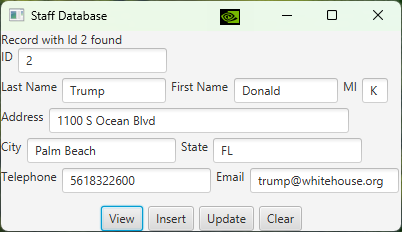

# Lab4: Basic Database Programming

## Q1: Access and update a Staff table 
- textbook programming exercises 34.1

(Access and update a Staff table) Write a program that views, inserts, and updates
staff information stored in a database, as shown below



- The View button displays a record with a specified ID
- The Insert button inserts a new record 
- The Update button updates the record for the specified ID
- The Clear button clears all textfields

A label on the top of the scene is used to show the status of the program. Each of the following operation has two results: success or fail.
- connect to the database
- view a record with the specified ID
- insert a new record
- update the record for the specified ID

The label text must be updated accordingly.

The status message can be constructed as operation + "succeeded" or operation + "failed", for example
- connecting to the database failed
- connecting to the database succeeded

The Staff table is created as follows:
```sql
-- create the table in MySQL and populate at least two records
create table Staff (
  id char(9) not null,
  lastName varchar(15),
  firstName varchar(15),
  mi char(1),
  address varchar(20),
  city varchar(20),
  state char(2),
  telephone char(10),
  email varchar(40),
  primary key (id)
);
```

## Extra credit (10%)
Implement Q1 with PreparedStatement.