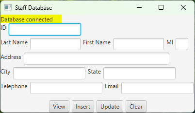
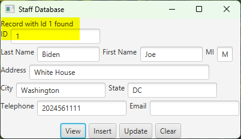
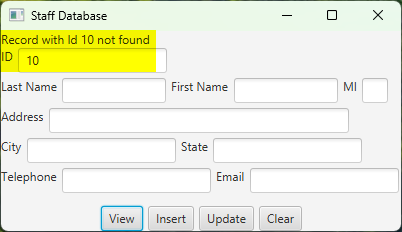
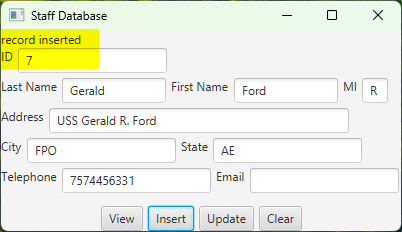
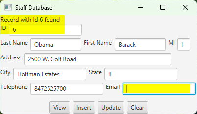
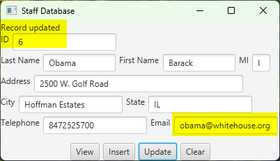
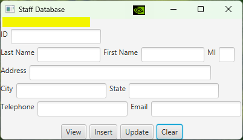

# Lab4: Basic Database Programming

## Q1: Access and update a Staff table 
- textbook programming exercises 34.1

(Access and update a Staff table) Write a program that views, inserts, and updates staff information stored in a database, as shown below


- The *View* button displays a record with a specified ID
  - use Statement.executeQuery 
  - suggested SQL: 
  ```sql
  SELECT * FROM Staff WHERE ID =  specifiedID
  ```
- The *Insert* button inserts a new record 
  - use Statement.executeUpdate 
  - suggested SQL: 
  ```sql
  -- make sure the order of the values is in the same order as the columns in the table
  -- gXXXs are the values retrieved from the textfields
  INSERT INTO Staff VALUES(gID, gLastName, gFirstName, gmi, gAddress, gCity, gState, gTelephone, gEmail);
  ```
- The *Update* button updates the record for the specified ID
  - use Statement.executeUpdate 
  - suggested SQL: 
  ```sql
  -- gXXXs are the values retrieved from the textfields
  UPDATE Staff  SET 
      LastName = gLastName,
      FirstName = gFirstName,
      mi = gmi,
      Address = gAddress,
      City = gCity,
      State = gState,
      Telephone = gTelephone,
      Email = gEmail -- no comma for this last one
  WHERE ID =  specifiedID
  ```
- The *Clear* button clears all textfields **and the status label**

A label on the top of the scene is used to show the status of the program. Each of the following operation has two results: success or fail.
- connect to the database
- view a record with the specified ID
- insert a new record
- update the record for the specified ID

*The label text must be updated accordingly.*

The status message can be constructed as operation + "succeeded" or operation + "failed", for example
- connecting to the database failed
- connecting to the database succeeded
- **Hints**: 
  - use try...catch blocks
    - show successful message in the try block
    - show failed message in the catch block

- **Note: the screenshots of the following test cases are required.**

1. startup, show database connection status, all textfields are cleared



2. view a record with the specified ID, show succeed and fail

| succeed | fail |
| --- | --- |
|  |  |

3. insert a new record, show succeed

| succeed | fail |
| --- | --- |
|   | Not required  |

4. update the record for the specified ID, show before and after update

| before update | after update |
| --- | --- |
|   |   |

5. clear GUI interface: all textfields **and the status label**




The Staff table is created as follows:
```sql
-- create the table in MySQL and populate at least two records
create table Staff (
  id char(9) not null,
  lastName varchar(15),
  firstName varchar(15),
  mi char(1),
  address varchar(20),
  city varchar(20),
  state char(2),
  telephone char(10),
  email varchar(40),
  primary key (id)
);
```

## Extra credit (10%)
Implement Q1 with PreparedStatement.

# References
- [MySQL tutorial](https://www.w3schools.com/MySQL/)