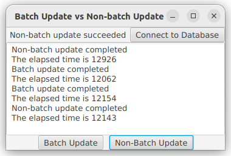
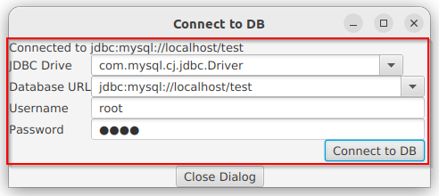
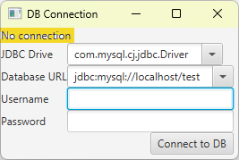
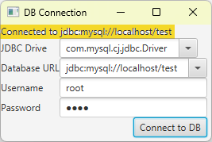

# Lab5: Advanced Database Programming

## Q1: Batch update 
- textbook programming exercises 35.1

Write a program that 
- inserts 5000 records to a database, and
- compare the performance with and without batch updates, 
- as shown below
- 
- Suppose the table is defined as follows:
  ```sql
  create table Temp(num1 double, num2 double, num3 double)
  ```
- Use the Math.random() method to generate random numbers for each record
- Create a dialog box that contains DBConnectionPanel as described in the Extra Credit
  - its jar file is provide [here](./resources/DBConnectionPane.jar) 
    - use the jar file in VS Code
      - Add to "JAVA PROJECTS" -> "Referenced Libraries"
        - DBConnectionPane.jar and mysql-connector-j-8.0.32.jar
    - use the jar file from command line
      ```cmd
      :: 1. compile 
      javac  -classpath ".;DBConnectionPane.jar"   .\TestDBConnectionPane.java
      :: 2. run
      java -classpath ".;mysql-connector-j-8.0.32.jar;DBConnectionPane.jar"   TestDBConnectionPane
      ```
  - Use this dialog box to connect to the database as shown below
  - 
- **Hints**
  - Batch update implementation in one thread
    - drop the table Temp
    - create the table Temp
    - mark start time with System.currentTimeMillis()
    - loop 5000 times, in each iteration add an insert statement to batch
    - execute batch
    - mark end time with System.currentTimeMillis()
    - get the time consumed = endTime - startTime
  - Non-batch update implementation in another thread
    - drop the table Temp
    - create the table Temp
    - mark start time with System.currentTimeMillis()
    - loop 5000 times, in each iteration execute an insert statement
    - mark end time with System.currentTimeMillis()
    - get the time consumed = endTime - startTime
- update the textarea from both threads using Platform.runLater
- construct the insert statement
  ```java
  "INSERT INTO TEMP VALUES(" +
          Math.random() * 1000 + ", " + Math.random() * 100 + ", " +
          Math.random() * 10 + ")"
  ```


## Extra Credit (10%) Implement the DBConnectionPanel
- textbook programming exercises 34.3
- *put your code file in a different EMPTY folder other than Q1*
  - otherwise it will conflict with the given *DBConnectionPane.jar*
- Develop a subclass of BorderPane named **DBConnectionPane** that enables the user to
  - select or enter 
    - a JDBC driver and a URL 
    - a username and password, as shown below
  - When the "Connect to DB button" is clicked
    - a Connection object for the database is stored in the connection property
    - You can then use the getConnection() method to return the connection

| Before connection | After connection |
| --- | --- |
|  |  |

- A test framework is provided here
```java
import javafx.application.Application;
import javafx.scene.Scene;
import javafx.stage.Stage;

import javafx.scene.control.Button;
import javafx.scene.control.Label;
import javafx.scene.control.TextField;
import java.sql.*;
import javafx.collections.FXCollections;
import javafx.geometry.HPos;
import javafx.scene.control.ComboBox;
import javafx.scene.control.PasswordField;
import javafx.scene.layout.BorderPane;
import javafx.scene.layout.GridPane;

public class TestDBConnectionPane extends Application { 
  @Override
  public void start(Stage primaryStage) {   
    Scene scene = new Scene(new DBConnectionPane(), 266, 148);
    primaryStage.setTitle("DB Connection");
    primaryStage.setScene(scene);
    primaryStage.show();
  }

  public static void main(String[] args) {
    launch(args);
  }
}

class DBConnectionPane extends BorderPane {
  // TODO: put your implementation here
}
```


# Reference
- [Dynamically loading a class in Java](https://stackoverflow.com/questions/5571466/dynamically-loading-a-class-in-java)
- [Create a JAR File Containing the Class File](https://docs.oracle.com/javase/tutorial/security/toolsign/step2.html)
  - [Guide to Creating and Running a Jar File in Java](https://www.baeldung.com/java-create-jar)
- [Lock table in oracle database using JDBC driver](https://stackoverflow.com/questions/8570440/lock-table-in-oracle-database-using-jdbc-driver)