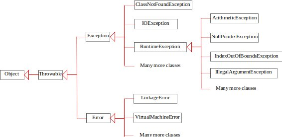

# Review for exam 2

Covers Chapter 12, 14-16.

Popular Java exceptions and their hierarchy
---
- Throwable is the root of all Java exceptions and errors



```java
1/0; // ArithmeticException

1.0/0; //=> Infinity, no exception

String s = null; 
s.length(); // NullPointerException

int [] tens = new int[10];
tens[10]; // ArrayIndexOutOfBoundsException
```

- Handling exceptions with try catch finally
  - Could we have a try block only? i.e. without catch or finally?


JavaFX main class
---
- How to define a JavaFX main class?
- How does a [JavaFX application](https://openjfx.io/javadoc/11/javafx.graphics/javafx/application/Application.html) execute?


Layout panes
---
- How to add more than one nodes to a pane simultaneously?
- How to place a node in the center region of a BorderPane?


Uni/Bidirectional Binding
---
- Analyze the following programs and find their outputs

```java
// BindingDemo.java: unidirectional binding
import javafx.beans.property.DoubleProperty;
import javafx.beans.property.SimpleDoubleProperty;

public class BindingDemo {
  public static void main(String[] args) {      
    DoubleProperty d1 = new SimpleDoubleProperty(1);
    DoubleProperty d2 = new SimpleDoubleProperty(2);
    d1.bind(d2); // Bind d1 with d2
    System.out.println("d1 is " + d1.getValue() 
      + " and d2 is " + d2.getValue());
    d2.setValue(70.2);
    System.out.println("d1 is " + d1.getValue() 
      + " and d2 is " + d2.getValue());
  }
}

// BidirectionalBindingDemo.java
import javafx.beans.property.DoubleProperty;
import javafx.beans.property.SimpleDoubleProperty;

public class BidirectionalBindingDemo {
  public static void main(String[] args) {       
    DoubleProperty d1 = new SimpleDoubleProperty(1);
    DoubleProperty d2 = new SimpleDoubleProperty(2);
    d1.bindBidirectional(d2);
    System.out.println("d1 is " + d1.getValue() 
      + " and d2 is " + d2.getValue());
    d1.setValue(50.1);
    System.out.println("d1 is " + d1.getValue() 
      + " and d2 is " + d2.getValue());
    d2.setValue(70.2);
    System.out.println("d1 is " + d1.getValue() 
      + " and d2 is " + d2.getValue());
  }
}
```


Image and ImageView
---
- Can an Image object be shared by multiple ImageView objects?
- Can an ImageView object be placed into a pane or scene multiple times?
  - How about any nodes?


Three popular ways of defining a JavaFX event handler
---
- define a JavaFX event handler with
  - inner class
  - anonymous inner class
  - lambda expression
- how do you register a JavaFX event handler?


Are the following four lambda expressions all equivalent?
---
```java
(ActionEvent e) -> { circlePane.enlarge(); }
(e) -> { circlePane.enlarge(); }
e -> { circlePane.enlarge(); }
e -> circlePane.enlarge()
```


Popular methods of class [Animation](https://openjfx.io/javadoc/11/javafx.graphics/javafx/animation/Animation.html)
---
- An animation can run in a loop by setting *cycleCount* 
- To make an animation run back and forth while looping, set the *autoReverse* flag
- Call *play*() or *playFromStart*() to play an Animation
- The Animation progresses in the direction and speed specified by rate, and stops when its duration is elapsed
- An Animation with indefinite duration (a cycleCount of INDEFINITE) runs repeatedly until the stop() method is explicitly called, which will stop the running Animation and reset its play head to the initial position
- An Animation can be paused by calling pause(), and the next play() call will resume the Animation from where it was paused
- An Animation's play head can be randomly positioned, whether it is running or not
  - If the Animation is running, the play head jumps to the specified position immediately and continues playing from new position
  - If the Animation is not running, the next play() will start the Animation from the specified position
- Inverting the value of rate toggles the play direction


Can you set the cycle count of animation to infinite?
---
- How?